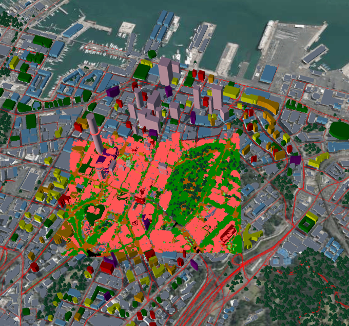
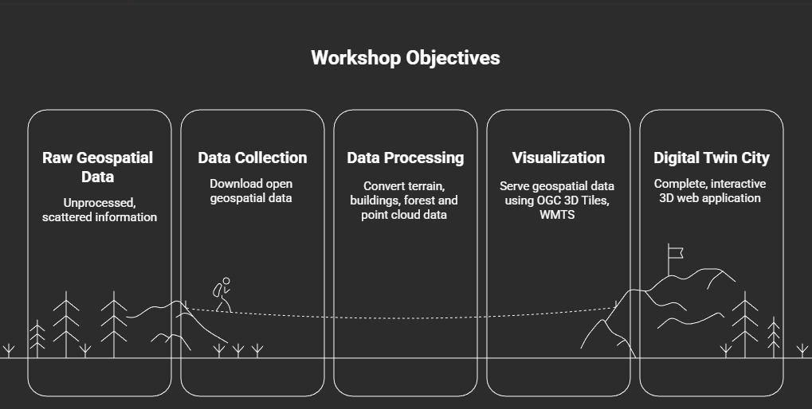
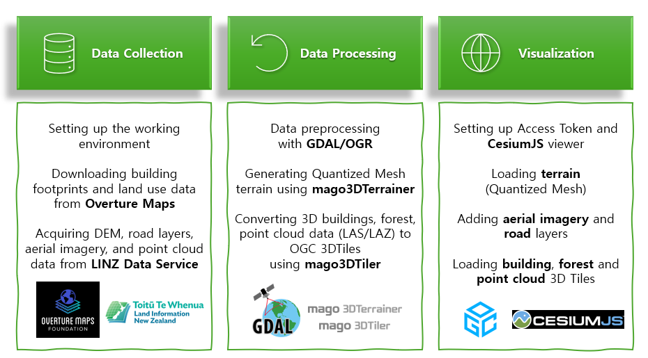
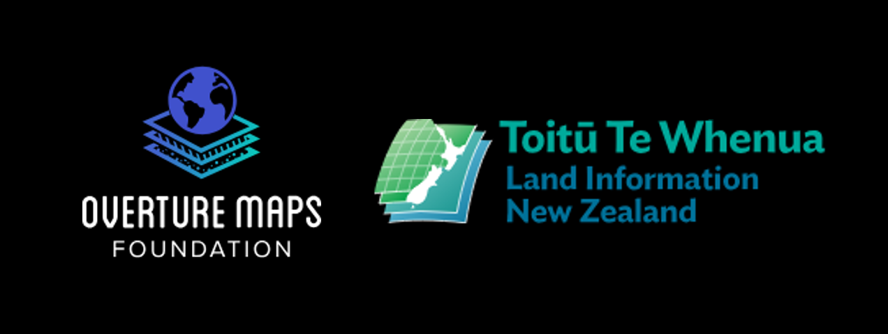
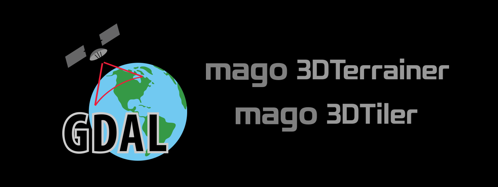
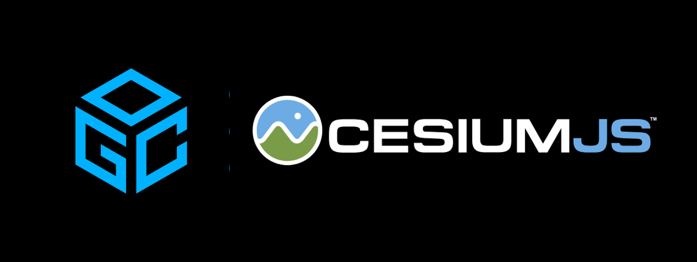

# Open Data, Open Source, Open Standard: Quickly Build Your Digital Twin City with mago3D

## Workshop Overview

This workshop provides participants with the experience of **creating a digital twin city from scratch** by utilizing open data from the region where FOSS4G is held.

Participants will:
- **Collect open data** from multiple geospatial sources
- **Transform data** using open-source tools (**mago3DTiler**, **mago3DTerrainer**)
- **Experience the full workflow** of serving data according to **OGC (Open Geospatial Consortium) standards**

You will visualize city **buildings** and **terrain** in 3D, overlay **road** layers and **aerial imagery** to construct a realistic urban environment.
Additionally, you will create **forests** by planting trees in the city, and then transform and overlay large-scale point cloud data.

This entire process relies on **open data, open source, and open standards**, allowing participants to experience building a digital twin city from scratch on an unprepared PC.

---

## Learning Objectives

By the end of this workshop, participants will be able to:

1. Collect and download open geospatial data from the workshop region
2. Process and convert 3D building data using GDAL and mago3DTiler
3. Generate terrain models from DEM data using mago3DTerrainer
4. Transform point cloud data and visualize vegetation-based individual tree models
5. Serve geospatial data using OGC WMTS
6. Create interactive 3D web applications with CesiumJS
7. Build a complete digital twin city from scratch in 3 hours

---

## Prerequisites

### Required Software
- **Docker Desktop** (Windows/Mac) or **Docker Engine** (Linux)
- **Git** for cloning repositories
- **Python** (version 3.8 or higher)
- **Node.js** (version 18 or higher)
- **IDE**: Visual Studio Code or IntelliJ IDEA (recommended)
- **Web Browser**: Chrome, Firefox, or Edge (latest version)

### Required Access
- **Cesium ion access token**: Sign up for a free account at [cesium.com/ion](https://cesium.com/ion/) and obtain your access token

### Hardware Requirements
- **Minimum**: 8GB RAM, 10GB free disk space
- **Recommended**: 16GB+ RAM, 50GB+ free disk space, dedicated GPU
- Stable internet connection for downloading data

### Technical Knowledge
- Basic understanding of GIS concepts
- Familiarity with command-line tools
- Basic knowledge of Docker (helpful but not required)

---

## Workshop Structure

### Part 1: Introduction (15 minutes)
Introduction to workshop overview, objectives, and environment setup.

### Part 2: Data Collection (45 minutes)
Learn how to collect and download open geospatial data from various sources.

**Topics covered:**
- Setting up the working environment
- Downloading building footprints and land use data from **Overture Maps**
- Acquiring DEM, road layers, aerial imagery, and point cloud data from **LINZ Data Service**

For reference, open data from around the world can be obtained from sources such as:
- Downloading Sentinel satellite imagery from **Copernicus Data Space Ecosystem**
- Obtaining elevation data from **NASA SRTM/ASTER DEM**

### Part 3: Data Processing (60 minutes)
Transform raw geospatial data into web-optimized 3D tiles and terrain.

**Topics covered:**
- Data preprocessing with **GDAL/OGR**
- Generating Quantized Mesh terrain using **mago3DTerrainer**
- Converting 3D buildings to OGC 3DTiles using **mago3DTiler**
- Converting forest data to 3DTiles i3dm format using **mago3DTiler**
- Converting point cloud data (LAS/LAZ) to OGC 3DTiles using **mago3DTiler**

### Part 4: Graphics Acceleration (10 minutes)
Optimize data processing performance through GPU acceleration.

**Topics covered:**
- Checking graphics acceleration status in your browser
- Hands-on comparison of performance before and after enabling graphics acceleration

### Part 5: Visualization (40 minutes)
Build an interactive 3D web application to visualize your digital twin city.

**Topics covered:**
- Setting up Access Token and CesiumJS viewer
- Loading terrain (Quantized Mesh)
- Adding aerial imagery and road layers
- Loading building 3D Tiles
- Loading forest and point cloud 3D Tiles
- Viewing the final 3D digital twin city

---

## Workshop Schedule

| Time          | Section                          | Activity                                |
|---------------|----------------------------------|-----------------------------------------|
| 01:30 - 01:45 | Introduction (15min)             | Workshop overview and environment setup |
| 01:45 - 02:30 | Data Collection (45min)          | Download geospatial data                |
| 02:30 - 03:00 | Data Processing - Part 1 (30min) | GDAL preprocessing                      |
| 03:00 - 03:30 | Break (30min)                    | Coffee break                            |
| 03:30 - 04:00 | Data Processing - Part 2 (30min) | 3D data conversion                      |
| 04:40 - 04:50 | Graphics Acceleration (10min)    | Graphics acceleration                   |
| 04:00 - 04:40 | Visualization (40min)            | Build 3D web application                |
| 04:50 - 05:00 | Q&A (10min)                      | Questions and wrap-up                   |

**Total Duration**: 3.5 hours

---

## Table of Contents

### [1. Data Collection Guide](guides/1_Resource_Guide_En.md)

#### ⚙️ Basic Setup
- Creating working directory for the workshop
- IDE preparation and Git repository clone
- Installing and verifying required software

#### ⬇️ Downloading Data
- Overture Maps building footprints and land use vector data
- Open data sources (LINZ Data Service) DEM and point cloud data
- Open data sources (LINZ Data Service) aerial imagery and road WMTS service

---

### [2. Data Processing Guide](guides/2_Processing_Guide_En.md)

#### 🔧 Data Preprocessing
- Preprocessing building height from Overture Maps building footprints
- Converting Overture Maps land use data to forest data
- Preparing DEM elevation data and tree instance 3D models

#### ⭐ mago3D Tools Usage Guide ⭐
- **mago3DTerrainer**: Generate optimized terrain
  - Creates terrain tiles from DEM (GeoTIFF) with simple commands
  - Generates high-accuracy Quantized mesh
  - Supports multi-resolution DEM tile generation
  - Calculates Normal Vectors for terrain lighting
  - Provides various customization options
- **mago3DTiler**: Convert to 3D Tiles format
  - Supports various formats: 3DS, OBJ, FBX, Collada DAE, GlTF, GLB, IFC, etc.
  - High-accuracy LAS, LAZ data conversion
  - Height extrusion and attribute mapping
  - Coordinate system transformation and terrain draping
  - Provides various customization options

#### 🎯 mago3D Hands-on Practice
- Generate terrain with mago3DTerrainer
- Create building 3D tiles with mago3DTiler
- Create forest 3D tiles with mago3DTiler
- Create point cloud 3D tiles with mago3DTiler

---

### [Optional: Hardware Acceleration](guides/Hardware_Acceleration_En.md)

#### 🎮 GPU-Accelerated Processing
- Optimizing data processing performance through GPU acceleration
- Checking graphics acceleration status in your browser
- Performance comparison before/after acceleration

---

### [3. Visualization Guide](src/main.js)

#### 🚀 Building the 3D Application
- Sample code structure and setup
- Running the application in your IDE
- Sample code explanation
- Verifying results based on conversion options

#### ⭐ Results ⭐
- Visualizing layers in CesiumJS viewer
- Layer toggling and attribute inspection
- Viewing the complete 3D digital twin

---

## Dataset Information

This workshop uses **real-world open data from the FOSS4G host city/region**, including:
- Building footprints from Overture Maps
- Land use data from Overture Maps
- Elevation data from LINZ Data Service
- Aerial imagery from LINZ Data Service
- Road network data from LINZ Data Service
- Point cloud data from LINZ Data Service

**Target Region**: Downtown Auckland, New Zealand (FOSS4G 2025 host city)

Sample datasets are provided in the [`public/`](public/) directory for participants who cannot download data during the workshop.

---

## Sample Code

Complete working examples are available in the [`src/`](src/) directory, including:
- CesiumJS-based 3D web application
- Loading terrain, aerial imagery, roads, buildings, forests, and point cloud layers
- Custom interactions and visualization settings

---

## Additional Resources

### Data Sources
- [Overture Maps](https://overturemaps.org/)
- [LINZ Data Service](https://data.linz.govt.nz/)

### Tools and Libraries
- [Docker](https://www.docker.com/)
- [GDAL/OGR](https://gdal.org/)
- [mago3D Terrainer](https://github.com/Gaia3D/mago-3d-terrainer)
- [mago3D Tiler](https://github.com/Gaia3D/mago-3d-tiler)
- [OGC WMTS Standard](https://www.ogc.org/standard/wmts/)
- [CesiumJS](https://cesium.com/cesiumjs/)

---

## Support and Contact

**Workshop Instructors:**
- Yeonhwa Jeong, Gaia3D, yhjeong@gaia3d.com
- Sungjun Jo, Gaia3D, sjcho@gaia3d.com
- Jungin Yoon, Gaia3D, jiyoon@gaia3d.com

**Technical Support:**
- GitHub Issues: [github.com/Gaia3D/mago3d-doc](https://github.com/Gaia3D/mago3d-doc)
- Official Website: [www.mago3d.com](http://www.mago3d.com/)

---

## License

This workshop material is provided under the Apache License 2.0.
mago3D platform is open-source software licensed under Apache License 2.0.

---

**Let's build amazing 3D digital twins together!**
