# mago3D Data Collection Guide

## Basic Setup
### 1. Clone the Repository

- Copy the Git URL from https://github.com/Gaia3D/mago3d-doc

  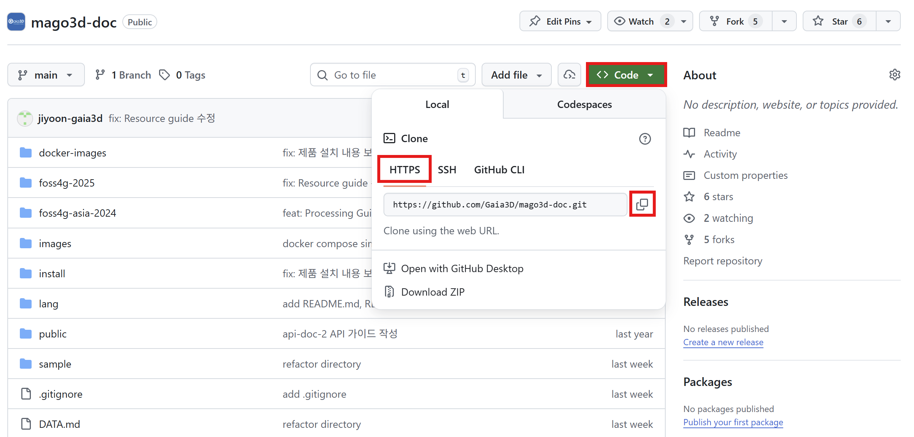

- - Open Git Bash in `C:\`

  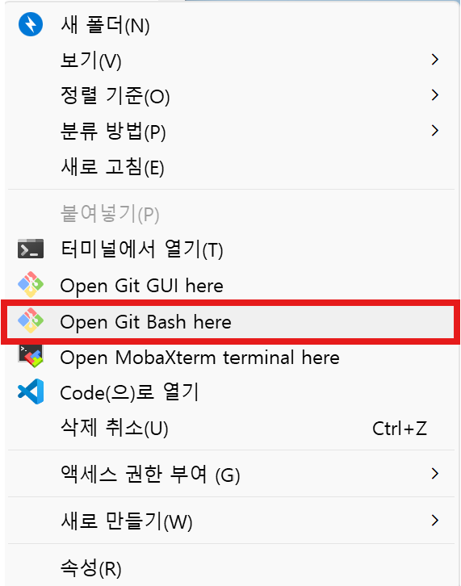

- Paste the copied URL and clone the repository.
  ```
  git clone https://github.com/Gaia3D/mago3d-doc.git
  ```
  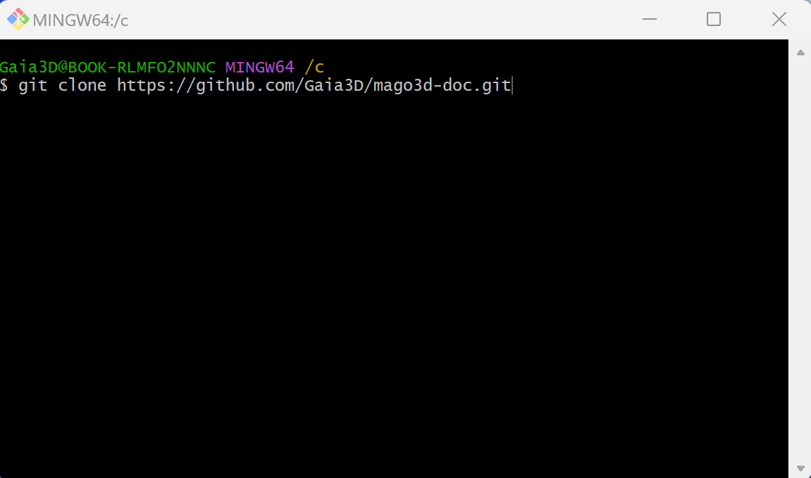

- If the `C:\mago3d-doc` folder has been created, the clone was successful.  
  You're now ready for the hands-on session. Proceed to the next step! 🚀

---
### 2. Prepare and Configure Your IDE
An IDE is a software application that helps developers efficiently write and manage code.

In the final chapter of this hands-on session, you will use an IDE to review the results.  
We recommend using Visual Studio Code or IntelliJ.

If you haven't installed one yet, you can download Visual Studio Code for free from:
[https://code.visualstudio.com/](https://code.visualstudio.com/)

---
### 3. Install and Verify Docker
Docker is a virtualization platform that allows you to package and run applications in lightweight containers.

Most of the hands-on exercises in this workshop will be executed using Docker commands.

If Docker is not installed, you will not be able to proceed with the exercises.  
Please download and install Docker from: [https://www.docker.com/](https://www.docker.com/)
- Open your terminal and check whether Docker is installed by entering the following command:
   ```sh
   docker --version
   ```
- If installed successfully, you should see output similar to:
   ```sh
   Docker version 27.3.1, build ce12230
   ```

---
### 4. Issuing a LINZ Data Service API Key
Sign up at: [https://data.linz.govt.nz/](https://data.linz.govt.nz/)

- Issue an API key as shown below.
  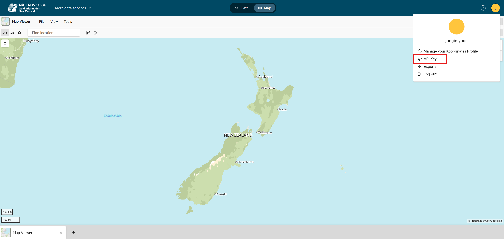

  

  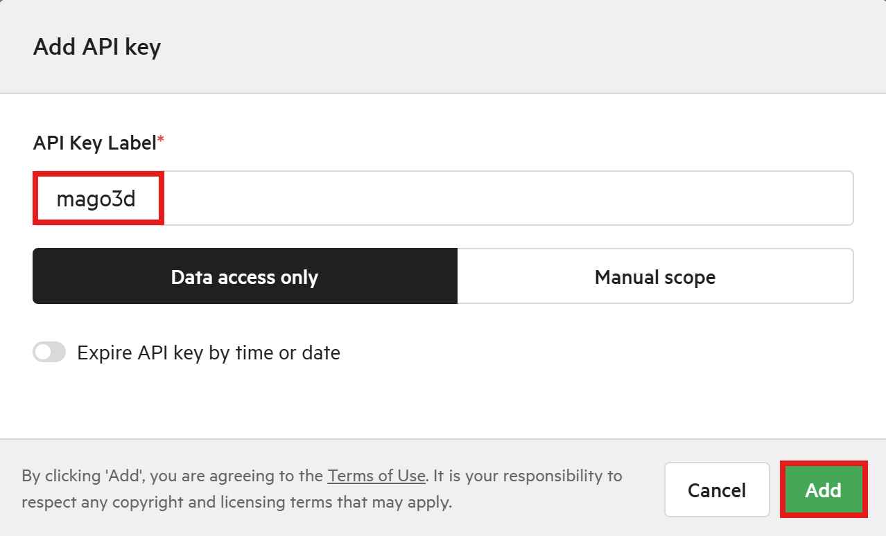

- Be sure to copy the generated API key and store it separately.

  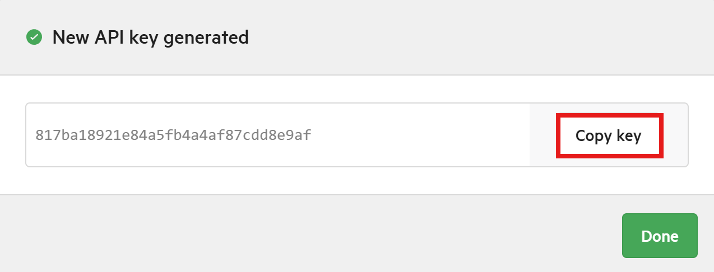

---

## Overture Maps Data

### **1. Python Installation**

- Download Python from: [https://www.python.org/downloads/](https://www.python.org/downloads/)

   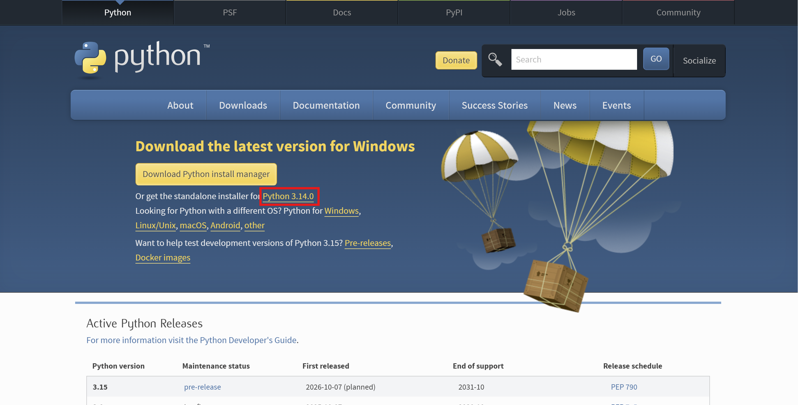

- During installation, check the box for [Add python.exe to PATH] and then click [Install Now].

   

- Open your terminal and verify that Python is installed by entering the following command:
  - #### Windows
      ```sh
      python --version
      ```
  - #### Linux/macOS
    ```sh
    python3 --version
    ```
- If installed correctly, you should see output similar to the following:
    ```sh
    Python 3.14.0
    ```

---

### **2. Create a Virtual Environment**
- Enter the following command to create a virtual environment:
  - #### Windows
    ```sh
    python -m venv myvenv
    ```
  - #### Linux/macOS
    ```sh
    python3 -m venv myvenv
    ```

- Here, `myvenv` is the name of the virtual environment. You can change it to any name you prefer.

---

### **3. Activate the Virtual Environment**

- To activate the virtual environment, enter the following command in the terminal:

  - #### Windows (Command Prompt)
    ```shell
    myvenv\Scripts\activate
    ```
  - #### Windows (PowerShell)
    ```shell
    .\myvenv\Scripts\Activate.ps1
    ```
  - #### Windows (Git Bash)
    ```shell
    source myvenv/Scripts/activate
    ```
  - #### Linux/macOS
    ```shell
    source myenv/bin/activate
    ```

- After running the command, the prompt will change to `(myvenv)`, indicating that the virtual environment is now active.

---

### **4. Install the Overture Maps Package**

- With the virtual environment activated, enter the following command in the terminal to install the Overture Maps package:
  ```shell
  pip install overturemaps
  ```

---

### **5. Overture Maps Data Download**

### Building

- #### Windows (Command Prompt)
  ```
  overturemaps download ^
      --bbox=174.7493740584586419,-36.8648980092102789,174.7949689180301220,-36.8329413929010130 ^
      -f geojson ^
      --type=building ^
      -o foss4g-2025/public/auckland_central_building.geojson
  ```
- #### Windows (PowerShell)
  ```
  overturemaps download `
      --bbox=174.7493740584586419,-36.8648980092102789,174.7949689180301220,-36.8329413929010130 `
      -f geojson `
      --type=building `
      -o foss4g-2025/public/auckland_central_building.geojson
  ```
- #### Linux/macOS
  ```
  overturemaps download \
      --bbox=174.7493740584586419,-36.8648980092102789,174.7949689180301220,-36.8329413929010130 \
      -f geojson \
      --type=building \
      -o foss4g-2025/public/auckland_central_building.geojson
  ```

- The output will be saved to the following path:
  ```
  foss4g-2025/public
  └── auckland_central_building.geojson
  ```

### Land Use

- #### Windows (Command Prompt)
  ```
  overturemaps download ^
      --bbox=174.7493740584586419,-36.8648980092102789,174.7949689180301220,-36.8329413929010130 ^
      -f geojson ^
      --type=land_use ^
      -o foss4g-2025/public/auckland_central_land_use.geojson
  ```
- #### Windows (PowerShell)
  ```
  overturemaps download `
      --bbox=174.7493740584586419,-36.8648980092102789,174.7949689180301220,-36.8329413929010130 `
      -f geojson `
      --type=land_use `
      -o foss4g-2025/public/auckland_central_land_use.geojson
  ```
- #### Linux/macOS
  ```
  overturemaps download \
      --bbox=174.7493740584586419,-36.8648980092102789,174.7949689180301220,-36.8329413929010130 \
      -f geojson \
      --type=land_use \
      -o foss4g-2025/public/auckland_central_land_use.geojson
  ```

- The output will be saved to the following path:
  ```
  foss4g-2025/public
  └── auckland_central_land_use.geojson
  ```

---
### Aerial Imagery Data

[https://data.linz.govt.nz/layer/121752-auckland-0075m-urban-aerial-photos-2024-2025/](https://data.linz.govt.nz/layer/121752-auckland-0075m-urban-aerial-photos-2024-2025/)

- Use the previously issued API key to access WMTS data.

  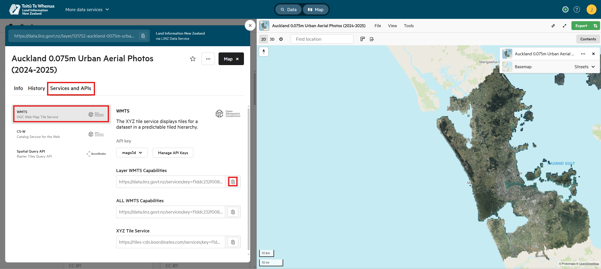

- If an XML file is returned when calling the Layer WMTS Capabilities API, it indicates that the request was successful.

  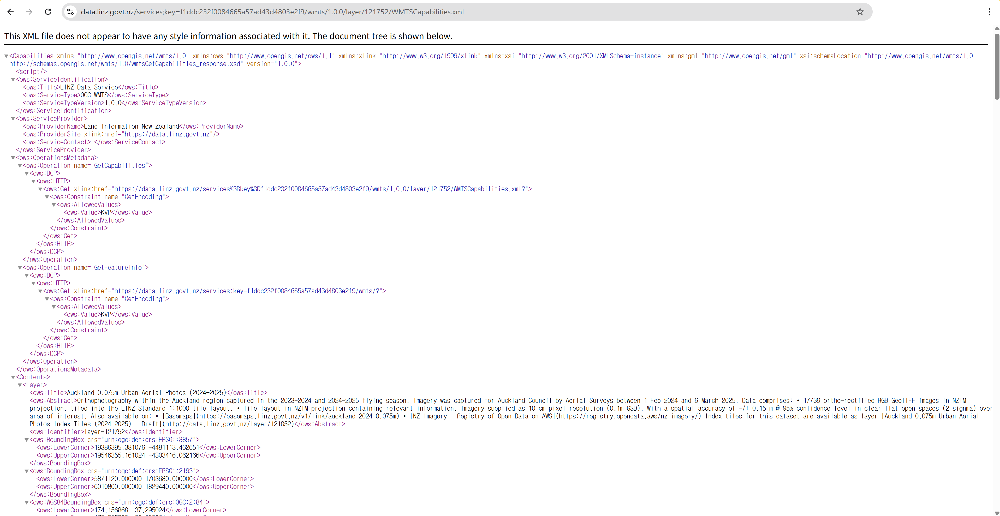

---
### Road Imagery Data

[https://data.linz.govt.nz/layer/53378-nz-roads-road-section-geometry/](https://data.linz.govt.nz/layer/53378-nz-roads-road-section-geometry/)

- Use the previously issued API key to access WMTS data.

  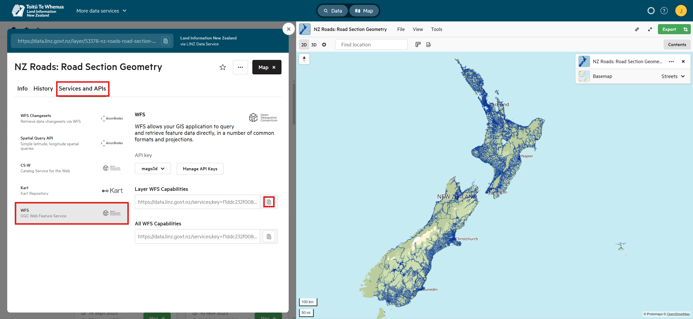

- If an XML file is returned when calling the Layer WFS Capabilities API, it indicates that the request was successful.

  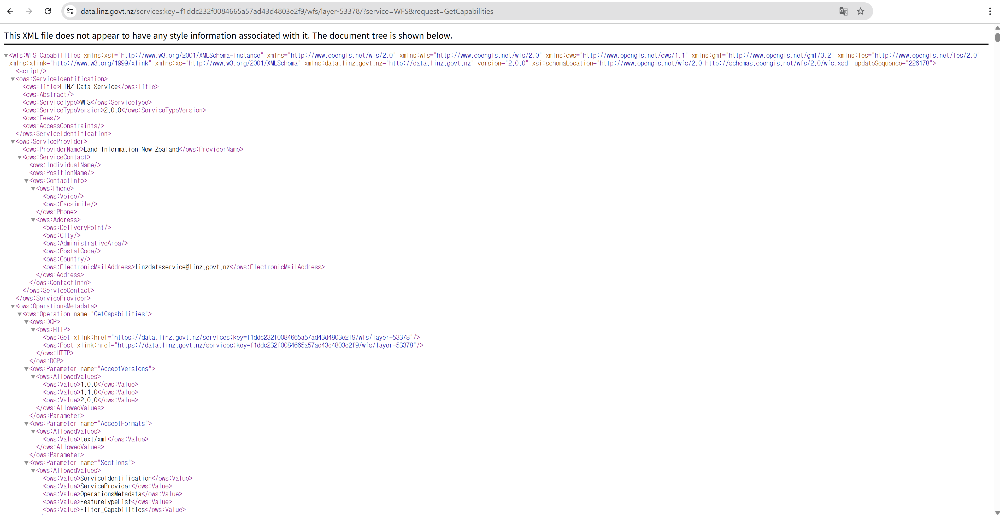

---
### DEM Data

[https://data.linz.govt.nz/layer/121859-new-zealand-lidar-1m-dem/](https://data.linz.govt.nz/layer/121859-new-zealand-lidar-1m-dem/)

- Select the desired area to download the data.

  

- Set the CRS and then click Export.

  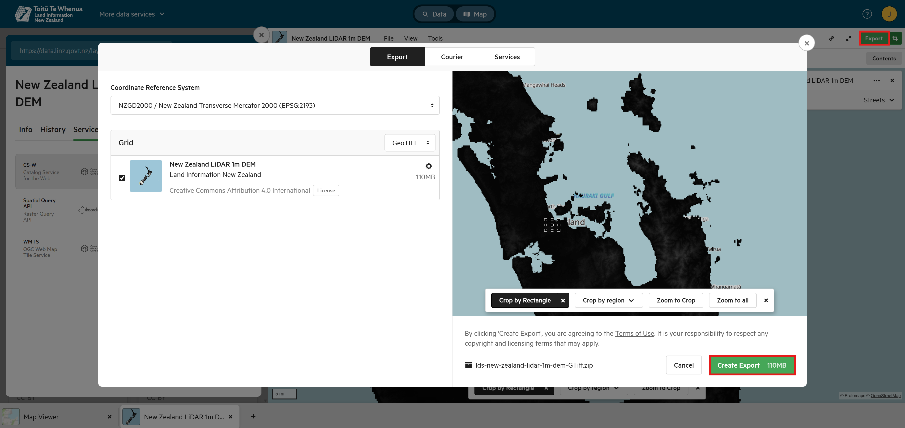

- Download the file.

  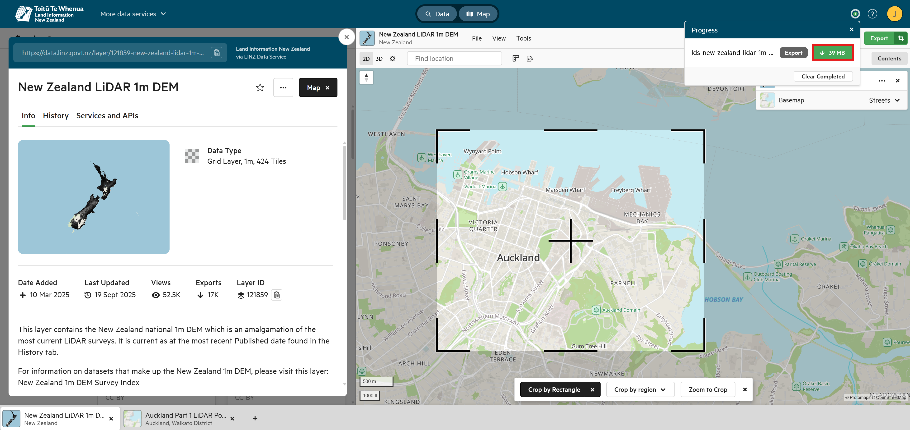

- Extract the downloaded file and copy the `BA32.tif` file to the `foss4g-2025/public` directory.

  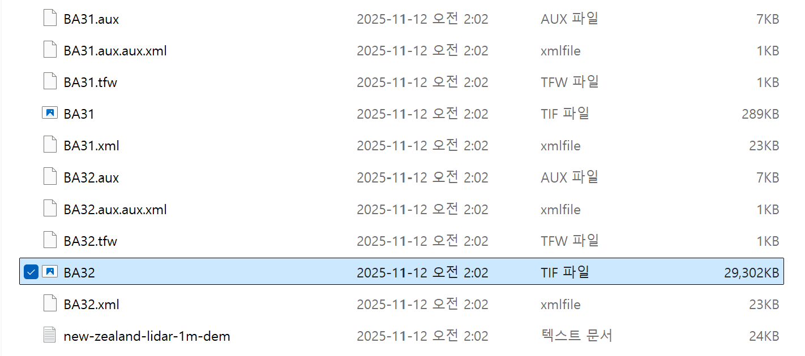

---
### Point Cloud Data

[https://data.linz.govt.nz/layer/d3VcCb5rKzNsNGk/auckland-part-1-lidar-point-cloud-2024/](https://data.linz.govt.nz/layer/d3VcCb5rKzNsNGk/auckland-part-1-lidar-point-cloud-2024/)

- Select the desired area to download the data.

  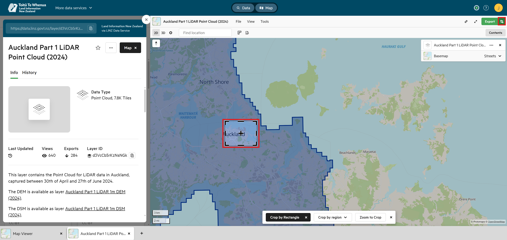

- Set the CRS and then click Export. Make sure the selected area does not exceed 50MB.

  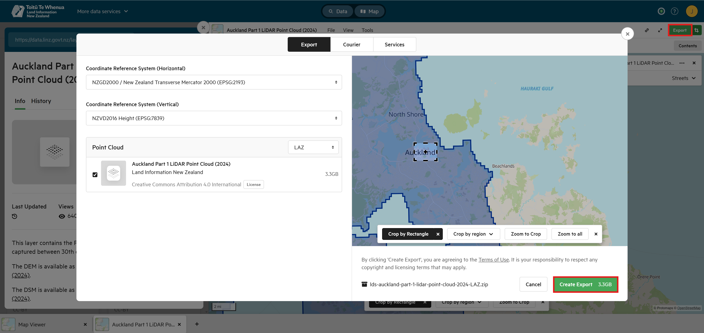

- Download the file.

  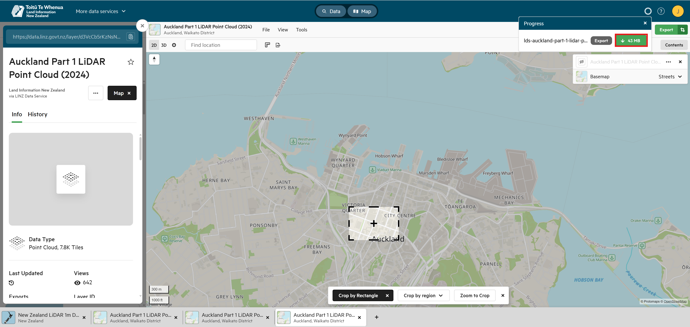

- Extract the downloaded files and copy the `.laz` files to the `foss4g-2025/public` directory.

  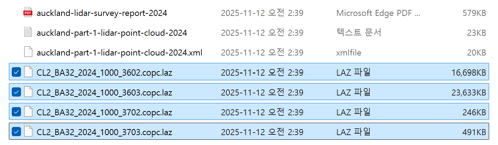