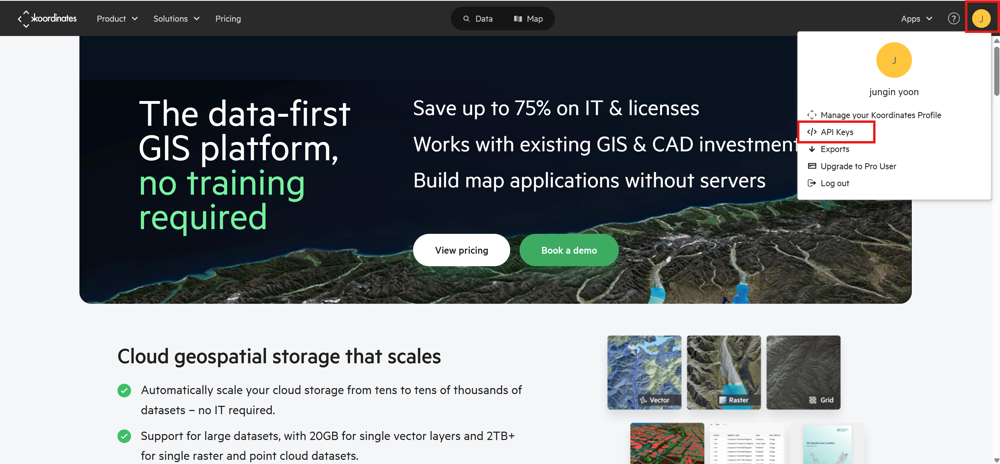

# mago3D 데이터 수집 가이드

## 기본 설정
### 워크샵 디렉터리 구조 생성

실습에 사용할 폴더를 생성합니다.  
이 폴더는 실습 과정에서 데이터를 저장하고 관리하기 위한 기본 작업 공간이 됩니다.  
Windows와 Mac/Linux 환경에 맞춰 아래 단계를 따라 진행하세요.

- Windows
  1. 명령 프롬프트 실행 
     - 시작 메뉴에서 cmd 또는 명령 프롬프트를 검색하여 실행합니다.
  2. 아래 명령어를 입력하여 폴더를 생성합니다:
     ```sh
     C:\> mkdir mago3d
     ```
  3. 생성된 폴더는 C:\mago3d 경로에 위치합니다.

- Mac / Linux
  1. 터미널 실행 
     - Mac에서는 Launchpad에서, Linux에서는 응용 프로그램 메뉴에서 터미널을 실행합니다.
  2. 아래 명령어를 입력하여 폴더를 생성합니다:
     ```sh
     mkdir ~/mago3d
     ```
  3. 생성된 폴더는 홈 디렉토리`~/mago3d`에 위치합니다.

<br/>
이제 실습 준비가 완료되었습니다. 다음 단계를 진행하세요! 🚀

---
### IDE 준비 및 구성
IDE란 프로그래머가 소프트웨어 코드를 효율적으로 개발하도록 돕는 소프트웨어 애플리케이션입니다.

실습 마지막 챕터에 IDE를 사용하여 결과물을 확인합니다.
Visual Studio Code 또는 IntelliJ 사용을 권장합니다.

설치가 안되어있으신 분들은 무료로 사용 가능한 [https://code.visualstudio.com/](https://code.visualstudio.com/) 에서 다운받으세요.

---
### Docker 설치 및 확인
도커는 애플리케이션을 컨테이너 단위로 패키징하고 실행할 수 있게 해주는 가상화 플랫폼입니다.

이번 워크샵의 대부분의 실습은 도커 명령어로 실행됩니다.

만약 도커가 설치 되어있지 않다면 실습 진행이 어려우므로, [https://www.docker.com/](https://www.docker.com/) 에서 도커를 다운 받으신 후 진행 하시기 바랍니다.

---
### koordinates API 키 발행
[https://koordinates.com/](https://koordinates.com/)가입합니다.

다음과 같이 API 키를 발행합니다


## 데이터 다운로드