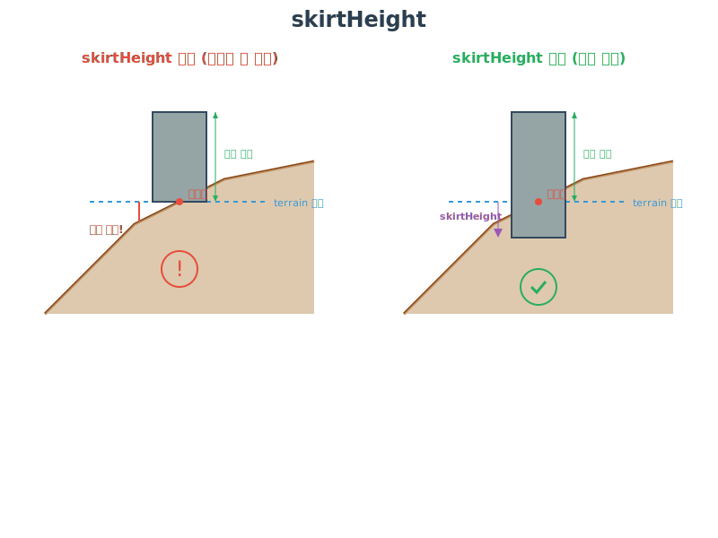

# Data Processing Guide

---

## Before You Start

### Checklist
Before starting this guide, please verify the following:

- [ ] Docker Desktop installed and running
- [ ] Source data downloaded (in `foss4g-2025/public` directory)
- [ ] Sufficient disk space available (approximately 2-4 GB recommended)
- [ ] Network connection verified (for Docker image downloads)

### Tool Versions
The versions of tools used in this guide are as follows:

- **GDAL**: 3.9.0
- **mago3DTiler**: latest
- **mago3DTerrainer**: latest

### Key Concept Introduction

**GDAL (Geospatial Data Abstraction Library)**
An open-source library that can read and write various geospatial data formats. This guide uses the `ogr2ogr` tool for vector data conversion.

**3D Tiles**
An OGC standard format for efficiently streaming and rendering large-scale 3D geospatial data on the web.

**Coordinate Reference System (CRS)**
This guide uses EPSG:4326 (WGS84 latitude/longitude coordinate system). This is the global standard coordinate system used by GPS.

### Data Preparation

This process guides you on how to process collected data for web service delivery.
We will use open-source tools for data processing.

While these tools provide powerful capabilities for implementing and visualizing urban digital twins, data conversion to formats that match each tool's characteristics and requirements is necessary.
The data conversion tasks to be performed are summarized in the following table:

| Conversion Task                 | Input Data Format      | Output Data Format                   | Tool Used                          | Estimated Time |
|---------------------------------|------------------------|--------------------------------------|------------------------------------|----------------|
| Building Data Preprocessing     | GeoJSON (.geojson)     | GeoJSON (.geojson)                   | GDAL, ogr2ogr                      | 5 min          |
| Forest Data Preprocessing       | GeoJSON (.geojson)     | GeoPackage (.gpkg)                   | GDAL, ogr2ogr                      | 5 min          |
| Terrain Data Generation         | GeoTIFF (.tif)         | terrain directory structure, layer.json | mago3DTerrainer                 | 5-10 min       |
| Building 3D Tiles Generation    | GeoJSON (.geojson)     | 3D Tiles (glb), tileset.json         | mago3DTiler                        | 5-10 min       |
| Forest 3D Tiles Generation      | GeoPackage (.gpkg)     | 3D Tiles (i3dm), tileset.json        | mago3DTiler                        | 1-2 min        |
| Point Cloud 3D Tiles Generation | LAZ (.laz)             | 3D Tiles (pnts), tileset.json        | mago3DTiler                        | 20-30 min      |

Ensure all source data is prepared in the `foss4g-2025/public` directory:

```
foss4g-2025/public/
├── auckland_central_building.geojson      # Building data
├── auckland_central_land_use.geojson      # Land use data
├── BA32.tif                               # Terrain elevation data
├── instance-LOD3.glb                      # Tree 3D model
└── *.laz                                  # Point cloud data
```
**Note**: `instance-LOD3.glb` is a tree 3D model file to be used for forest tile generation. It is included in the workshop materials and can be replaced with a different 3D model if desired.

---

## Data Preprocessing
Data preprocessing is performed using GDAL/OGR tools.
GDAL/OGR is a powerful open-source library capable of processing various geospatial data formats.
In this process, we will preprocess building and forest data using the `ogr2ogr` command.

### Building Data Preprocessing

**Purpose**: Extract and process height information from Overture Maps building data.

**Input Data Attributes**:
- `height`: Actual building height (meters)
- `num_floors`: Number of floors in the building


Building data downloaded from Overture Maps is provided in GeoJSON format.
We will process the building height information using the `ogr2ogr` command from GDAL/OGR.

**Conversion Logic**:
1. If `height` value exists, use that value
2. If `height` is missing but `num_floors` exists, calculate `num_floors × 3.3` (assuming average floor height of 3.3m)
3. If both are missing, assign default value of 3.3m

#### Windows (Command Prompt)
```shell
docker run --rm ^
  -v {YOUR_PROJECT_ROOT_DIR}/mago3d-doc/foss4g-2025/public:/data ghcr.io/osgeo/gdal:ubuntu-full-3.9.0 ogr2ogr ^
  -f "GeoJSON" /data/converted/auckland_building.geojson /data/auckland_central_building.geojson ^
  -dialect SQLite ^
  -sql "SELECT geometry, CASE WHEN height IS NOT NULL THEN height WHEN num_floors IS NOT NULL THEN num_floors * 3.3 ELSE 3.3 END AS height FROM auckland_central_building"
```

#### Windows (PowerShell)
```shell
docker run --rm `
  -v {YOUR_PROJECT_ROOT_DIR}/mago3d-doc/foss4g-2025/public:/data ghcr.io/osgeo/gdal:ubuntu-full-3.9.0 ogr2ogr `
  -f "GeoJSON" /data/converted/auckland_building.geojson /data/auckland_central_building.geojson `
  -dialect SQLite `
  -sql "SELECT geometry, CASE WHEN height IS NOT NULL THEN height WHEN num_floors IS NOT NULL THEN num_floors * 3.3 ELSE 3.3 END AS height FROM auckland_central_building"
```

#### Linux/macOS
```shell
docker run --rm \
  -v {YOUR_PROJECT_ROOT_DIR}/mago3d-doc/foss4g-2025/public:/data ghcr.io/osgeo/gdal:ubuntu-full-3.9.0 ogr2ogr \
  -f "GeoJSON" /data/converted/auckland_building.geojson /data/auckland_central_building.geojson \
  -dialect SQLite \
  -sql "SELECT geometry, CASE WHEN height IS NOT NULL THEN height WHEN num_floors IS NOT NULL THEN num_floors * 3.3 ELSE 3.3 END AS height FROM auckland_central_building"
```

**Command Explanation**:
- `docker run --rm`: Run Docker container and automatically remove after execution
- `-v {host_path}:/data`: Mount host directory to container (specify as absolute path)
- `ghcr.io/osgeo/gdal:ubuntu-full-3.9.0`: GDAL Docker image (download takes approximately 1-2 minutes on first run)
- `ogr2ogr`: Vector data conversion tool
- `-f "GeoJSON"`: Specify output format
- `-dialect SQLite`: SQL query dialect setting
- `-sql "SELECT ..."`: Data conversion logic

**Expected Output**:
```
0...10...20...30...40...50...60...70...80...90...100 - done.
```

**Result Verification**:
- Output file: `foss4g-2025/public/converted/auckland_building.geojson`
- Verify that all buildings have the `height` attribute added
  **Note**: The `height` attribute will be used in the subsequent 3D tile generation process. The unit is meters.

The building data preprocessing result is as follows.


### Forest Data Preprocessing

**Purpose**: Extract forest areas from Overture Maps land use data.

**Input Data Attributes**:
- `subtype`: Land use subtype
- `class`: Land use classification

Filter forest areas using the `subtype` and `class` attributes from the land use data.


Convert to GeoPackage format using the `ogr2ogr` command from GDAL/OGR.

#### Windows (Command Prompt)
```shell
docker run --rm ^
  -v {YOUR_PROJECT_ROOT_DIR}/mago3d-doc/foss4g-2025/public:/data ghcr.io/osgeo/gdal:ubuntu-full-3.9.0 ogr2ogr ^
  -f "GPKG" /data/converted/auckland_forest.gpkg /data/auckland_central_land_use.geojson ^
  -sql "SELECT subtype, class, 20 AS height FROM auckland_central_land_use WHERE subtype = 'park' OR (subtype = 'managed' AND class = 'grass')"
```

#### Windows (PowerShell)
```shell
docker run --rm `
    -v {YOUR_PROJECT_ROOT_DIR}/mago3d-doc/foss4g-2025/public:/data ghcr.io/osgeo/gdal:ubuntu-full-3.9.0 ogr2ogr `
    -f "GPKG" /data/converted/auckland_forest.gpkg /data/auckland_central_land_use.geojson `
    -sql "SELECT subtype, class, 20 AS height FROM auckland_central_land_use WHERE subtype = 'park' OR (subtype = 'managed' AND class = 'grass')"
```

#### Linux/macOS
```shell
docker run --rm \
    -v {YOUR_PROJECT_ROOT_DIR}/mago3d-doc/foss4g-2025/public:/data ghcr.io/osgeo/gdal:ubuntu-full-3.9.0 ogr2ogr \
    -f "GPKG" /data/converted/auckland_forest.gpkg /data/auckland_central_land_use.geojson \
    -sql "SELECT subtype, class, 20 AS height FROM auckland_central_land_use WHERE subtype = 'park' OR (subtype = 'managed' AND class = 'grass')"
```

The explanation for the above syntax is as follows:
**Command Explanation**:
- `-f "GPKG"`: Specify output format as GeoPackage (GeoJSON is also supported)
- `20 AS height`: Set tree instance height to 20m (can be adjusted to actual tree height)

[Note] The `height` attribute will be used in the subsequent 3D tile generation process. The unit is meters.

**Result Verification**:
- Output file: `foss4g-2025/public/converted/auckland_forest.gpkg`
- Verify green (filtered forest) areas within pink (total land use) areas


**After Completion**:
Upon completing this step, preprocessed vector data required for 3D tile generation will be ready.

---

## Data Conversion
Data conversion is performed using mago3DTerrainer and mago3DTiler tools.

* **mago3DTerrainer** is a tool that generates terrain data from GeoTIFF files.
* **mago3DTiler** is a tool that converts various 3D data to 3D Tiles format.
* **mago3DTiler** also supports creating 3D tiles from attribute values of 2D data.

### Terrain Data Generation

**Purpose**: Convert GeoTIFF elevation data to web-optimized terrain tiles.

**Input**: `BA32.tif` (LINZ Data Service elevation data)
**Output**: Hierarchical terrain tileset and metadata

#### Windows (Command Prompt)
```shell
docker run --rm ^
  -v {YOUR_PROJECT_ROOT_DIR}/mago3d-doc/foss4g-2025/public:/workspace gaia3d/mago-3d-terrainer ^
  --input /workspace/BA32.tif ^
  --output /workspace/output/terrain/ ^
  --log /workspace/output/terrain/log.txt ^
  --calculateNormals --minDepth 0 --maxDepth 17
```

#### Windows (PowerShell)
```shell
docker run --rm `
  -v {YOUR_PROJECT_ROOT_DIR}/mago3d-doc/foss4g-2025/public:/workspace gaia3d/mago-3d-terrainer `
  --input /workspace/BA32.tif `
  --output /workspace/output/terrain/ `
  --log /workspace/output/terrain/log.txt `
  --calculateNormals --minDepth 0 --maxDepth 17
```

#### Linux/macOS
```shell
docker run --rm \
  -v {YOUR_PROJECT_ROOT_DIR}/mago3d-doc/foss4g-2025/public:/workspace gaia3d/mago-3d-terrainer \
  --input /workspace/BA32.tif \
  --output /workspace/output/terrain/ \
  --log /workspace/output/terrain/log.txt \
  --calculateNormals --minDepth 0 --maxDepth 17
```

**Key Option Explanation**:
- `--calculateNormals`: Calculate normal vectors for lighting effects
- `--minDepth 0`: Minimum tile depth
- `--maxDepth 17`: Maximum tile depth (higher means more detailed)

**Output Directory Structure**:
```shell
tree foss4g-2025/public/output/terrain -L 1 -v
```
```
foss4g-2025/public/output/terrain
├── 0/          # LOD 0 tiles
├── 1/          # LOD 1 tiles
├── ...
├── 17/         # LOD 17 tiles
├── layer.json  # Metadata
└── report.txt  # Conversion report
```

**layer.json Example**:
```json
{
  "tilejson": "2.1.0",
  "name": "insert name here",
  "description": "insert description here",
  "version": "1.1.0",
  "format": "quantized-mesh-1.0",
  "attribution": "insert attribution here",
  "template": "terrain",
  "legend": "insert legend here",
  "scheme": "tms",
  "projection": "EPSG:4326",
  "tiles": [
    "{z}/{x}/{y}.terrain?v={version}"
  ],
  "bounds": [174.749400158197, -36.8648634141841, 174.794775308094, -36.8330127688094],
  "extensions": [
    "octvertexnormals"
  ],
  "available": [
    [
      {
        "startX": 0,
        "endX": 1,
        "startY": 0,
        "endY": 0
      }
    ]
    // omitted
  ]
}
```

**Check Additional Options**:
```shell
docker run gaia3d/mago-3d-terrainer --help
```


---

### Building 3D Tiles Generation

**Purpose**: Convert 2D building polygons with height information to 3D building models.

**Input**: `auckland_building.geojson` (preprocessed building data)
**Output**: glTF-based 3D Tiles (GLB format)

Building 3D tiles generation is performed using the mago3DTiler tool.

#### Windows (Command Prompt)
```shell
docker run --rm ^
  -v {YOUR_PROJECT_ROOT_DIR}/mago3d-doc/foss4g-2025/public:/workspace gaia3d/mago-3d-tiler ^
  --input /workspace/converted/auckland_building.geojson ^
  --output /workspace/output/tileset/buildings/ ^
  --inputType geojson ^
  --crs 4326 ^
  --heightColumn height ^
  --minimumHeight 3.3 ^
  --terrain /workspace/BA32.tif ^
  --log /workspace/output/tileset/buildings/log.txt
```

#### Windows (PowerShell)
```shell
docker run --rm `
  -v {YOUR_PROJECT_ROOT_DIR}/mago3d-doc/foss4g-2025/public:/workspace gaia3d/mago-3d-tiler `
  --input /workspace/converted/auckland_building.geojson `
  --output /workspace/output/tileset/buildings/ `
  --inputType geojson `
  --crs 4326 `
  --heightColumn height `
  --minimumHeight 3.3 `
  --terrain /workspace/BA32.tif `
  --log /workspace/output/tileset/buildings/log.txt
```

#### Linux/macOS
```shell
docker run --rm \
  -v {YOUR_PROJECT_ROOT_DIR}/mago3d-doc/foss4g-2025/public:/workspace gaia3d/mago-3d-tiler \
  --input /workspace/converted/auckland_building.geojson \
  --output /workspace/output/tileset/buildings/ \
  --inputType geojson \
  --crs 4326 \
  --heightColumn height \
  --minimumHeight 3.3 \
  --terrain /workspace/BA32.tif \
  --log /workspace/output/tileset/buildings/log.txt
```

**Key Option Explanation**:
- `--inputType geojson`: Input data format
- `--crs 4326`: Coordinate system (EPSG:4326, WGS84 latitude/longitude)
- `--heightColumn height`: Attribute column containing height information
- `--minimumHeight 3.3`: Minimum building height (meters)
- `--terrain`: Terrain data (accurately places buildings on terrain)

**Output Directory Structure**:
```shell
tree foss4g-2025/public/output/tileset/buildings -L 2 -v
```
```
foss4g-2025/public/output/tileset/buildings
├── data
│ ├── RC000.glb
│ ├── RC001.glb
│ ├── RC002.glb
│ ├── RC003.glb
│ ├── RC0030.glb
│ ├── RC00.glb
│ ├── RC01.glb
│ ├── RC010.glb
│ ├── RC011.glb
│ ├── RC012.glb
│ ├── RC013.glb
│ ├── RC0120.glb
│ └── ...
├── report.txt
└── tileset.json
```

Example `tileset.json` file is as follows:
```json
{
  "asset": {"version": "1.1"},
  "geometricError": 285.20,
  "root": {
    "boundingVolume": {
      "region": [3.0499, -0.6434, 3.0507, -0.6429, -5.138, 155.679]
    },
    "refine": "REPLACE",
    "geometricError": 285.20,
    "children": [
      {
        "boundingVolume": {
          "region": [ 3.04993281, -0.64342338, 3.05033109, -0.64303011, -3.99999905, 155.67882846 ]
        },
        "refine": "ADD",
        "geometricError": 120.1,
        "children": [{
            "boundingVolume": {
              "region": [
                3.04994507,
                -0.64341824,
                3.05014145,
                -0.64322286,
                -3.99999902,
                128.49599948
              ]
            },
            "refine": "ADD",
            "geometricError": 50.1,
            "children": [
              {
                "boundingVolume": {
                  "region": [
                    3.04994609,
                    -0.64341628,
                    3.05004485,
                    -0.64331836,
                    -3.99999902,
                    88.53333219
                  ]
                },
                "refine": "ADD",
                "geometricError": 8.1,
                "content": {
                  "uri": "data/RC000.glb"
                }
              },
              {
                "boundingVolume": {
                  "region": [
                    3.05004087,
                    -0.64341646,
                    3.05013344,
                    -0.64331882,
                    -3.99999296,
                    89.32425734
                  ]
                },
                "refine": "ADD",
                "geometricError": 8.1,
                "content": {
                  "uri": "data/RC001.glb"
                }
              },
              {
                "boundingVolume": {
                  "region": [
                    3.05004049,
                    -0.64332105,
                    3.0501333,
                    -0.64322286,
                    15.87444325,
                    91.57850883
                  ]
                },
                "refine": "ADD",
                "geometricError": 8.1,
                "content": {
                  "uri": "data/RC002.glb"
                }
              },
              {
                "boundingVolume": {
                  "region": [
                    3.04994694,
                    -0.64332188,
                    3.0500435,
                    -0.643223,
                    -3.999999,
                    75.51575125
                  ]
                },
                "refine": "ADD",
                "geometricError": 8.1,
                "children": [
                  {
                    "boundingVolume": {
                      "region": [
                        3.04996425,
                        -0.64327155,
                        3.04996463,
                        -0.64327127,
                        56.4726933,
                        63.77269329
                      ]
                    },
                    "refine": "ADD",
                    "geometricError": 0.1,
                    "content": {
                      "uri": "data/RC0030.glb"
                    }
                  }
                ],
                "content": {
                  "uri": "data/RC003.glb"
                }
              }
            ],
            "content": {
              "uri": "data/RC00.glb"
            }
          }
          // omitted
        ]
    }]
  }
}
```

**Check All Options**:

```shell
docker run gaia3d/mago-3d-tiler --help
```

**Key Options Summary**:

```
-i, --input <arg>              Input directory/file path
-o, --output <arg>             Output directory path
-it, --inputType <arg>         Input format (kml, 3ds, fbx, obj, gltf, las, laz, citygml, shp, geojson, gpkg)
-c, --crs <arg>                Coordinate reference system (EPSG code)
-hc, --heightColumn <arg>      Height attribute column name
-mh, --minimumHeight <arg>     Minimum height value
-te, --terrain <arg>           Terrain GeoTIFF file path
-sh, --skirtHeight <arg>       Building skirt height (removes terrain gaps)
-mx, --maxCount <arg>          Maximum triangles per tile
-xl, --maxLod <arg>            Maximum LOD level
```

**skirtHeight Option**:
To prevent gaps between building bases and terrain, you can add the `--skirtHeight` option:

```shell
--skirtHeight 5
```



---

### Forest 3D Tiles Generation

**Purpose**: Generate tiles with tree 3D model instances placed in forest areas.

**Input**:
- `auckland_forest.gpkg` (preprocessed forest areas)
- `instance-LOD3.glb` (tree 3D model)

**Output**: I3DM (Instanced 3D Model) format tiles

**Tree Model Preparation**:
`instance-LOD3.glb` is a tree 3D model that will be repeatedly placed in each forest area. It is included in the workshop materials and can be replaced with a different 3D model (e.g., specific tree species).

#### Windows (Command Prompt)
```shell
docker run --rm ^
  -v {YOUR_PROJECT_ROOT_DIR}/mago3d-doc/foss4g-2025/public:/workspace gaia3d/mago-3d-tiler ^
  --scaleColumn height ^
  --inputType gpkg ^
  --input /workspace/converted/auckland_forest.gpkg ^
  --outputType i3dm ^
  --output /workspace/output/tileset/forest ^
  --crs 4326 ^
  --instance /workspace/instance-LOD3.glb ^
  --terrain /workspace/BA32.tif ^
  --log /workspace/output/tileset/forest/log.txt ^
  --tilesVersion 1.0
```

#### Windows (PowerShell)
```shell
docker run --rm `
  -v {YOUR_PROJECT_ROOT_DIR}/mago3d-doc/foss4g-2025/public:/workspace gaia3d/mago-3d-tiler `
  --scaleColumn height `
  --inputType gpkg `
  --input /workspace/converted/auckland_forest.gpkg `
  --outputType i3dm `
  --output /workspace/output/tileset/forest `
  --crs 4326 `
  --instance /workspace/instance-LOD3.glb `
  --terrain /workspace/BA32.tif `
  --log /workspace/output/tileset/forest/log.txt `
  --tilesVersion 1.0
```

#### Linux/macOS
```shell
docker run --rm \
  -v {YOUR_PROJECT_ROOT_DIR}/mago3d-doc/foss4g-2025/public:/workspace gaia3d/mago-3d-tiler \
  --scaleColumn height \
  --inputType gpkg \
  --input /workspace/converted/auckland_forest.gpkg \
  --outputType i3dm \
  --output /workspace/output/tileset/forest \
  --crs 4326 \
  --instance /workspace/instance-LOD3.glb \
  --terrain /workspace/BA32.tif \
  --log /workspace/output/tileset/forest/log.txt \
  --tilesVersion 1.0
```

**Key Option Explanation**:
- `--scaleColumn height`: Height (scale) attribute for tree instances
- `--outputType i3dm`: Instance tile format output
- `--instance`: 3D model file to be repeatedly placed
- `--tilesVersion 1.0`: 3D Tiles version (I3DM uses 1.0)

**Output Directory Structure**:
```shell
tree foss4g-2025/public/output/tileset/forest -L 2 -v
```
```
foss4g-2025/public/output/tileset/forest
├── data
│ ├── RC0000.i3dm
│ ├── RC0002.i3dm
│ ├── RC0003.i3dm
│ ├── RC000.i3dm
│ ├── RC001.i3dm
│ ├── RC0010.i3dm
│ ├── RC0011.i3dm
│ ├── RC0012.i3dm
│ ├── RC0013.i3dm
│ ├── RC002.i3dm
│ ├── RC0020.i3dm
│ ├── RC0021.i3dm
│ ├── RC0022.i3dm
│ ├── RC003.i3dm
│ ├── RC0030.i3dm
│ ├── RC0031.i3dm
│ ├── RC0032.i3dm
│ ├── RC0033.i3dm
│ ├── ...
├── report.txt
└── tileset.json
```

**After Completion**:
Upon completing this step, 3D tiles with trees automatically placed in park and grass areas will be generated.

---

### Point Cloud 3D Tiles Generation

**Purpose**: Convert LiDAR point cloud data to 3D tiles for web rendering.

**Input**: `*.laz` (LAZ compressed LAS files)
**Output**: PNTS (Point Cloud) format tiles

#### Windows (Command Prompt)
```shell
docker run --rm ^
  -v {YOUR_PROJECT_ROOT_DIR}/mago3d-doc/foss4g-2025/public:/workspace gaia3d/mago-3d-tiler ^
  --input /workspace ^
  --output /workspace/output/tileset/pointcloud ^
  --log /workspace/output/tileset/pointcloud/log.txt ^
  --inputType laz ^
  --crs 4326 ^
  --pointRatio 70 ^
  --tilesVersion 1.0
```

#### Windows (PowerShell)
```shell
docker run --rm `
  -v {YOUR_PROJECT_ROOT_DIR}/mago3d-doc/foss4g-2025/public:/workspace gaia3d/mago-3d-tiler `
  --input /workspace `
  --output /workspace/output/tileset/pointcloud `
  --log /workspace/output/tileset/pointcloud/log.txt `
  --inputType laz `
  --crs 4326 `
  --pointRatio 70 `
  --tilesVersion 1.0
```

#### Linux/macOS
```shell
docker run --rm \
  -v {YOUR_PROJECT_ROOT_DIR}/mago3d-doc/foss4g-2025/public:/workspace gaia3d/mago-3d-tiler \
  --input /workspace \
  --output /workspace/output/tileset/pointcloud \
  --log /workspace/output/tileset/pointcloud/log.txt \
  --inputType laz \
  --crs 4326 \
  --pointRatio 70 \
  --tilesVersion 1.0
```

**Key Option Explanation**:
- `--inputType laz`: LAZ compressed point cloud format
- `--pointRatio 70`: Use only 70% of source data (optimize file size)
- `--tilesVersion 1.0`: 3D Tiles version

**Point Ratio Adjustment**:
- High ratio (90-100): High quality, large file size
- Medium ratio (50-70): Recommended setting, balanced
- Low ratio (30-50): Fast loading, lower quality

**Output Directory Structure**:
```shell
tree foss4g-2025/public/output/tileset/pointcloud -L 2 -v
```
```
foss4g-2025/public/output/tileset/pointcloud
├── data
│ ├── R0.pnts
│ ├── R0B.pnts
│ ├── R0BA.pnts
│ ├── R0BAA.pnts
│ ├── R0BAB.pnts
│ ├── R0BAC.pnts
│ ├── R0BAD.pnts
│ ├── R0BAE.pnts
│ ├── R0BAF.pnts
│ ├── R0BAG.pnts
│ ├── R0BAH.pnts
│ ├── R0BB.pnts
│ ├── R0BBA.pnts
│ ├── R0BBB.pnts
│ ├── R0BBC.pnts
│ ├── R0BBD.pnts
│ ├── R0BBE.pnts
│ ├── R0BBF.pnts
│ ├── R0BBH.pnts
│ ├── R0BC.pnts
│ ├── ...
├── report.txt
└── tileset.json
```

**After Completion**:
Upon completing this step, high-density point clouds will be converted to hierarchical tiles for efficient web rendering.

---

All tasks are now complete. Let's check the results! 🚀

---

## Troubleshooting

### Common Issues

**1. Docker Execution Permission Error**
```
Cannot connect to the Docker daemon
```
- **Solution**: Verify Docker Desktop is running
- Windows: Run with administrator privileges
- Linux: Add user to docker group (`sudo usermod -aG docker $USER`)

**2. Volume Mount Error**
```
Error response from daemon: invalid mount config
```
- **Solution**:
  - Verify absolute path is used
  - Check for Korean characters or spaces in the path
  - Verify Docker Desktop file sharing settings

**3. Out of Memory**
```
Container killed by OOM killer
```
- **Solution**: Increase memory allocation to at least 4GB in Docker Desktop settings

**4. Output Directory Creation Failure**
```
Failed to create output directory
```
- **Solution**: Verify output directory is writable

**5. Coordinate Transformation Error**
```
Failed to transform coordinates
```
- **Solution**: Verify `--crs` option is correct (4326)

### Performance Optimization

**Disk Space Management**:
- Clean intermediate files: Backup original files after preprocessing
- Clean unnecessary Docker images: `docker system prune`

**Processing Speed Improvement**:
- SSD recommended
- Adjust tile depth: Lower `--maxDepth` value is faster but reduces quality
- Adjust point ratio: Lower `--pointRatio` value processes faster