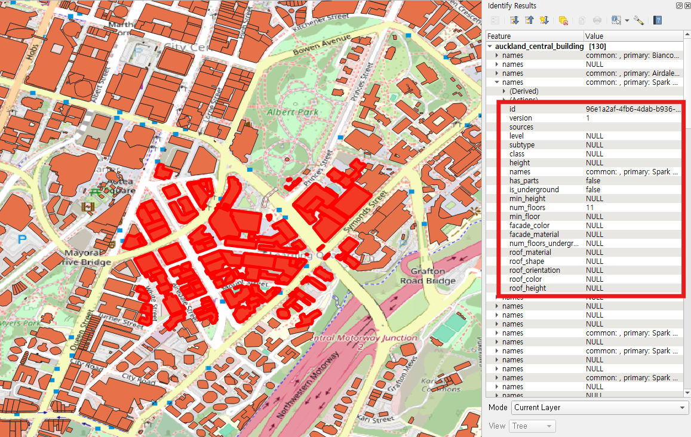
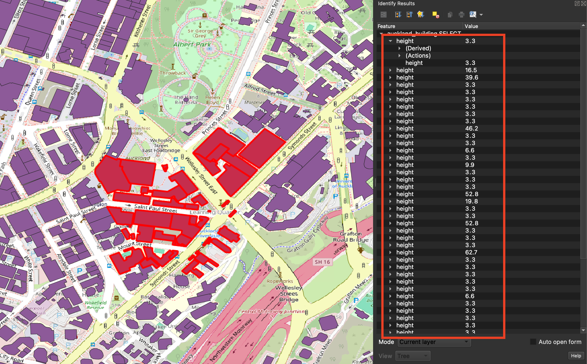
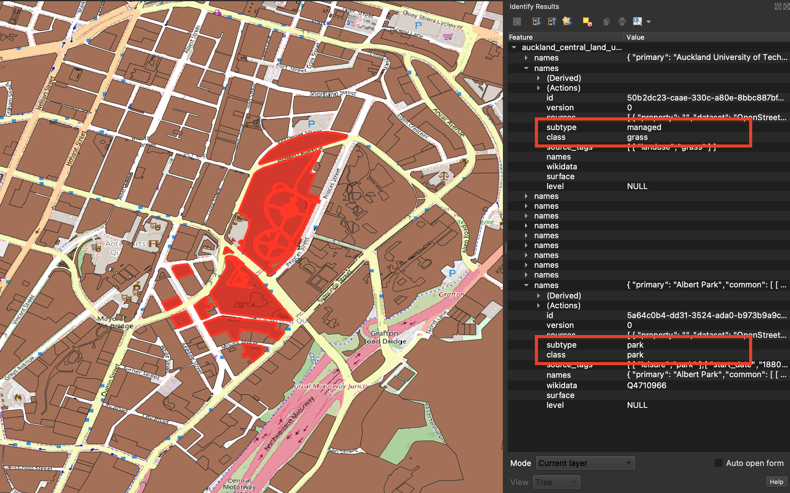
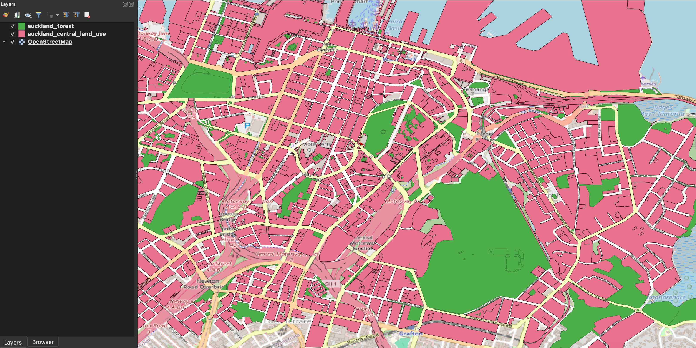
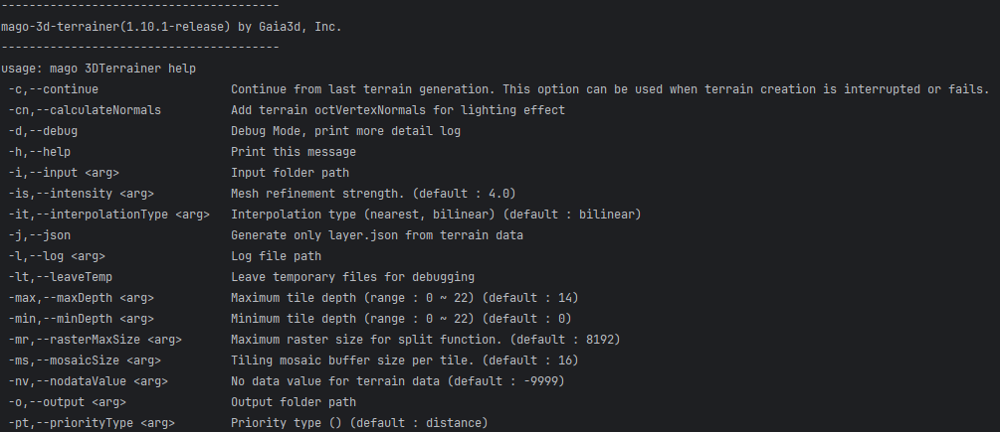
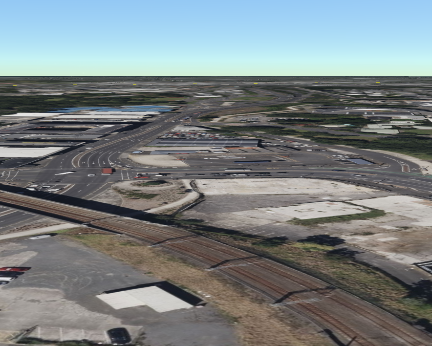
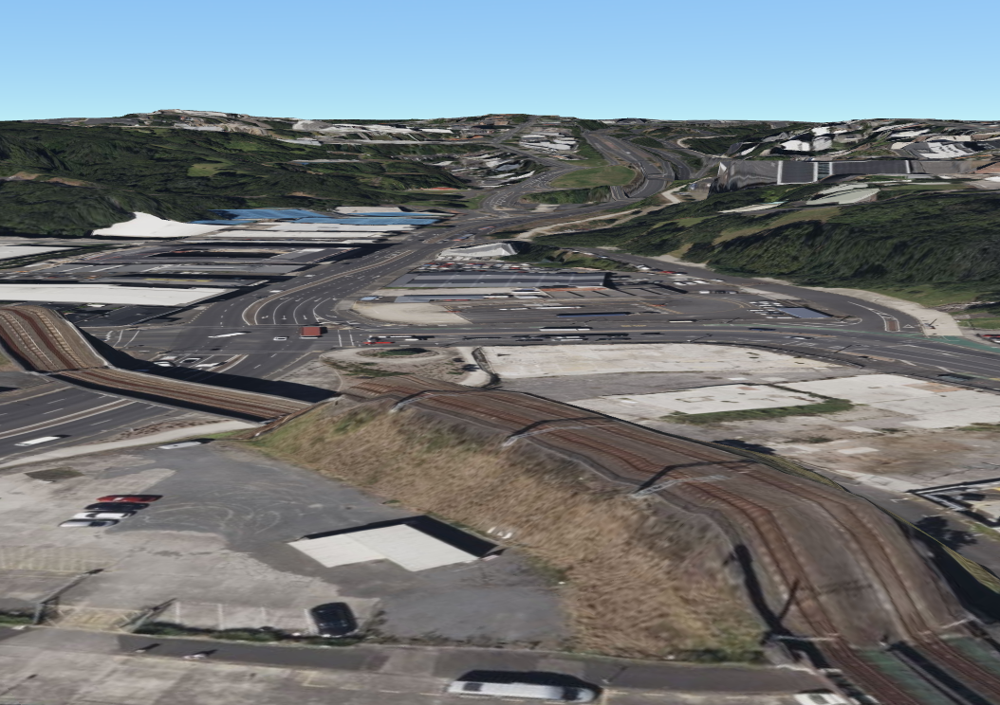
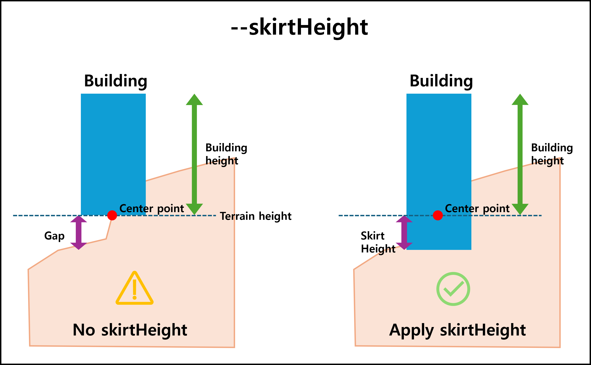
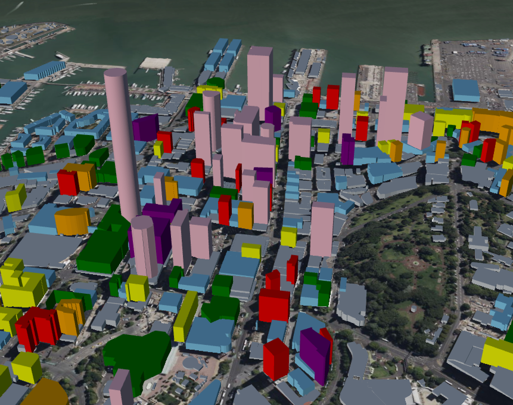
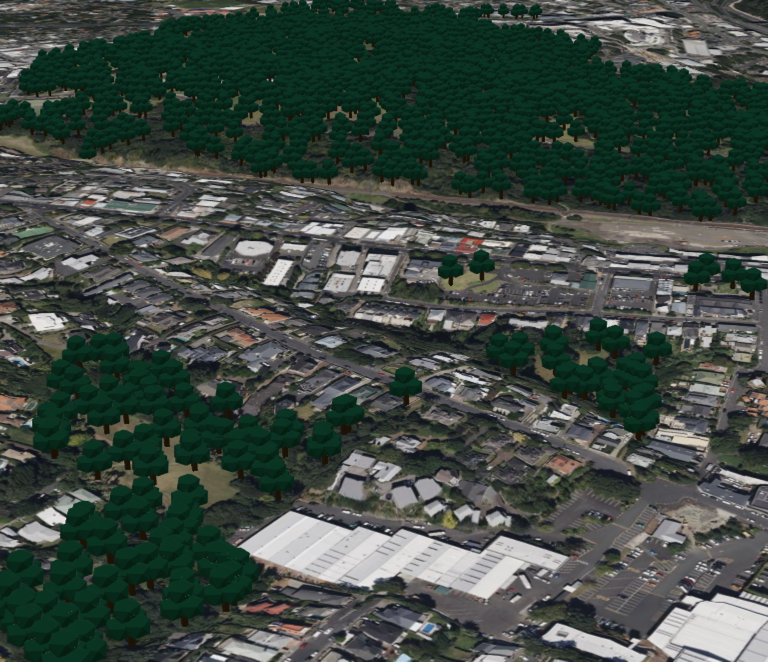

# 데이터 처리 가이드

---

## 시작하기 전에

### 체크리스트
이 가이드를 시작하기 전에 다음 사항을 확인하세요:

- [ ] Docker Desktop 설치 및 실행 확인
- [ ] 원본 데이터 다운로드 완료 (`foss4g-2025/public` 디렉토리)
- [ ] 충분한 디스크 공간 확보 (약 2-4 GB 권장)
- [ ] 네트워크 연결 확인 (Docker 이미지 다운로드용)

### 사용 도구 버전
이 가이드에서 사용하는 도구의 버전은 다음과 같습니다:

- **GDAL**: 3.9.0
- **mago3DTiler**: latest
- **mago3DTerrainer**: latest

### 주요 개념 소개

**GDAL (Geospatial Data Abstraction Library)**
다양한 지리공간 데이터 형식을 읽고 쓸 수 있는 오픈 소스 라이브러리입니다. 이 가이드에서는 벡터 데이터 변환을 위해 `ogr2ogr` 도구를 사용합니다.

**3D Tiles**
대규모 3D 지리공간 데이터를 웹에서 효율적으로 스트리밍하고 렌더링하기 위한 OGC 표준 형식입니다.

**좌표 참조 시스템 (CRS)**
이 가이드에서는 EPSG:4326 (WGS84 위경도 좌표계)을 사용합니다. 이는 GPS에서 사용하는 전 세계 표준 좌표계입니다.

### 데이터 준비

이번 과정은 수집한 데이터를 웹으로 서비스하기 위해 데이터를 처리하는 방법을 안내합니다.
이 과정에서 데이터 처리용 오픈 소스 도구를 사용합니다.

도시 디지털 트윈을 구현하고 시각화 하는데 강력한 기능을 제공하지만, 각 도구의 특성과 요구사항에 맞는 데이터 형식으로 변환이 필요합니다.
진행할 데이터 변환 작업을 표로 정리하면 다음과 같습니다.

| 변환 작업             | 입력 데이터 형식          | 출력 데이터 형식                     | 사용 도구           | 예상 소요 시간 |
|-------------------|--------------------|-------------------------------|-----------------|----------|
| 건물 데이터 전처리        | GeoJSON (.geojson) | GeoJSON (.geojson)            | GDAL, ogr2ogr   | 1분       |
| 산림 데이터 전처리        | GeoJSON (.geojson) | GeoPackage (.gpkg)            | GDAL, ogr2ogr   | 1분       |
| 지형 데이터 생성         | GeoTIFF (.tif)     | terrain 디렉토리 구조, layer.json   | mago3DTerrainer | 1-2분     |
| 건물 3D 타일 생성       | GeoJSON (.geojson) | 3D Tiles (glb), tileset.json  | mago3DTiler     | 5-10분    |
| 산림 3D 타일 생성       | GeoPackage (.gpkg) | 3D Tiles (i3dm), tileset.json | mago3DTiler     | 1-2분     |
| 포인트 클라우드 3D 타일 생성 | LAZ (.laz)         | 3D Tiles (pnts), tileset.json | mago3DTiler     | 20-30분   |

모든 원본 데이터가 `foss4g-2025/public` 디렉토리에 준비가 되었는지 확인하세요:

```
foss4g-2025/public/
├── auckland_central_building.geojson      # 건물 데이터
├── auckland_central_land_use.geojson      # 토지 이용 데이터
├── BA32.tif                               # 지형 고도 데이터
├── *.glb                                  # 나무 3D 모델
└── *.laz                                  # 포인트 클라우드 데이터
```
**참고**: `*.glb`는 산림 타일 생성에 사용할 나무 3D 모델 파일입니다. 워크샵 자료에 포함되어 있으며, 원하는 경우 다른 3D 모델로 교체할 수 있습니다.

---

## 데이터 전처리
데이터 전처리는 GDAL/OGR 도구를 사용하여 수행됩니다.
GDAL/OGR은 다양한 지리공간 데이터 형식을 처리할 수 있는 강력한 오픈 소스 라이브러리입니다.
이번 과정에서는 `ogr2ogr` 명령을 사용하여 건물과 산림 데이터를 전처리 합니다.

### 건물 데이터 전처리

**목적**: Overture Maps 건물 데이터에서 높이 정보를 추출하고 가공합니다.

**입력 데이터 속성**:
- `height`: 건물의 실제 높이 (미터)
- `num_floors`: 건물의 층수



Overture Maps에서 다운로드한 건물 데이터는 GeoJSON 형식으로 제공됩니다.   
이 데이터를 GDAL/OGR의 `ogr2ogr` 명령을 사용하여 건물 높이 정보를 가공합니다.

**변환 로직**:
1. `height` 값이 있으면 해당 값 사용
2. `height`가 없고 `num_floors`가 있으면 `num_floors × 3.3` 계산 (평균 층고 3.3m 가정)
3. 둘 다 없으면 기본값 3.3m 할당

#### Windows (Command Prompt)
```shell
docker run --rm ^
  -v {YOUR_PROJECT_ROOT_DIR}/mago3d-doc/foss4g-2025/public:/data ghcr.io/osgeo/gdal:ubuntu-full-3.9.0 ogr2ogr ^
  -f "GeoJSON" /data/auckland_building.geojson /data/auckland_central_building.geojson ^
  -dialect SQLite ^
  -sql "SELECT geometry, CASE WHEN height IS NOT NULL THEN height WHEN num_floors IS NOT NULL THEN num_floors * 3.3 ELSE 3.3 END AS height FROM auckland_central_building"
```

#### Windows (PowerShell)
```shell
docker run --rm `
  -v {YOUR_PROJECT_ROOT_DIR}/mago3d-doc/foss4g-2025/public:/data ghcr.io/osgeo/gdal:ubuntu-full-3.9.0 ogr2ogr `
  -f "GeoJSON" /data/auckland_building.geojson /data/auckland_central_building.geojson `
  -dialect SQLite `
  -sql "SELECT geometry, CASE WHEN height IS NOT NULL THEN height WHEN num_floors IS NOT NULL THEN num_floors * 3.3 ELSE 3.3 END AS height FROM auckland_central_building"
```

#### Windows (Git Bash)
```shell
docker run --rm \
  -v {YOUR_PROJECT_ROOT_DIR}/mago3d-doc/foss4g-2025/public:/data ghcr.io/osgeo/gdal:ubuntu-full-3.9.0 ogr2ogr \
  -f "GeoJSON" //data/auckland_building.geojson //data/auckland_central_building.geojson \
  -dialect SQLite \
  -sql "SELECT geometry, CASE WHEN height IS NOT NULL THEN height WHEN num_floors IS NOT NULL THEN num_floors * 3.3 ELSE 3.3 END AS height FROM auckland_central_building"
```

#### Linux/macOS
```shell
docker run --rm \
  -v {YOUR_PROJECT_ROOT_DIR}/mago3d-doc/foss4g-2025/public:/data ghcr.io/osgeo/gdal:ubuntu-full-3.9.0 ogr2ogr \
  -f "GeoJSON" /data/auckland_building.geojson /data/auckland_central_building.geojson \
  -dialect SQLite \
  -sql "SELECT geometry, CASE WHEN height IS NOT NULL THEN height WHEN num_floors IS NOT NULL THEN num_floors * 3.3 ELSE 3.3 END AS height FROM auckland_central_building"
```

**명령어 설명**:
- `docker run --rm`: Docker 컨테이너 실행 후 자동 제거
- `-v {호스트경로}:/data`: 호스트 디렉토리를 컨테이너에 마운트 (경로는 절대 경로로 지정)
- `ghcr.io/osgeo/gdal:ubuntu-full-3.9.0`: GDAL Docker 이미지 (첫 실행 시 다운로드 약 1-2분 소요)
- `ogr2ogr`: 벡터 데이터 변환 도구
- `-f "GeoJSON"`: 출력 형식 지정
- `-dialect SQLite`: SQL 쿼리 방언 설정
- `-sql "SELECT ..."`: 데이터 변환 로직

**결과 확인**:
- 출력 파일: `foss4g-2025/public/auckland_building.geojson`
- 모든 건물에 `height` 속성이 추가되었는지 확인
  **참고**: `height` 속성은 이후 3D 타일 생성 과정에서 사용됩니다. 단위는 미터입니다.

건물 데이터 전처리 결과는 다음과 같습니다.   


### 산림 데이터 전처리

**목적**: Overture Maps 토지 이용 데이터에서 산림 영역을 추출 합니다.

**입력 데이터 속성**:
- `subtype`: 토지 이용 세부 유형
- `class`: 토지 이용 분류

토지 이용 데이터에서 `subtype`과 `class` 속성을 사용하여 산림 영역을 필터링합니다.


GDAL/OGR의 `ogr2ogr` 명령을 사용하여 GeoPackage 형식으로 변환합니다.

#### Windows (Command Prompt)
```shell
docker run --rm ^
  -v {YOUR_PROJECT_ROOT_DIR}/mago3d-doc/foss4g-2025/public:/data ghcr.io/osgeo/gdal:ubuntu-full-3.9.0 ogr2ogr ^
  -f "GPKG" /data/auckland_forest.gpkg /data/auckland_central_land_use.geojson ^
  -sql "SELECT subtype, class, 20 AS height FROM auckland_central_land_use WHERE subtype = 'park' OR (subtype = 'managed' AND class = 'grass')"
```

#### Windows (PowerShell)
```shell
docker run --rm `
    -v {YOUR_PROJECT_ROOT_DIR}/mago3d-doc/foss4g-2025/public:/data ghcr.io/osgeo/gdal:ubuntu-full-3.9.0 ogr2ogr `
    -f "GPKG" /data/auckland_forest.gpkg /data/auckland_central_land_use.geojson `
    -sql "SELECT subtype, class, 20 AS height FROM auckland_central_land_use WHERE subtype = 'park' OR (subtype = 'managed' AND class = 'grass')"
```

#### Windows (Git Bash)
```shell
docker run --rm \
    -v {YOUR_PROJECT_ROOT_DIR}/mago3d-doc/foss4g-2025/public:/data ghcr.io/osgeo/gdal:ubuntu-full-3.9.0 ogr2ogr \
    -f "GPKG" //data/auckland_forest.gpkg //data/auckland_central_land_use.geojson \
    -sql "SELECT subtype, class, 20 AS height FROM auckland_central_land_use WHERE subtype = 'park' OR (subtype = 'managed' AND class = 'grass')"
```

#### Linux/macOS
```shell
docker run --rm \
    -v {YOUR_PROJECT_ROOT_DIR}/mago3d-doc/foss4g-2025/public:/data ghcr.io/osgeo/gdal:ubuntu-full-3.9.0 ogr2ogr \
    -f "GPKG" /data/auckland_forest.gpkg /data/auckland_central_land_use.geojson \
    -sql "SELECT subtype, class, 20 AS height FROM auckland_central_land_use WHERE subtype = 'park' OR (subtype = 'managed' AND class = 'grass')"
```

**명령어 설명**:   
- `-f "GPKG"`: 출력 형식을 GeoPackage로 지정 (GeoJSON도 지원 가능)
- `20 AS height`: 나무 인스턴스의 높이를 20m로 설정 (실제 나무 높이에 맞게 조정 가능)
  **참고**: `height` 속성은 이후 3D 타일 생성 과정에서 사용됩니다. 단위는 미터입니다.

**결과 확인**:
- 출력 파일: `foss4g-2025/public/auckland_forest.gpkg`
- 분홍색(전체 토지 이용) 중 초록색(필터링된 산림) 영역 확인



**완료 후 상태**:
이 단계를 완료하면 3D 타일 생성에 필요한 전처리된 벡터 데이터가 준비됩니다. 🚀

---

## ⭐ 데이터 변환 ⭐
데이터 변환은 **mago3DTerrainer** 및 **mago3DTiler** 도구를 사용하여 수행됩니다.

- **mago3DTerrainer**는 GeoTIFF 파일로 지형 데이터를 생성하는 도구입니다.
- **mago3DTiler**는 다양한 3D 데이터를 3D 타일 형식으로 변환하는 도구입니다.
- **mago3DTiler**는 2D 데이터의 속성 값으로 3D 타일 생성도 지원합니다.

### 지형

**목적**: GeoTIFF 고도 데이터를 웹 최적화 지형 타일로 변환합니다.

**입력**: `BA32.tif` (LINZ Data Service 고도 데이터)   
**출력**: 지형 타일셋과 메타데이터   

지형 생성은 **mago3DTerrainer**를 사용하여 수행됩니다.

**참고**: 다양한 좌표 참조 시스템의 원본 데이터를 수용합니다.
입력 파일의 좌표 참조 시스템을 자동으로 감지하고 올바르게 변환합니다.

#### Windows (Command Prompt)
```shell
docker run --rm ^
  -v {YOUR_PROJECT_ROOT_DIR}/mago3d-doc/foss4g-2025/public:/workspace gaia3d/mago-3d-terrainer ^
  --input /workspace/BA32.tif ^
  --output /workspace/output/terrain/ ^
  --log /workspace/output/terrain/log.txt ^
  --calculateNormals --minDepth 0 --maxDepth 17
```

#### Windows (PowerShell)
```shell
docker run --rm `
  -v {YOUR_PROJECT_ROOT_DIR}/mago3d-doc/foss4g-2025/public:/workspace gaia3d/mago-3d-terrainer `
  --input /workspace/BA32.tif `
  --output /workspace/output/terrain/ `
  --log /workspace/output/terrain/log.txt `
  --calculateNormals --minDepth 0 --maxDepth 17
```

#### Windows (Git Bash)
```shell
docker run --rm \
  -v {YOUR_PROJECT_ROOT_DIR}/mago3d-doc/foss4g-2025/public:/workspace gaia3d/mago-3d-terrainer \
  --input //workspace/BA32.tif \
  --output //workspace/output/terrain/ \
  --log //workspace/output/terrain/log.txt \
  --calculateNormals --minDepth 0 --maxDepth 17
```

#### Linux/macOS
```shell
docker run --rm \
  -v {YOUR_PROJECT_ROOT_DIR}/mago3d-doc/foss4g-2025/public:/workspace gaia3d/mago-3d-terrainer \
  --input /workspace/BA32.tif \
  --output /workspace/output/terrain/ \
  --log /workspace/output/terrain/log.txt \
  --calculateNormals --minDepth 0 --maxDepth 17
```

**주요 옵션 설명**:
- `--input`: 입력 GeoTIFF 파일/디렉토리 경로
- `--output`: 출력 디렉토리 경로
- `--calculateNormals`: 조명 효과를 위한 Vertex Normal 계산, 지형 octVertexNormals 추가 (권장)
- `--minDepth 0`: 최소 타일 깊이, 범위 : 0 ~ 22, 기본값 : 0
- `--maxDepth 17`: 최대 타일 깊이, 범위 : 0 ~ 22, 기본값 : 14 (높을수록 더 세밀함)

**추가 옵션 확인**:
```shell
docker run --rm gaia3d/mago-3d-terrainer --help
```


**주요 옵션 요약**:
- `--intensity <arg>`: 메시 세분화 강도. (기본값 : 4.0)
- `--interpolationType <arg>`: 보간 타입 (nearest, bilinear) (기본값 : bilinear)
- `--nodataValue <arg>`: 지형 데이터의 no data 값 (기본값 : -9999)

**출력 디렉토리 구조**:
```
foss4g-2025/public/output/terrain
├── 0/          # LOD 0 타일
├── 1/          # LOD 1 타일
├── ...
├── 17/         # LOD 17 타일
├── layer.json  # 메타데이터
└── report.txt  # 변환 보고서
```

**layer.json 예시**:
```json
{
  "tilejson": "2.1.0",
  "name": "insert name here",
  "description": "insert description here",
  "version": "1.1.0",
  "format": "quantized-mesh-1.0",
  "attribution": "insert attribution here",
  "template": "terrain",
  "legend": "insert legend here",
  "scheme": "tms",
  "projection": "EPSG:4326",
  "tiles": [
    "{z}/{x}/{y}.terrain?v={version}"
  ],
  "bounds": [174.749400158197, -36.8648634141841, 174.794775308094, -36.8330127688094],
  "extensions": [ "octvertexnormals" ],
  "available": [
    [{"startX": 0, "endX": 1, "startY": 0, "endY": 0}]
    // 생략
  ]
}
```

**결과 미리보기**:



---

### 건물

**목적**: 높이 정보가 있는 2D 건물 풋프린트를 3D 건물 모델로 변환합니다.

**입력**: `auckland_building.geojson` (전처리된 건물 데이터)
**출력**: glTF 기반 3D Tiles (GLB 형식)

건물 3D 타일 생성은 mago3DTiler 도구를 사용하여 수행됩니다.

#### Windows (Command Prompt)
```shell
docker run --rm ^
  -v {YOUR_PROJECT_ROOT_DIR}/mago3d-doc/foss4g-2025/public:/workspace gaia3d/mago-3d-tiler ^
  --input /workspace/auckland_building.geojson ^
  --output /workspace/output/tileset/buildings/ ^
  --inputType geojson ^
  --crs 4326 ^
  --heightColumn height ^
  --minimumHeight 3.3 ^
  --terrain /workspace/BA32.tif ^
  --log /workspace/output/tileset/buildings/log.txt
```

#### Windows (PowerShell)
```shell
docker run --rm `
  -v {YOUR_PROJECT_ROOT_DIR}/mago3d-doc/foss4g-2025/public:/workspace gaia3d/mago-3d-tiler `
  --input /workspace/auckland_building.geojson `
  --output /workspace/output/tileset/buildings/ `
  --inputType geojson `
  --crs 4326 `
  --heightColumn height `
  --minimumHeight 3.3 `
  --terrain /workspace/BA32.tif `
  --log /workspace/output/tileset/buildings/log.txt
```

#### Windows (Git Bash)
```shell
docker run --rm \
  -v {YOUR_PROJECT_ROOT_DIR}/mago3d-doc/foss4g-2025/public:/workspace gaia3d/mago-3d-tiler \
  --input //workspace/auckland_building.geojson \
  --output //workspace/output/tileset/buildings/ \
  --inputType geojson \
  --crs 4326 \
  --heightColumn height \
  --minimumHeight 3.3 \
  --terrain //workspace/BA32.tif \
  --log //workspace/output/tileset/buildings/log.txt
```

#### Linux/macOS
```shell
docker run --rm \
  -v {YOUR_PROJECT_ROOT_DIR}/mago3d-doc/foss4g-2025/public:/workspace gaia3d/mago-3d-tiler \
  --input /workspace/auckland_building.geojson \
  --output /workspace/output/tileset/buildings/ \
  --inputType geojson \
  --crs 4326 \
  --heightColumn height \
  --minimumHeight 3.3 \
  --terrain /workspace/BA32.tif \
  --log /workspace/output/tileset/buildings/log.txt
```

**주요 옵션 설명**:
- `--inputType geojson`: 입력 데이터 형식
- `--crs 4326`: 좌표계 (EPSG:4326, WGS84 위경도)
- `--heightColumn height`: 높이 정보를 담은 속성 컬럼
- `--minimumHeight 3.3`: 최소 건물 높이 (미터)
- `--terrain`: 지형 데이터 (건물을 지형에 정확히 배치)

**출력 디렉토리 구조**:
```
foss4g-2025/public/output/tileset/buildings
├── data
│ ├── RC000.glb
│ ├── RC001.glb
│ ├── RC002.glb
│ ├── RC003.glb
│ ├── RC0030.glb
│ ├── RC00.glb
│ ├── RC01.glb
│ ├── RC010.glb
│ ├── RC011.glb
│ ├── RC012.glb
│ ├── RC013.glb
│ ├── RC0120.glb
│ └── ...
├── report.txt
└── tileset.json
```

예시 `tileset.json` 파일은 다음과 같습니다:
```json
{
  "asset": {"version": "1.1"},
  "geometricError": 285.20,
  "root": {
    "boundingVolume": {"region": [3.0499, -0.6434, 3.0507, -0.6429, -5.138, 155.679]},
    "refine": "REPLACE",
    "geometricError": 285.20,
    "children": [
      {
        "boundingVolume": {"region": [ 3.04993281, -0.64342338, 3.05033109, -0.64303011, -3.99999905, 155.67882846 ]},
        "refine": "ADD",
        "geometricError": 120.1,
        "children": [{
            "content": {
              "uri": "data/RC00.glb"
            },
            "boundingVolume": {"region": [3.04994507, -0.64341824, 3.05014145, -0.64322286, -3.99999902, 128.49599948]},
            "refine": "ADD",
            "geometricError": 50.1,
            "children": [
              {
                "boundingVolume": {"region": [3.04994609, -0.64341628, 3.05004485, -0.64331836, -3.99999902, 88.53333219]},
                "refine": "ADD",
                "geometricError": 8.1,
                "content": {
                  "uri": "data/RC000.glb"
                }
              },
              {
                "boundingVolume": {"region": [3.05004087, -0.64341646, 3.05013344, -0.64331882, -3.99999296, 89.32425734]},
                "refine": "ADD",
                "geometricError": 8.1,
                "content": {
                  "uri": "data/RC001.glb"
                }
              },
              {
                "boundingVolume": {"region": [3.05004049, -0.64332105, 3.0501333, -0.64322286, 15.87444325, 91.57850883]},
                "refine": "ADD",
                "geometricError": 8.1,
                "content": {
                  "uri": "data/RC002.glb"
                }
              },
              {
                "content": {
                  "uri": "data/RC003.glb"
                },
                "boundingVolume": {"region": [3.04994694, -0.64332188, 3.0500435, -0.643223, -3.999999, 75.51575125]},
                "refine": "ADD",
                "geometricError": 8.1,
                "children": [{
                    "boundingVolume": {"region": [3.04996425, -0.64327155, 3.04996463, -0.64327127, 56.4726933, 63.77269329]},
                    "refine": "ADD",
                    "geometricError": 0.1,
                    "content": {
                      "uri": "data/RC0030.glb"
                    }
                }]
              }
            ]
        }]
    }]
  }
}
```

**모든 옵션 확인**:
```shell
docker run --rm gaia3d/mago-3d-tiler --help
```

**주요 옵션 요약**:

```
-i, --input <arg>              입력 디렉토리/파일 경로
-o, --output <arg>             출력 디렉토리 경로
-it, --inputType <arg>         입력 형식 (kml, 3ds, fbx, obj, gltf, las, laz, citygml, shp, geojson, gpkg)
-c, --crs <arg>                좌표 참조 시스템 (EPSG 코드)
-hc, --heightColumn <arg>      높이 속성 열 이름
-mh, --minimumHeight <arg>     최소 높이 값
-te, --terrain <arg>           지형 GeoTIFF 파일 경로
-sh, --skirtHeight <arg>       건물 스커트 높이 (지형 간격 제거)
-mx, --maxCount <arg>          타일당 최대 삼각형 수
-xl, --maxLod <arg>            최대 LOD 레벨
```

**skirtHeight 옵션**:   
건물 바닥과 지형 사이의 틈을 방지하려면 `--skirtHeight` 옵션을 추가할 수 있습니다



**결과 미리보기**:



---

### 산림

**목적**: 산림 영역에 나무 3D 모델 인스턴스를 배치한 타일을 생성합니다.

**입력**:
- `auckland_forest.gpkg` (전처리된 산림 영역)
- `mix-tree-1m.glb` (나무 3D 모델)

**출력**: I3DM(Instanced 3D Model) 형식 타일

**나무 모델 준비**:
`mix-tree-1m.glb`는 각 산림 영역에 반복 배치될 나무 3D 모델입니다. 워크샵 자료에 포함되어 있으며, 다른 3D 모델(예: 특정 나무 종)로 교체 가능합니다.

#### Windows (Command Prompt)
```shell
docker run --rm ^
  -v {YOUR_PROJECT_ROOT_DIR}/mago3d-doc/foss4g-2025/public:/workspace gaia3d/mago-3d-tiler ^
  --scaleColumn height ^
  --inputType gpkg ^
  --input /workspace/auckland_forest.gpkg ^
  --outputType i3dm ^
  --output /workspace/output/tileset/forest ^
  --crs 4326 ^
  --instance /workspace/mix-tree-1m.glb ^
  --terrain /workspace/BA32.tif ^
  --log /workspace/output/tileset/forest/log.txt ^
  --tilesVersion 1.0
```

#### Windows (PowerShell)
```shell
docker run --rm `
  -v {YOUR_PROJECT_ROOT_DIR}/mago3d-doc/foss4g-2025/public:/workspace gaia3d/mago-3d-tiler `
  --scaleColumn height `
  --inputType gpkg `
  --input /workspace/auckland_forest.gpkg `
  --outputType i3dm `
  --output /workspace/output/tileset/forest `
  --crs 4326 `
  --instance /workspace/mix-tree-1m.glb `
  --terrain /workspace/BA32.tif `
  --log /workspace/output/tileset/forest/log.txt `
  --tilesVersion 1.0
```

#### Windows (Git Bash)
```shell
docker run --rm \
  -v {YOUR_PROJECT_ROOT_DIR}/mago3d-doc/foss4g-2025/public:/workspace gaia3d/mago-3d-tiler \
  --scaleColumn height \
  --inputType gpkg \
  --input //workspace/auckland_forest.gpkg \
  --outputType i3dm \
  --output //workspace/output/tileset/forest \
  --crs 4326 \
  --instance //workspace/mix-tree-1m.glb \
  --terrain //workspace/BA32.tif \
  --log //workspace/output/tileset/forest/log.txt \
  --tilesVersion 1.0
```

#### Linux/macOS
```shell
docker run --rm \
  -v {YOUR_PROJECT_ROOT_DIR}/mago3d-doc/foss4g-2025/public:/workspace gaia3d/mago-3d-tiler \
  --scaleColumn height \
  --inputType gpkg \
  --input /workspace/auckland_forest.gpkg \
  --outputType i3dm \
  --output /workspace/output/tileset/forest \
  --crs 4326 \
  --instance /workspace/mix-tree-1m.glb \
  --terrain /workspace/BA32.tif \
  --log /workspace/output/tileset/forest/log.txt \
  --tilesVersion 1.0
```

**주요 옵션 설명**:
- `--scaleColumn height`: 나무 인스턴스의 높이(스케일) 속성
- `--outputType i3dm`: 인스턴스 타일 형식 출력
- `--instance`: 반복 배치할 3D 모델 파일
- `--tilesVersion 1.0`: 3D Tiles 버전 (I3DM은 1.0 사용)

**출력 디렉토리 구조**:
```
foss4g-2025/public/output/tileset/forest
├── data
│ ├── RC0000.i3dm
│ ├── RC0002.i3dm
│ ├── RC0003.i3dm
│ ├── RC000.i3dm
│ ├── RC001.i3dm
│ ├── RC0010.i3dm
│ ├── RC0011.i3dm
│ ├── RC0012.i3dm
│ ├── RC0013.i3dm
│ ├── RC002.i3dm
│ ├── RC0020.i3dm
│ ├── RC0021.i3dm
│ ├── RC0022.i3dm
│ ├── RC003.i3dm
│ ├── RC0030.i3dm
│ ├── RC0031.i3dm
│ ├── RC0032.i3dm
│ ├── RC0033.i3dm
│ ├── ...
├── report.txt
└── tileset.json
```

**완료 후 상태**:
이 단계를 완료하면 공원과 잔디 지역에 나무가 자동으로 배치된 3D 타일이 생성됩니다.

**결과 미리보기**:


---

### 포인트 클라우드

**목적**: LiDAR 포인트 클라우드 데이터를 웹 렌더링용 3D 타일로 변환합니다.

**입력**: `*.laz` (LAZ 압축 LAS 파일)  
**출력**: PNTS(Point Cloud) 형식 타일

#### Windows (Command Prompt)
```shell
docker run --rm ^
  -v {YOUR_PROJECT_ROOT_DIR}/mago3d-doc/foss4g-2025/public:/workspace gaia3d/mago-3d-tiler ^
  --input /workspace ^
  --output /workspace/output/tileset/pointcloud ^
  --log /workspace/output/tileset/pointcloud/log.txt ^
  --inputType laz ^
  --crs 2193 ^
  --pointRatio 70 ^
  --tilesVersion 1.0
```

#### Windows (PowerShell)
```shell
docker run --rm `
  -v {YOUR_PROJECT_ROOT_DIR}/mago3d-doc/foss4g-2025/public:/workspace gaia3d/mago-3d-tiler `
  --input /workspace `
  --output /workspace/output/tileset/pointcloud `
  --log /workspace/output/tileset/pointcloud/log.txt `
  --inputType laz `
  --crs 2193 `
  --pointRatio 70 `
  --tilesVersion 1.0
```

#### Windows (Git Bash)
```shell
docker run --rm \
  -v {YOUR_PROJECT_ROOT_DIR}/mago3d-doc/foss4g-2025/public:/workspace gaia3d/mago-3d-tiler \
  --input //workspace \
  --output //workspace/output/tileset/pointcloud \
  --log //workspace/output/tileset/pointcloud/log.txt \
  --inputType laz \
  --crs 2193 \
  --pointRatio 70 \
  --tilesVersion 1.0
```

#### Linux/macOS
```shell
docker run --rm \
  -v {YOUR_PROJECT_ROOT_DIR}/mago3d-doc/foss4g-2025/public:/workspace gaia3d/mago-3d-tiler \
  --input /workspace \
  --output /workspace/output/tileset/pointcloud \
  --log /workspace/output/tileset/pointcloud/log.txt \
  --inputType laz \
  --crs 2193 \
  --pointRatio 70 \
  --tilesVersion 1.0
```

**주요 옵션 설명**:
- `--inputType laz`: LAZ 압축 포인트 클라우드 형식
- `--pointRatio 70`: 원본 데이터의 70%만 사용 (파일 크기 최적화)
- `--tilesVersion 1.0`: 3D Tiles 버전
- **참고**: Auckland LiDAR 데이터의 좌표 참조 시스템은 **EPSG:2193** (New Zealand Transverse Mercator 2000)입니다.

**출력 디렉토리 구조**:
```
foss4g-2025/public/output/tileset/pointcloud
├── data
│ ├── R0.pnts
│ ├── R0B.pnts
│ ├── R0BA.pnts
│ ├── R0BAA.pnts
│ ├── R0BAB.pnts
│ ├── R0BAC.pnts
│ ├── R0BAD.pnts
│ ├── R0BAE.pnts
│ ├── R0BAF.pnts
│ ├── R0BAG.pnts
│ ├── R0BAH.pnts
│ ├── R0BB.pnts
│ ├── R0BBA.pnts
│ ├── R0BBB.pnts
│ ├── R0BBC.pnts
│ ├── R0BBD.pnts
│ ├── R0BBE.pnts
│ ├── R0BBF.pnts
│ ├── R0BBH.pnts
│ ├── R0BC.pnts
│ ├── ...
├── report.txt
└── tileset.json
```

**완료 후 상태**:
이 단계를 완료하면 고밀도 포인트 클라우드가 계층적 타일로 변환되어 웹에서 효율적으로 렌더링할 수 있습니다.

**결과 미리보기**:


---

이제 모든 작업이 완료되었습니다. 결과물을 확인해봅시다! 🚀

---

## 문제 해결

### 일반적인 문제

**1. Docker 실행 권한 오류**
```
Cannot connect to the Docker daemon
```
- **해결**: Docker Desktop이 실행 중인지 확인
- Windows: 관리자 권한으로 실행
- Linux: 사용자를 docker 그룹에 추가 (`sudo usermod -aG docker $USER`)

**2. 볼륨 마운트 오류**
```
Error response from daemon: invalid mount config
```
- **해결**:
  - 절대 경로 사용 확인
  - 경로에 한글이나 공백이 없는지 확인
  - Docker Desktop의 파일 공유 설정 확인

**3. 메모리 부족**
```
Container killed by OOM killer
```
- **해결**: Docker Desktop 설정에서 메모리 할당을 최소 4GB 이상으로 증가

**4. 출력 디렉토리 생성 실패**
```
Failed to create output directory
```
- **해결**: 출력 디렉토리가 쓰기 가능한지 확인

**5. 좌표계 변환 오류**
```
Failed to transform coordinates
```
- **해결**: `--crs` 옵션이 올바른지 확인 (4326)

### 성능 최적화

**디스크 공간 관리**:
- 중간 파일 정리: 전처리 후 원본 파일 백업
- 불필요한 Docker 이미지 정리: `docker system prune`

**처리 속도 향상**:
- SSD 사용 권장
- 타일 깊이 조정: `--maxDepth` 값을 낮추면 빠르지만 품질 감소
- 포인트 비율 조정: `--pointRatio` 값을 낮추면 빠르게 처리