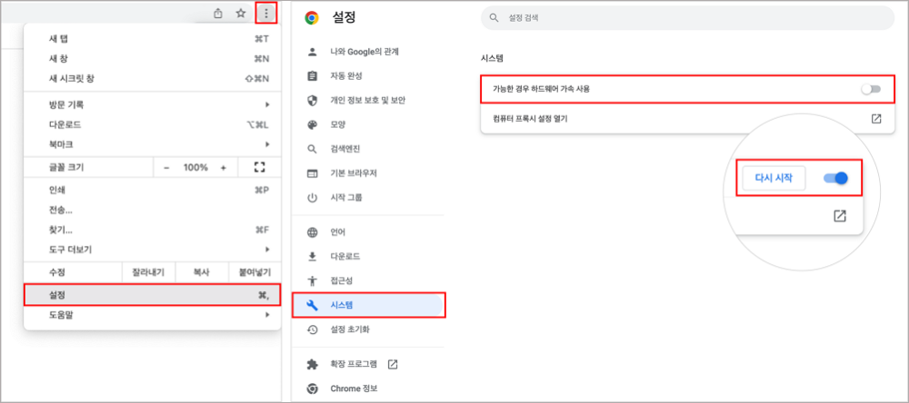
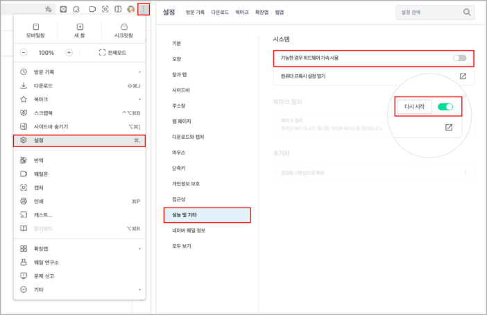
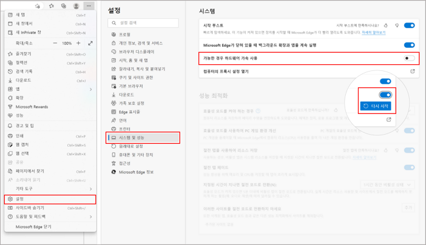

# 1. Google Chrome

#### 1) 브라우저 창 오른쪽 위 더보기(︙) 버튼 > 설정
#### 2) 시스템 > 가능한 경우 하드웨어 가속 사용 켜기 > 다시 시작

# 2. 네이버 웨일

#### 1) 브라우저 창 오른쪽 위 더보기(︙) 버튼 > 설정
#### 2) 성능 및 기타 > 가능한 경우 하드웨어 가속 사용 켜기 > 다시 시작

# 3. Microsoft Edge

#### 1) 브라우저 창 오른쪽 위 더보기(⋯) 버튼> 설정
#### 2) 시스템 및 성능 > 가능한 경우 하드웨어 가속 사용 켜기 > 다시 시작

# 4. Safari
#### Safari는 macOS Catalina(v10.15) 이후부터 자동으로 하드웨어 가속 사용이 켜집니다.
