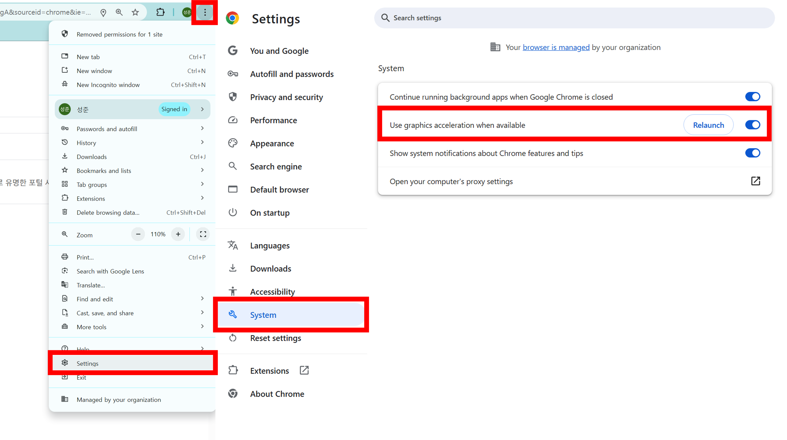
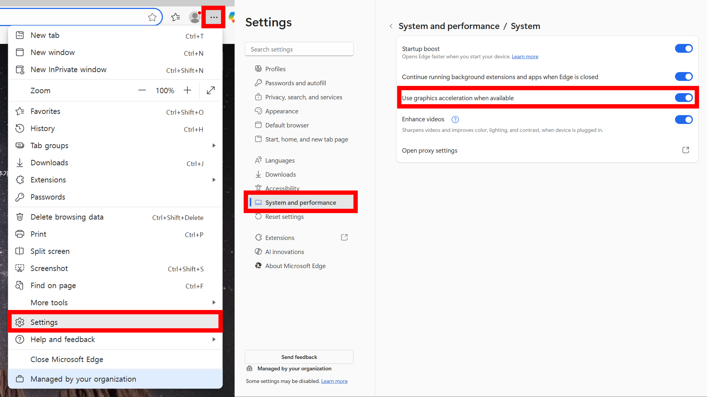
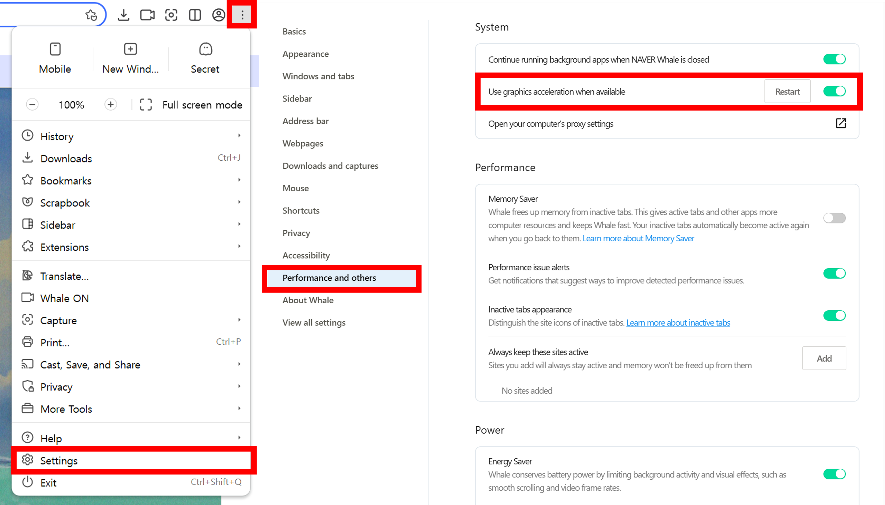

# 1. Google Chrome

#### 1) Click the More (︙) button at the top right corner of the browser window > Settings
#### 2) Go to System > Turn on Use graphics acceleration when available > Click Relaunch

# 2. Microsoft Edge

#### 1) Click the More (⋯) button at the top right corner of the browser window > Settings
#### 2) Go to System and Performance > Turn on Use graphics acceleration when available > Click Relaunch or Auto apply

# 3. Naver Whale

#### 1) Click the More (︙) button at the top right corner of the browser window > Settings
#### 2) Go to Performance and Others > Turn on Use graphics acceleration when available > Click Restart

# 4. Safari
#### For Safari, Graphics acceleration is automatically enabled starting from macOS Catalina (v10.15) and later.
