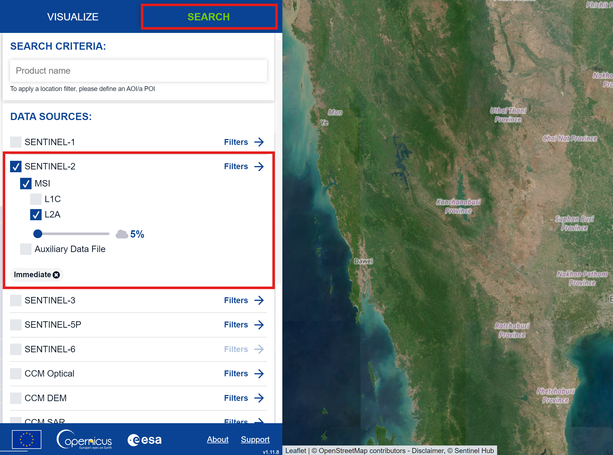

# mago3D 데이터 수집 가이드

# :bookmark_tabs: 데이터 구축 방안

## ⚙️ 기본 세팅

### 1. 원하는 경로에 실습을 위해 사용할 파일 생성

- 예를 들어, C:/ 경로에 mago3d 폴더와 workspace 폴더를 생성합니다.
    ```sql
    $ C:\Users\user> mkdir ../../mago3d/workspace
    ```

### 2. docker에 필요 항목 다운로드

- cmd 창을 연다.
- mago3d-tiler를 설치합니다.
    ```sql
    $ docker pull gaia3d/mago-3d-tiler
    ```
- mago3d-terrainer를 설치합니다.
    ```sql
    $ docker pull gaia3d/mago-3d-terrainer
    ```
- 생성해줬던 디렉터리에 geoserver를 설치합니다.
    ```spl
	$ docker run -v C:\mago3d\workspace\geoserver:/apt/geoserver/data_dir -e GEOSEVER_ADMIN_USER=admin -e GEOSERVER_ADMIN_PASSWORD=geoserver -p 8080:8080 kartoza/geoserver
    ```

### 3. Cesium sample code 다운로드

- scripts 폴더 안에 있는 index.html 파일을 다운 받아서 C:\mago3d\workspace 디렉터리에 넣습니다.

## :globe_with_meridians: Overture Maps 데이터 다운로드

### 1. Python이 설치되었는지 확인

- [Python을 설치합니다](https://www.python.org/downloads/)
- cmd 창을 열고 Python이 설치되었는지 확인합니다. 다음 명령어를 입력하세요.
    ```sql
    $ python --version
    ```

### 2. 가상환경 생성

- cmd 창에서 가상환경을 생성하려는 디렉터리로 이동합니다. 아까 생성해준 디렉터리로 이동하려면 다음 명령어를 입력하세요.
    ```sql
    $ cd C:\mago3d
    ```

- 다음 명령어를 입력하여 가상환경을 생성합니다.
    ```sql
    $ python -m venv myvenv
    ```

- 여기서 ‘myvenv’는 가상환경의 이름입니다. 원하는 이름으로 변경할 수 있습니다.

### 3. 가상환경 활성

- 가상환경을 활성화하려면 cmd 창에서 다음 명령어를 입력합니다.
    ```sql
    $ myvenv\Scripts\activate
    ```

- 위 명령어를 실행하면, 프롬프트가 ‘(myvenv)’와 같이 변경되어 가상환경이 활성화된 것을 알 수 있습니다.

### 4. Overture Maps 패키지 설치

- 가상환경이 활성화된 상태에서, Overture Maps 패키지를 설치하기 위해 cmd 창에서 다음 명령어를 입력합니다.
    ```sql
    $ pip install overturemaps
    ```


### 5. Overture Maps 데이터 다운로드

- 가상환경이 활성화된 상태에서, Overture Maps 데이터를 다운로드 하기 위해 cmd 창에서 다음명령어를 입력합니다.
- 방콕의 Building 데이터를 khlongtoei_building.geojson 파일로 다운로드합니다.
    ```sql
    $ overturemaps download --bbox=100.5507001257371797,13.6970007530963525,100.6016431134770528,13.7428667529314463 -f geojson --type=building -o khlongtoei_building.geojson
    ```

- 방콕의 transportation 데이터를 khlongtoei_transportation.geojson 파일로 다운로드합니다.
    ```sql
    $ overturemaps download --bbox=100.5507001257371797,13.6970007530963525,100.6016431134770528,13.7428667529314463 -f geojson --type=segment -o khlongtoei_transportation.geojson
    ```

- 다운로드한 파일은 가상환경을 생성한 디렉토리(C:\mago3d)에 저장됩니다.

## :rocket: NASA DEM 다운로드

### 1. NASA EARTHDATA 접속

- Login 필수입니다.
- tif 파일 다운로드를 위해 Earthdata Download 앱을 설치해야 합니다. 

[search.earthdata.nasa.gov](https://search.earthdata.nasa.gov/search/granules?p=C1711961296-LPCLOUD&pg[0][v]=f&pg[0][gsk]=-start_date&as[science_keywords][0]=Land%20Surface%3ATopography%3ATerrain%20Elevation%3ADigital%20Elevation/Terrain%20Model%20(Dem)&tl=1723601365!3!!&fst0=Land%20Surface&fsm0=Topography&fs10=Terrain%20Elevation&fs20=Digital%20Elevation/Terrain%20Model%20(Dem))

### 2. 영역 지정

- 다운로드 하고싶은 영역을 오른쪽의 도구를 사용하여 지정합니다.


### 3. 데이터 다운로드

- 지정한 영역에 해당되는 데이터를 다운로드합니다.


## :telescope: Sentinel 영상 다운로드

### 1. Copernicus Data Space Ecosystem 접속
- Login 필수입니다.

[Copernicus Data Space Ecosystem | Europe's eyes on Earth](https://dataspace.copernicus.eu/)


### 2. 데이터 검색 조건 설정

- 원하는 지역으로 이동하여 확대한 후 search 버튼을 클릭하고 SENTINEL-2>MSI>L2A>구름 양을 5%로 조절합니다.



- 날짜를 지정하고 Search 버튼을 클릭합니다.


### 3. 데이터 다운로드

- 검색된 영상 목록과 화면에 센티넬 영상의 범위가 나타납니다.


- 원하는 영상을 검색 완료했다면 마우스 버튼을 클릭하여 다운로드합니다.


