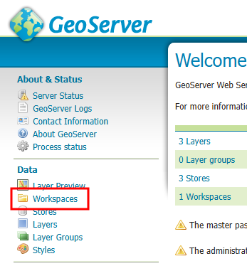
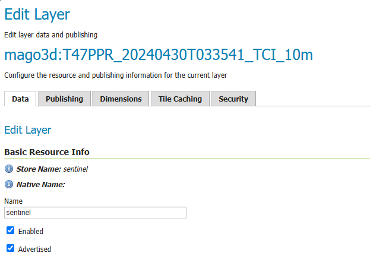
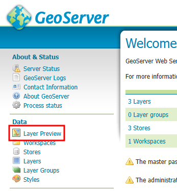
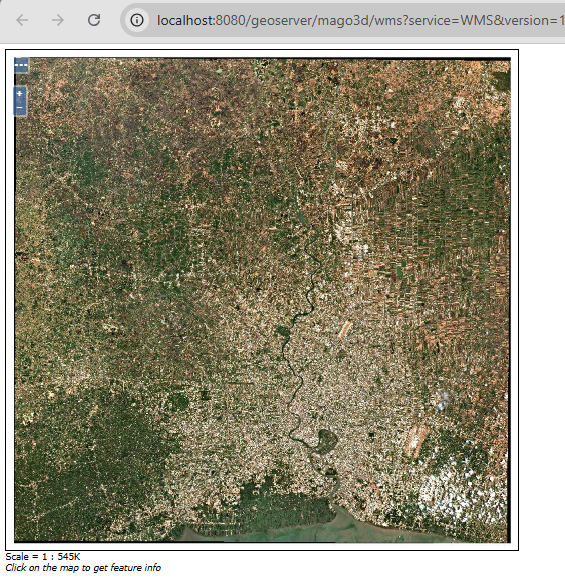
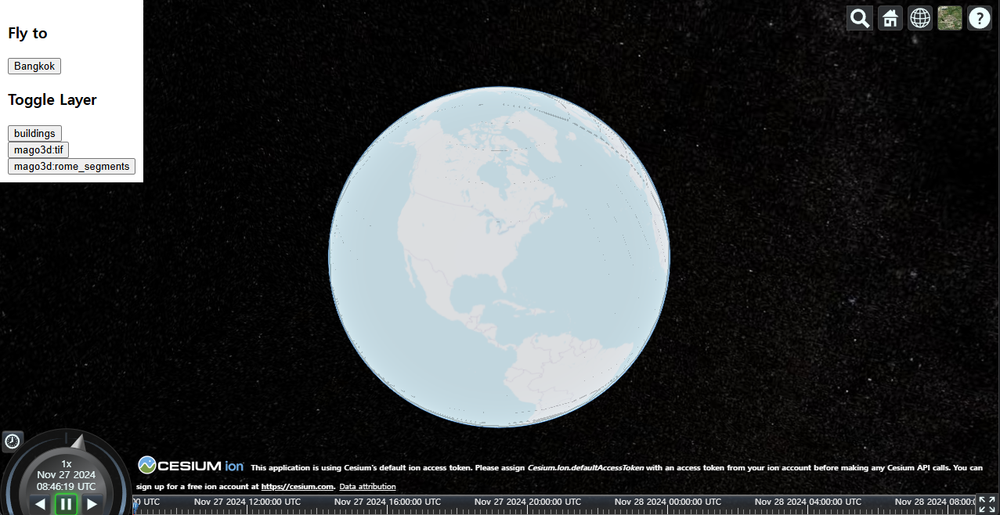

# Mago3D Data Processing Guide

# :bookmark_tabs: Data Preprocessing

Before the practice, in this chapter, we will proceed with data processing and conversion necessary for utilizing data in mago3D and GeoServer.  
These tools provide powerful capabilities for implementing and visualizing urban digital twins, but conversion to data formats that meet each tool's characteristics and requirements is necessary.  
The data conversion tasks to be performed can be summarized in the following table:

| Original Filename |  Before Conversion   |    After Conversion    |                                  Conversion Reason                                   |  
|:---:|:-------:|:----------:|:------------------------------------------------------------------------------------:|
|khlongtoei_building.geojson| GeoJSON |  3DTiles   |              To smoothly render in mago3D according to osgeo standards               |
|khlongtoei_transportation.geojson| GeoJSON | Geopackage |           To increase management and distribution efficiency in GeoServer            |
|T47PPR_20240430T033541_TCI_10m.jp2|   JP2   |  GeoTiff   | To convert satellite images to a format easily analyzed and distributed in GeoServer |

Practice preparation is now complete. Proceed to the next step! 🚀

---

## 1. Processing Overture Maps Data

Preprocessing is required for the GeoJSON data received in the Python virtual environment.
- Move all GeoJSON files received to the `C:\mago3d\workspace` folder that was set up for the virtual environment.

### 1. khlongtoei_building.geojson

This file will be converted to 3DTiles using mago3d-tiler.
The GeoJSON file contains buildings without height values, so we will extract and process the building heights.

- Copy the khlongtoei_building.geojson file and create khlongtoei_building_origin.geojson.
- Extract building heights from the khlongtoei_building_origin.geojson file:
    ```sql
    $ docker run --rm -v C:\mago3d\workspace:/data ghcr.io/osgeo/gdal:ubuntu-full-3.9.0 ogr2ogr -f "GeoJSON" /data/khlongtoei_hegiht.geojson /data/khlongtoei_building_origin.geojson -sql "SELECT height FROM khlongtoei_building_origin WHERE height IS NOT NULL"
    ```
- Convert building floor count to height values:
    ```sql
    $ docker run --rm -v C:\mago3d\workspace:/data ghcr.io/osgeo/gdal:ubuntu-full-3.9.0 ogr2ogr -f "GeoJSON" /data/khlongtoei_num_floors.geojson /data/khlongtoei_building_origin.geojson -sql "SELECT num_floors * 3.3 AS height FROM khlongtoei_building_origin WHERE height IS NULL"
    ```
- Merge the extracted building heights and floor-based heights into khlongtoei_building.geojson:
    ```sql 
    $ docker run --rm -v C:\mago3d\workspace:/data ghcr.io/osgeo/gdal:ubuntu-full-3.9.0 ogr2ogr -f "GeoJSON" /data/khlongtoei_building.geojson /data/khlongtoei_hegiht.geojson
    $ docker run --rm -v C:\mago3d\workspace:/data ghcr.io/osgeo/gdal:ubuntu-full-3.9.0 ogr2ogr -f "GeoJSON" -append /data/khlongtoei_building.geojson /data/khlongtoei_num_floors.geojson
    ```
- Create an input folder at `C:\mago3d\workspace` and place the merged khlongtoei_building.geojson file inside.

### 2. khlongtoei_transportation.geojson

This file will be converted to Geopackage for uploading as a layer to GeoServer.

  ```sql
  $ docker run --rm -v C:\mago3d\workspace:/data ghcr.io/osgeo/gdal:ubuntu-full-3.9.0 ogr2ogr -f "GPKG" /data/rome_segments.gpkg /data/khlongtoei_transportation.geojson
  ```
- Create a data folder at `C:\mago3d\workspace\geoserver` and place the converted gpkg file inside.

---

## 2. Processing Copernicus Data Space Ecosystem Data

This file will be converted to GeoTIFF for uploading as a layer to GeoServer.

- Unzip the downloaded SAFE.zip file.
- Move the T47PPR_20240430T033541_TCI_10m.jp2 file from the GRANULE\L2A_T47PPR_A046247_20240430T034959\IMG_DATA\R10m path to the `C:\mago3d\workspace` folder.
- Convert the jp2 file to tif:
    ```sql
    $ docker run --rm -v C:\mago3d\workspace:/data ghcr.io/osgeo/gdal:ubuntu-full-3.9.0 gdal_translate -of GTiff /data/T47PPR_20240430T033541_TCI_10m.jp2 /data/T47PPR_20240430T033541_TCI_10m.tif
    ```
- Place the converted tif file in the `C:\mago3d\workspace\geoserver\data` path.

---

## 3. Processing NASA DEM Data

This file will be converted to terrain information through mago3d-terrainer and will also be used when running mago3d-tiler.

- Open the downloaded ASTGTM_003-20241118_054943 folder and copy the ASTGTMV003_N13E100_dem.tif file.
- Paste the copied file into the `C:\mago3d\workspace\input` path.
- Create a dem folder at `C:\mago3d\workspace` and paste the copied file there.

---

Data processing is now complete. Proceed to the next step! 🚀

---

# 🌟 MAGO3D Usage Guide

- Verify that data is properly placed in the input and dem folders at `C:\mago3d\workspace`:
  - input> khlongtoei_building.geojson, ASTGTMV003_N13E100_dem.tif
  - dem> ASTGTMV003_N13E100_dem.tif

## MAGO3D-TILER

- Run mago3d-tiler with the base building height set to 3.3m.

### Windows

```sql
$ docker run ^
  --rm ^
  -v C:\mago3d\workspace:/workspace gaia3d/mago-3d-tiler ^
  -input /workspace/input ^
  -output /workspace/output ^
  -it geojson ^
  -crs 4326 ^
  -te /workspace/dem/ASTGTMV003_N13E100_dem.tif ^
  -mh 3.3 ^
  -hc height
```

### Mac / Linux

```sql
$ docker run \
  --rm \
  -v C:/mago3d/workspace:/workspace gaia3d/mago-3d-tiler \
  -input /workspace/input \
  -output /workspace/output \
  -it geojson \
  -crs 4326 \
  -te /workspace/dem/ASTGTMV003_N13E100_dem.tif \
  -mh 3.3 \
  -hc height
```
  
---

### Command Explanation

Enter `$ docker run gaia3d/mago-3d-tiler --help` to view all command options.

> - `--rm`: Automatically delete container after execution
> - `-v`: Data directory volume mount
>   - Mount the `C:\mago3d\workspace` path to mago3d-tiler's data_dir to connect data.
> - `-input`: Path containing pre-conversion data
> - `-output`: Path to store post-conversion data
> - `-it`: Data type before conversion
> - `-crs`: EPSG coordinate system of pre-conversion data
> - `-te`: Path to GeoTiff Terrain file used during conversion
> - `-mh`: Set minimum height value for 3D models
> - `-hc`: Set column containing height values for 3D models

---

## MAGO3D-TERRAINER

- Run mago3d-terrainer with the maximum terrain level set to 14.

### Windows

```sql
docker run ^
  --rm ^
  -v C:\mago3d\workspace:/workspace gaia3d/mago-3d-terrainer ^
  -input /workspace/dem ^
  -output /workspace/assets/terrain ^
  -cn ^
  -it bilinear ^
  -mn 0 ^
  -mx 14
```

### Mac / Linux

```sql
docker run \
  --rm \
  -v C:/mago3d/workspace:/workspace gaia3d/mago-3d-terrainer \
  -input /workspace/dem \
  -output /workspace/assets/terrain \
  -cn \
  -it bilinear \
  -mn 0 \
  -mx 14
```

---

### Command Explanation

Enter `docker run gaia3d/mago-3d-terrainer --help` to view all command options.

> - `--rm`: Automatically delete container after execution
> - `-v`: Data directory volume mount
>   - Mount the `C:\mago3d\workspace` path to mago3d-terrainer's data_dir to connect data.
> - `-input`: Path containing pre-conversion data
> - `-output`: Path to store post-conversion data
> - `-cn`: Automatically calculate normal vectors
>   - Normal vectors represent the direction perpendicular to a specific point on the surface of a 3D object.
> - `-it`: Interpolation setting
>   - Two values can be used for this option: Nearest and Bilinear.
>     - Nearest: When converting data, select the nearest neighbor value.
>     - Bilinear: Calculate values based on four points using bilinear interpolation.
> - `-mn`: Set minimum tile depth
> - `-mx`: Set maximum tile depth

---

# 🗺️ GeoServer Usage Guide

## 1. Verify GeoServer Data Directory

- Navigate to the path `C:\mago3d\workspace\geoserver\data` and confirm that the data is properly stored in the folder.
  - data > khlongtoei_transportation.gpkg, T47PPR_20240430T033541_TCI_10m.tif

## 2. Create Workspace

1. Access GeoServer
  - Open in browser: `http://localhost:8080/geoserver`
  - Login: Use the option values set during image execution
  - **ID**: admin
  - **PASSWORD**: geoserver

    

2. Navigate to **Workspaces** in the left menu.

   

3. Click the **Add New Workspace** button.

   

4. Enter the following information:
  - **Name**: Workspace name (e.g., `mago3d`)
  - **Namespace URI**: Unique URI (e.g., `http://www.mago3d_workspace.com`)

    

5. Click the **Save** button to save.

---

## 3. Create Store

1. Go to **Data Stores** in the admin console.

   

2. Click the **Add New Store** button.

   

3. Select the data format you want to use (e.g., GeoTIFF, GeoPackage).

   

4. Enter the following information:
  - **Workspace**: Select the workspace created previously
  - **Data Store Name**: Enter a name for the data store (e.g., `sentinel`, `transportation`)
  - **Connection Parameters**: Select the directory where the data was previously stored

    #### Sentinel GeoTiFF
    
    
    

    ### Transportation GeoPackage 

    
    

5. Click the **Save** button to save.

---

## 4. Publish Layer

1. Navigate to the **Layers** menu.

   

2. Click the **Add New Layer** button.

   

3. Select the data store created in the previous step.

4. Select the data you want to add from the available data list and click **Publish**.

   

5. Set layer attributes:
  - **Name**: Layer name (e.g.: khlongtoei_transportation / T47PPR_20240430T033541_TCI_10m)

    

  - **Spatial Coordinate System**: Specify the coordinate system of the data (e.g., EPSG:4326)
  - **Layer Bounds**: Click to calculate from the data

    

6. Click the **Save** button to save.

---

## 5. Layer Preview

1. Navigate to the **Layer Preview** menu.

   

2. Find the published layer in the list.

3. Select a preview format (WMS, OpenLayers, etc.)
  - Selecting OpenLayers allows you to view the layer in the browser.

  
  

---

Now all tasks are complete. Let's check the results! 🚀

---

# 💻 Confirming Results Using Sample Code

- Open the `C:\mago3d\workspace\index.html` file in your preferred IDE.
  - If necessary, modify the codes with the ✏️ icon to suit your environment.
- Keep index.html open and activate the server to view results in Chrome.

## IDE

### 1. Visual Studio Code


### 2. Intellij


## Result

- This is the first screen after logging in.

    

- By clicking the [Bangkok] button in the top left corner, you can see the view of Bangkok.

    

- By clicking the Toggle Layer button in the top left, you can control the display of layers.

- If you zoom in on the map, you can see the work results clearly.

    

---

🎉 Great job! Well done! 🎉
