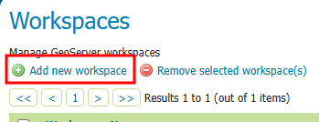
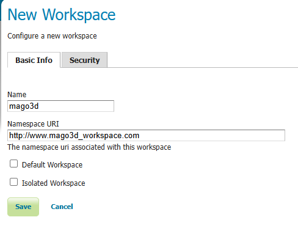
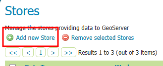
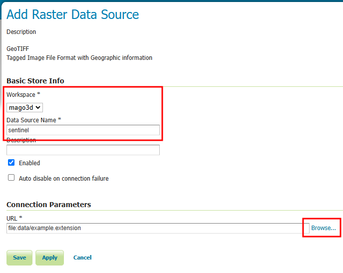
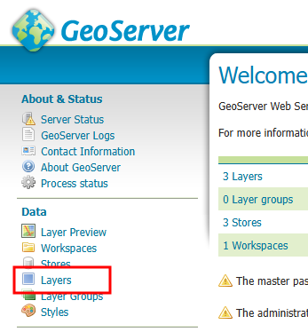
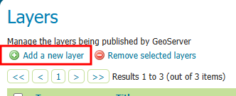
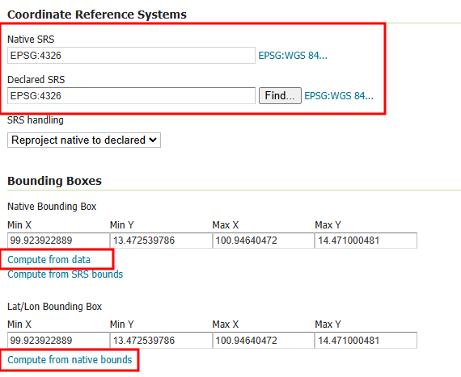

# Mago3D Data Processing Guide

# :bookmark_tabs: Data Preprocessing to be Used

Before starting the practical session, this chapter will proceed with data processing and conversion tasks necessary for utilizing data in Mago3D and GeoServer.
These tools provide powerful capabilities for implementing and visualizing urban digital twins, but require data conversion to formats that match each tool's characteristics and requirements.
The data conversion work to be performed can be summarized in the following table:

| Original Filename | Before Conversion | After Conversion |                    Reason for Conversion                    |  
|:---:|:-------:|:----------:|:--------------------------------------------:|
|khlongtoei_building.geojson| GeoJSON |  3DTiles   | To smoothly render in Mago3D according to osgeo standards |
|khlongtoei_transportation.geojson| GeoJSON | Geopackage | To improve management and deployment efficiency in GeoServer |
|T47PPR_20240430T033541_TCI_10m.jp2|   JP2   |  GeoTiff   | To convert satellite imagery to a format suitable for analysis and distribution in GeoServer |

<br/>

Preparation is now complete. Proceed to the next step! 🚀

---
## 1. Processing Overture Maps Data

Preprocessing of the received GeoJSON data is required in the Python virtual environment.
- Move all received GeoJSON files to the `C:\mago3d\workspace` folder located in the path where the virtual environment was set up.

### 1. khlongtoei_building.geojson

This file will be converted to 3DTiles using mago3d-tiler.
This GeoJSON file includes buildings without height values, so we will extract and process building heights.

- Extract building heights from khlongtoei_building.geojson file:
    - Windows
      ```sh
      docker run --rm ^
        -v C:\mago3d\workspace:/data ghcr.io/osgeo/gdal:ubuntu-full-3.9.0 ogr2ogr ^
        -f "GeoJSON" /data/khlongtoei_hegiht.geojson /data/khlongtoei_building.geojson ^
        -sql "SELECT height FROM khlongtoei_building WHERE height IS NOT NULL"
      ```
    - Mac / Linux
      ```sh
      docker run --rm \
        -v ~/mago3d/workspace:/data ghcr.io/osgeo/gdal:ubuntu-full-3.9.0 ogr2ogr \
        -f "GeoJSON" /data/khlongtoei_hegiht.geojson /data/khlongtoei_building.geojson \
        -sql "SELECT height FROM khlongtoei_building WHERE height IS NOT NULL"
      ```

- Convert building floor count to height values:
    - Windows
      ```sh
      docker run --rm ^
        -v C:\mago3d\workspace:/data ghcr.io/osgeo/gdal:ubuntu-full-3.9.0 ogr2ogr ^
        -f "GeoJSON" /data/khlongtoei_num_floors.geojson /data/khlongtoei_building.geojson ^
        -sql "SELECT num_floors * 3.3 AS height FROM khlongtoei_building WHERE height IS NULL"
      ```
    - Mac / Linux
      ```sh
      docker run --rm \
        -v ~/mago3d/workspace:/data ghcr.io/osgeo/gdal:ubuntu-full-3.9.0 ogr2ogr \
        -f "GeoJSON" /data/khlongtoei_num_floors.geojson /data/khlongtoei_building.geojson \
        -sql "SELECT num_floors * 3.3 AS height FROM khlongtoei_building WHERE height IS NULL"
      ```

- Merge the extracted building heights and floor count heights into khlongtoei_building.geojson:
    - Windows
      ```sh 
      docker run --rm ^
        -v C:\mago3d\workspace:/data ghcr.io/osgeo/gdal:ubuntu-full-3.9.0 ogr2ogr ^
        -f "GeoJSON" /data/khlongtoei_building.geojson /data/khlongtoei_hegiht.geojson
    
      docker run --rm ^
        -v C:\mago3d\workspace:/data ghcr.io/osgeo/gdal:ubuntu-full-3.9.0 ogr2ogr ^
        -f "GeoJSON" -append /data/khlongtoei_building.geojson /data/khlongtoei_num_floors.geojson
      ```
    - Mac / Linux
      ```sh 
      docker run --rm \
        -v ~/mago3d/workspace:/data ghcr.io/osgeo/gdal:ubuntu-full-3.9.0 ogr2ogr \
        -f "GeoJSON" /data/khlongtoei_building.geojson /data/khlongtoei_hegiht.geojson
    
      docker run --rm \
        -v ~/mago3d/workspace:/data ghcr.io/osgeo/gdal:ubuntu-full-3.9.0 ogr2ogr \
        -f "GeoJSON" -append /data/khlongtoei_building.geojson /data/khlongtoei_num_floors.geojson
      ```

- Create an `input` folder in the `C:\mago3d\workspace` path and place the merged khlongtoei_building.geojson file inside.

### 2. khlongtoei_transportation.geojson

This file will be converted to Geopackage to upload as a layer to GeoServer.

- Windows
  ```sh
  docker run --rm ^
    -v C:\mago3d\workspace:/data ghcr.io/osgeo/gdal:ubuntu-full-3.9.0 ogr2ogr ^
    -f "GPKG" /data/khlongtoei_transportation.gpkg /data/khlongtoei_transportation.geojson
  ```
- Mac / Linux
  ```sh
  docker run --rm \
    -v ~/mago3d/workspace:/data ghcr.io/osgeo/gdal:ubuntu-full-3.9.0 ogr2ogr \
    -f "GPKG" /data/khlongtoei_transportation.gpkg /data/khlongtoei_transportation.geojson
  ```
- Create a `data` folder in the `C:\mago3d\workspace\geoserver` path and place the converted gpkg file inside.

<br/>

---
## 2. Processing Copernicus Data Space Ecosystem Data

To upload to GeoServer as a layer, this file will be converted to GeoTIFF.

- Unzip the downloaded SAFE.zip file.
- Move the `T47PPR_20240430T033541_TCI_10m.jp2` file from the `GRANULE\L2A_T47PPR_A046247_20240430T034959\IMG_DATA\R10m` path to the `C:\mago3d\workspace` folder.
- Convert the jp2 file to tif:
    - Windows
        ```sh
        docker run --rm ^
          -v C:\mago3d\workspace:/data ghcr.io/osgeo/gdal:ubuntu-full-3.9.0 gdal_translate ^
          -of GTiff /data/T47PPR_20240430T033541_TCI_10m.jp2 /data/T47PPR_20240430T033541_TCI_10m.tif
        ```
    - Mac / Linux
        ```sh
        docker run --rm \
          -v ~/mago3d/workspace:/data ghcr.io/osgeo/gdal:ubuntu-full-3.9.0 gdal_translate \
          -of GTiff /data/T47PPR_20240430T033541_TCI_10m.jp2 /data/T47PPR_20240430T033541_TCI_10m.tif
        ```
- Place the converted tif file in the `C:\mago3d\workspace\geoserver\data` path.

---
## 3. Processing NASA DEM Data

This file will be converted to terrain information through mago3d-terrainer and will also be used when running mago3d-tiler.

- Open the downloaded `ASTGTM_003-20241118_054943` folder and copy the `ASTGTMV003_N13E100_dem.tif` file.
- Create a `dem` folder in the `C:\mago3d\workspace` path and paste the copied file.

<br/>

Data processing is now complete. Proceed to the next step! 🚀

---
# 🌟 mago3D Usage Guide

[mago3DTiler Github](http://github.com/Gaia3D/mago-3d-tiler)

- Verify that the data is correctly placed in the `input` and `dem` folders in the `C:\mago3d\workspace` path.
    - input> khlongtoei_building.geojson
    - dem> ASTGTMV003_N13E100_dem.tif

## mago3DTiler

Run mago3d-tiler with the default building height set to 3.3m.  
Depending on computer specifications and network, it may take a minimum of 7 minutes.

- Windows
    ```sh
    docker run ^
      --rm ^
      -v C:\mago3d\workspace:/workspace gaia3d/mago-3d-tiler ^
      -input /workspace/input ^
      -output /workspace/output ^
      -it geojson ^
      -crs 4326 ^
      -te /workspace/dem/ASTGTMV003_N13E100_dem.tif ^
      -mh 3.3 ^
      -hc height
    ```

- Mac / Linux
    ```sh
    docker run \
      --rm \
      -v ~/mago3d/workspace:/workspace gaia3d/mago-3d-tiler \
      -input /workspace/input \
      -output /workspace/output \
      -it geojson \
      -crs 4326 \
      -te /workspace/dem/ASTGTMV003_N13E100_dem.tif \
      -mh 3.3 \
      -hc height
    ```
  
<br/>

> ### Command Explanation
>
> Enter `docker run gaia3d/mago-3d-tiler --help` to see all command options.
>
> - `--rm`: Automatically delete the container after execution
> - `-v`: Mount data directory volume
>   - Mount the `C:\mago3d\workspace` path to mago3d-tiler's data_dir to connect data.
> - `-input`: Path containing pre-conversion materials
> - `-output`: Path to store post-conversion materials
> - `-it` (`--inputType`): Data type of pre-conversion materials
> - `-crs`: EPSG coordinate system of pre-conversion materials
> - `-te` (`--terrain`): Path to GeoTiff format Terrain file used for conversion
> - `-mh` (`--minimumHeight`): Set minimum height value for 3D models
> - `-hc` (`--heightColumn`): Set column containing height values for 3D models

<br/>

---
## mago3DTerrainer

Run mago3d-terrainer with the maximum terrain depth set to 14.  
Depending on computer specifications and network, it may take a minimum of 10 minutes.

- Windows
    ```sh
    docker run ^
      --rm ^
      -v C:\mago3d\workspace:/workspace gaia3d/mago-3d-terrainer ^
      -input /workspace/dem ^
      -output /workspace/assets/terrain ^
      -cn ^
      -it bilinear ^
      -mn 0 ^
      -mx 14
    ```

- Mac / Linux
    ```sh
    docker run \
      --rm \
      -v ~/mago3d/workspace:/workspace gaia3d/mago-3d-terrainer \
      -input /workspace/dem \
      -output /workspace/assets/terrain \
      -cn \
      -it bilinear \
      -mn 0 \
      -mx 14
    ```
  
<br/>

### Command Explanation

Enter `docker run gaia3d/mago-3d-terrainer --help` to see all command options.

> - `--rm`: Automatically delete the container after execution
> - `-v`: Mount data directory volume
>   - Mount the `C:\mago3d\workspace` path to mago3d-terrainer's data_dir to connect data.
> - `-input`: Path containing pre-conversion materials
> - `-output`: Path to store post-conversion materials
> - `-cn` (`--calculateNormals`): Automatically calculate normal vectors
>   - Normal vectors represent the direction perpendicular to a specific point on the surface of a 3D object.
> - `-it` (`--interpolationType`): Set interpolation method
>   - Two values can be used for this option: Nearest and Bilinear.
>     - Nearest: Uses nearest neighbor interpolation to select the closest neighbor value when converting data.
>     - Bilinear: Uses bilinear interpolation to calculate values based on four points.
> - `-mn` (`--minDepth`): Set minimum tile depth
> - `-mx` (`--maxDepth`): Set maximum tile depth

---
# 🗺️ GeoServer Usage Guide

## 1. Verify GeoServer Data Directory

- Navigate to `C:\mago3d\workspace\geoserver\data` path and confirm that data is correctly placed.
    - data > khlongtoei_transportation.gpkg, T47PPR_20240430T033541_TCI_10m.tif

## 2. Create Workspace

1. Access GeoServer
    - Open [http://localhost:8080/geoserver] in your browser
    - Login: Use the options set during image execution
    - **ID**: admin
    - **PASSWORD**: geoserver

   

2. Navigate to **Workspaces** in the left menu

   

3. Click **Add new workspace** button

   

4. Enter the following information:
    - **Name**: Workspace name (e.g., `mago3d`)
    - **Namespace URI**: Unique URI (e.g., `http://www.mago3d_workspace.com`)

   

5. Click **Save** button to save.

<br/>

## 3. Create Stores

1. Go to **Data Stores** in the admin console

   

2. Click **Add new store** button

   

3. Select the data format you want to use (e.g., GeoTIFF, GeoPackage)

   

4. Enter the following information:
    - **Workspace**: Select the workspace created previously
    - **Data Store Name**: Enter a name for the data store (e.g., `sentinel`, `transportation`)
    - **Connection Parameters**: Click Browse to select the directory where data was previously stored

   #### How to Register Sentinel GeoTiFF

   
   

   ### How to Register Transportation GeoPackage

   
   

5. Click **Save** button to save.

<br/>

## 4. Publish Layers

1. Go to the **Layers** menu

   

2. Click **Add new layer** button

   

3. Select the data store created in the previous step

4. Select the data you want to add from the available data list and click **Publish**

   

5. Set layer attributes:
    - **Name**: Layer name (e.g., `sentinel`, `transportation`)

   

    - **Spatial Reference System**: Specify the coordinate system of the data (e.g., EPSG:4326)

    - **Layer Bounding Box**: Click "Compute from data" to apply

   

6. Click **Save** button to save.

<br/>

## 5. Layer Preview

1. Go to the **Layer Preview** menu

   

2. Find the published layer in the list (e.g., `sentinel`)

3. Select a preview format (WMS, OpenLayers, etc.)
    - Selecting OpenLayers allows you to view the layer in the browser

   
   

<br/>

All tasks are now complete. Let's check the results! 🚀

<br/>

---
