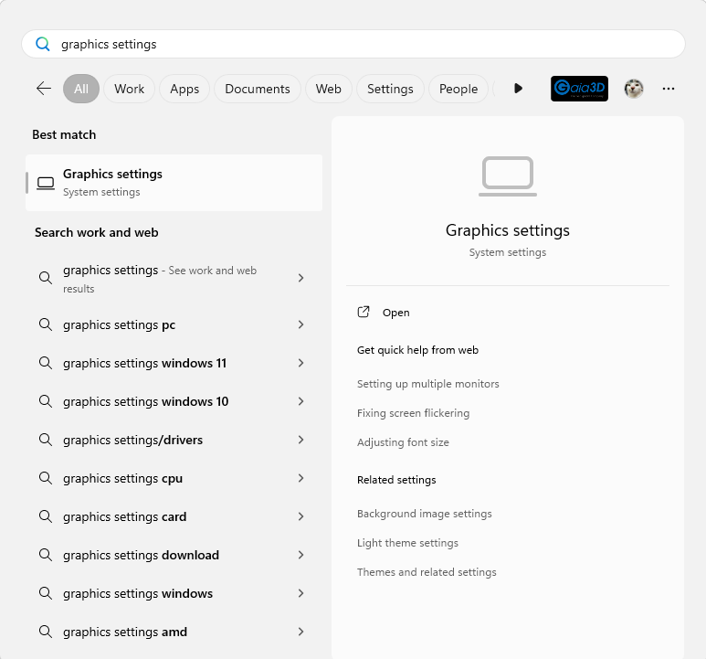
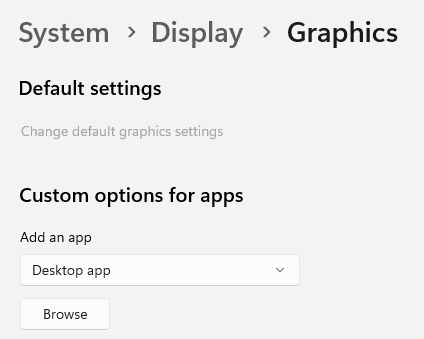
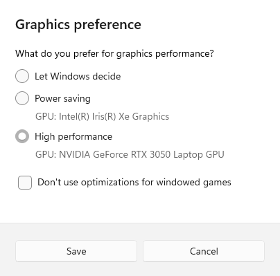

# Google Hardware Acceleration Settings

## WINDOWS (ver.11)

### 1. Chrome Settings

- Enter the following code in the Chrome address bar:
    ```
    chrome://settings/system
    ```
- Check [**Use graphics acceleration when available**].

  

### 2. Graphics Settings

- Search for [**Graphics Settings**] in the WINDOWS search bar.

  

- Click [**Browse**] under App Addition.

  

- Find the download path for Chrome and select [**chrome.exe**].

  
  

- Click on the added Google Chrome and select [**Options**].
- Check [**High Performance**] for graphics default settings and save.

  

### 3. Task Manager

- Click the [**Details**] tab on the left.
- Right-click on the top header tab and select [**Select Columns**].
- Scroll down and check [**GPU, GPU Engine**] then click OK.

  


## MAC OS

### 1. Chrome settings

- Enter the following code in the Chrome address bar:
    ```
    chrome://settings/system
    ```
- Check [**Use graphics acceleration when available**].

  

### 2. Checking Active Status

- Mac OS does not require any additional graphics settings.

- Click the [**CPU**] tab at the top.
- Click [**%GPU**] to sort in descending order.
- Check for Chrome Window Helper (GPU).


### ⚠️ If Chrome's hardware acceleration is not enabled on macOS

- WebGL, required by Cesium, will not function properly, causing errors.

  
