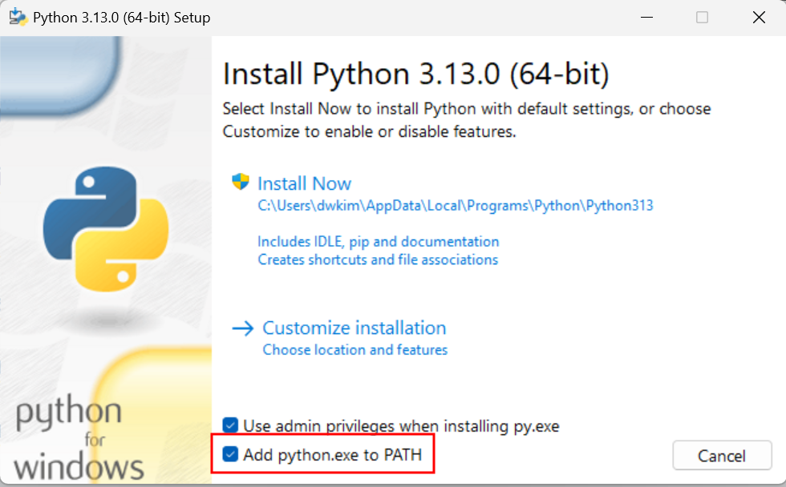
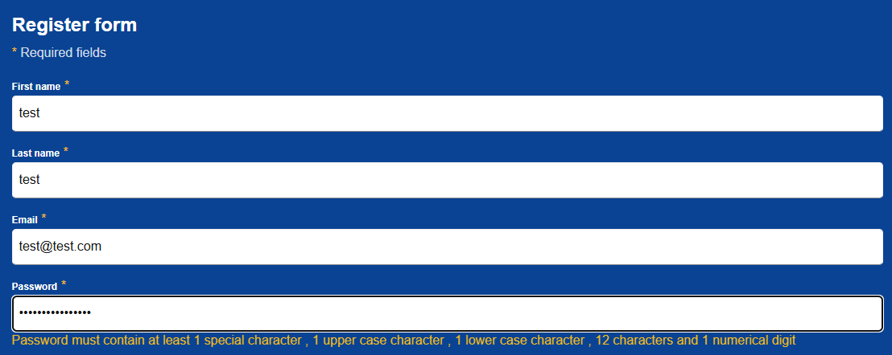
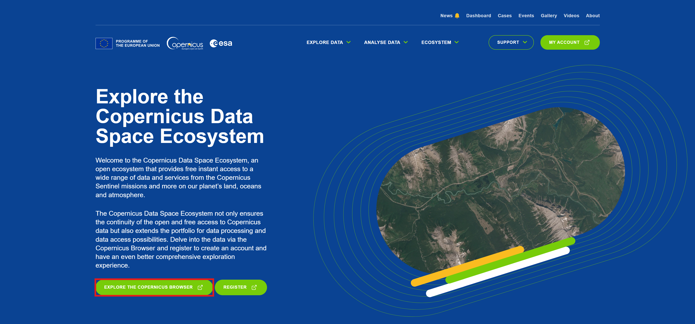

# mago3D 데이터 수집 가이드

# :bookmark_tabs: 데이터 구축 방안

## ⚙️ 기본 세팅

### 1. 원하는 경로에 실습 폴더 생성

실습에 사용할 폴더를 생성합니다.  
이 폴더는 실습 과정에서 데이터를 저장하고 관리하기 위한 기본 작업 공간이 됩니다.  
Windows와 Mac/Linux 환경에 맞춰 아래 단계를 따라 진행하세요.

- Windows
  1. 명령 프롬프트 실행 
     - 시작 메뉴에서 cmd 또는 명령 프롬프트를 검색하여 실행합니다.
  2. 아래 명령어를 입력하여 폴더를 생성합니다:
     ```sh
     C:\> mkdir mago3d
     ```
  3. 생성된 폴더는 C:\mago3d 경로에 위치합니다.

- Mac / Linux
  1. 터미널 실행 
     - Mac에서는 Launchpad에서, Linux에서는 응용 프로그램 메뉴에서 터미널을 실행합니다.
  2. 아래 명령어를 입력하여 폴더를 생성합니다:
     ```sh
     mkdir ~/mago3d
     ```
  3. 생성된 폴더는 홈 디렉토리`~/mago3d`에 위치합니다.

<br/>
이제 실습 준비가 완료되었습니다. 다음 단계를 진행하세요! 🚀

---
### 2. Docker 사용

실습에 필요한 Docker 이미지를 다운로드하고 컨테이너를 실행하여 실습 환경을 구성합니다.  
아래 단계를 차근차근 따라 진행하세요.

> #### ⚠️ 도커가 설치가 안 되어 있다면
> 
> 이번 워크샵의 대부분의 실습은 도커 명령어로 실행됩니다.
> 만약 도커가 설치 되어있지 않다면 실습 진행이 어려우므로, 도커를 다운 받으신 후 진행 하시기 바랍니다.

<br/>

#### 1. Docker 이미지 다운로드

실습에 필요한 이미지를 사전에 다운로드 받습니다. 아래 명령어를 입력하여 이미지를 로컬로 가져옵니다.  

```sh
docker pull gaia3d/mago-3d-tiler
docker pull gaia3d/mago-3d-terrainer
docker pull ghcr.io/osgeo/gdal:ubuntu-full-3.9.0
docker pull kartoza/geoserver
```

> #### 이미지 설명
>
> - `gaia3d/mago-3d-tiler`: mago3D의 3D 타일링 작업에 사용되는 이미지
> - `gaia3d/mago-3d-terrainer`: 지형 데이터 처리를 위한 이미지
> - `kartoza/geoserver`: GeoServer를 통해 공간 데이터를 관리 및 시각화하는 이미지
> - `ghcr.io/osgeo/gdal`: GDAL 라이브러리로 공간 데이터 처리 기능을 제공하는 이미지

<br/>

> #### ⚠️ Mac 사용 중 GeoServer의 권한 문제가 발생한 경우
>
> 1. 기존 디렉터리를 삭제하고 다시 GeoServer 디렉터리를 생성합니다.
> 2. `chmod 777 {workspace}/geoserver` 명령어를 실행하여 GeoServer 디렉터리 권한을 변경합니다.
> 3. 다시 Docker 이미지를 실행합니다.

<br/>


#### 2. Docker 컨테이너 실행

다운로드한 이미지를 기반으로 컨테이너를 실행합니다.  
아래 명령어를 입력하여 GeoServer 컨테이너를 실행하세요.  

- Windows
  ```sh
  docker run ^
    -v C:\mago3d\geoserver:/opt/geoserver/data_dir ^
    -e GEOSERVER_ADMIN_USER=admin ^
    -e GEOSERVER_ADMIN_PASSWORD=geoserver ^
    -p 8080:8080 --name geoserver kartoza/geoserver
  ```

- Mac / Linux
  ```sh
  docker run \
    -v ~/mago3d/geoserver:/opt/geoserver/data_dir \
    -e GEOSERVER_ADMIN_USER=admin \
    -e GEOSERVER_ADMIN_PASSWORD=geoserver \
    -p 8080:8080 --name geoserver kartoza/geoserver
  ```

> #### 실행 명령어 설명
>
> - `-v`: 데이터 디렉토리 볼륨 마운트  
>  - `C:\mago3d\geoserver` 경로를 GeoServer의 data_dir로 마운트하여 데이터를 저장합니다.  
> - `-e`: 환경 변수 설정  
>  - GEOSERVER_ADMIN_USER: 관리자 계정 이름 `admin`  
>  - GEOSERVER_ADMIN_PASSWORD: 관리자 계정 비밀번호 `geoserver`  
> - `-p`: 포트 포워딩  
>  - 8080:8080: 호스트와 컨테이너의 8080 포트를 연결합니다.  

<br/>

---
### 3. GeoServer 접속 확인

컨테이너 실행 후, 웹 브라우저에서 [http://localhost:8080/geoserver](http://localhost:8080/geoserver)로 접속하면
`http://localhost:8080/geoserver/index.html` 로 주소가 수정되며 접속됩니다.  
접속이 되었다면 GeoServer 관리자 화면을 확인하세요.

> - 관리자 계정 정보:
>   - 사용자명: admin
>   - 비밀번호: geoserver

---
### 4. IDE 준비

IDE란 프로그래머가 소프트웨어 코드를 효율적으로 개발하도록 돕는 소프트웨어 애플리케이션입니다.

실습 마지막 챕터에 IDE를 사용하여 결과물을 확인합니다.
Visual Studio Code 또는 IntelliJ 사용을 권장합니다.

설치가 안되어있으신 분들은 무료로 사용 가능한 [https://code.visualstudio.com/](https://code.visualstudio.com/) 에서 다운받으세요.

<br/>

이제 Docker 기반 실습 환경이 준비되었습니다! 다음 단계를 진행하세요. 🎉  

---
<br/>


이번 실습에서는 도시 디지털 트윈 구축을 위한 데이터로 건물, 운송, 위성영상, DEM(디지털 고도 모델) 데이터를 다운로드할 예정입니다.  
이러한 데이터는 Overture Maps, NASA, Copernicus Data Space Ecosystem과 같은 플랫폼에서 제공되며, 모두 **오픈 데이터(Open Data)** 로 접근이 가능합니다.

이 데이터들은 도시의 공간 정보를 입체적으로 표현하고 분석할 수 있는 기초 데이터면서 중요한 자료로 3D, Vector, Raster, Terrain 같은 다양한 데이터 형식을 활용할 수 있습니다.


## :globe_with_meridians: Overture Maps 데이터 다운로드

### 1. Python이 설치되었는지 확인

- [Python을 설치합니다](https://www.python.org/downloads/)

> ### 📢️ 설치 시 확인 사항
>
> #### Windows
>
> - 설치 시 하단의 [Add python.exe to PATH]를 체크한 후 [Install Now]를 클릭합니다.
>   
>
> #### Mac / Linux
> 
> - (추가 예정)

<br/>

- cmd 창을 열고 Python이 설치되었는지 확인합니다. 다음 명령어를 입력하세요.
    ```sh
    python --version
    ```

### 2. 가상환경 생성

- cmd 창에서 가상환경을 생성하려는 디렉터리로 이동합니다. 아까 생성해준 디렉터리로 이동하려면 다음 명령어를 입력하세요.
    - Windows
      ```sh
      cd C:\mago3d
      ```
    - Mac / Linux
      ```sh
      cd ~/mago3d
      ```

- 다음 명령어를 입력하여 가상환경을 생성합니다.
    ```sh
    python -m venv myvenv
    ```

- 여기서 `myvenv`는 가상환경의 이름입니다. 원하는 이름으로 변경할 수 있습니다.

### 3. 가상환경 활성

- 가상환경을 활성화하려면 cmd 창에서 다음 명령어를 입력합니다.
  - Windows
    ```sh
    myvenv\Scripts\activate
    ```
  - Mac / Linux
    ```sh
    source myenv/bin/activate
    ```

- 위 명령어를 실행하면, 프롬프트가 `(myvenv)`와 같이 변경되어 가상환경이 활성화된 것을 알 수 있습니다.

### 4. Overture Maps 패키지 설치

- 가상환경이 활성화된 상태에서, Overture Maps 패키지를 설치하기 위해 cmd 창에서 다음 명령어를 입력합니다.
    ```sh
    pip install overturemaps
    ```

### 5. Overture Maps 데이터 다운로드

- 가상 환경이 활성화된 상태에서, Overture Maps 데이터를 다운 받기 위해 cmd 창에서 다음 명령어를 입력합니다.
- 방콕의 Building 데이터를 khlongtoei_building.geojson 파일로 다운로드합니다.
  - Windows
    ```sh
    overturemaps download ^
      --bbox=100.5507001257371797,13.6970007530963525,100.6016431134770528,13.7428667529314463 ^
      -f geojson ^
      --type=building ^
      -o khlongtoei_building.geojson
    ```
  - Mac / Linux
    ```sh
    overturemaps download \
      --bbox=100.5507001257371797,13.6970007530963525,100.6016431134770528,13.7428667529314463 \
      -f geojson \
      --type=building \
      -o khlongtoei_building.geojson
    ```

- 방콕의 transportation 데이터를 khlongtoei_transportation.geojson 파일로 다운로드합니다.
  - Windows 
    ```sh
    overturemaps download ^
      --bbox=100.5507001257371797,13.6970007530963525,100.6016431134770528,13.7428667529314463 ^
      -f geojson ^
      --type=segment ^
      -o khlongtoei_transportation.geojson
    ```    
  - Mac / Linux
    ```sh
    overturemaps download \
      --bbox=100.5507001257371797,13.6970007530963525,100.6016431134770528,13.7428667529314463 \
      -f geojson \
      --type=segment \
      -o khlongtoei_transportation.geojson
    ```

- 다운로드한 파일은 가상환경을 생성한 디렉토리 `C:\mago3d`에 저장됩니다.

<br/>

---
## :telescope: Sentinel 영상 다운로드

### 1. Copernicus Data Space Ecosystem 접속

- Login 필수입니다.

> #### ⚠️ 회원 가입 시 비밀번호 유효성 문제
> 
> 
> 비밀번호를 규정에 따라 작성했다면 이 문구는 무시하셔도 됩니다.

[Copernicus Data Space Ecosystem | Europe's eyes on Earth](https://dataspace.copernicus.eu/)



### 2. 데이터 검색 조건 설정

- 원하는 지역으로 이동하여 확대한 후 search 버튼을 클릭하고 SENTINEL-2>MSI>L2A>구름 양을 5%로 조절합니다.


- 날짜를 지정하고 Search 버튼을 클릭합니다.


### 3. Sentinel 데이터 다운로드

- 검색된 영상 목록과 화면에 센티넬 영상의 범위가 나타납니다.


- 원하는 영상을 검색 완료했다면 마우스 버튼을 클릭하여 다운로드합니다.


<br/>

---
## :rocket: NASA DEM 다운로드

### 1. NASA EARTHDATA 접속

- Login 필수입니다.  
- 필요 시 tif 파일 다운로드를 위해 Earthdata Download 앱을 설치 해야 합니다.

[search.earthdata.nasa.gov](https://search.earthdata.nasa.gov/search/granules?p=C1711961296-LPCLOUD&pg[0][v]=f&pg[0][gsk]=-start_date&as[science_keywords][0]=Land%20Surface%3ATopography%3ATerrain%20Elevation%3ADigital%20Elevation/Terrain%20Model%20(Dem)&tl=1723601365!3!!&fst0=Land%20Surface&fsm0=Topography&fs10=Terrain%20Elevation&fs20=Digital%20Elevation/Terrain%20Model%20(Dem))

### 2. 영역 지정

- 다운로드 하고 싶은 영역을 오른쪽의 도구를 사용하여 지정합니다.


### 3. DEM 데이터 다운로드

- 지정한 영역에 해당되는 데이터를 다운로드합니다.


