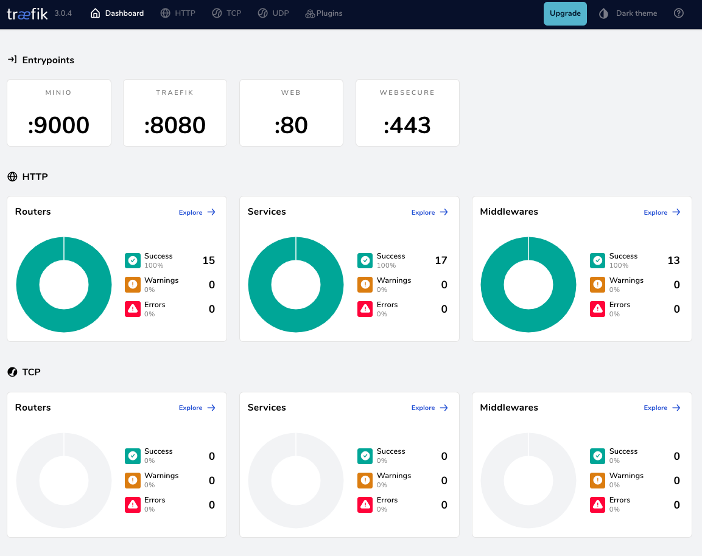
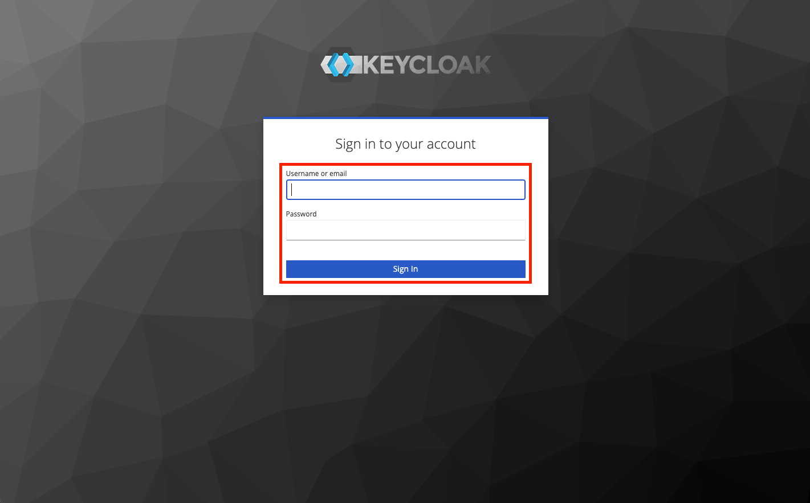
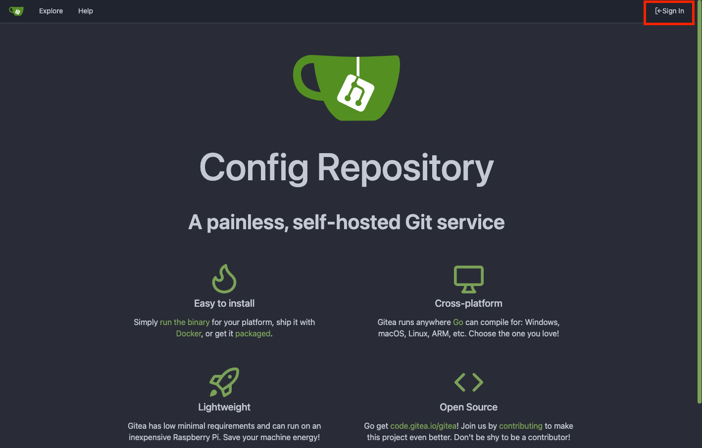
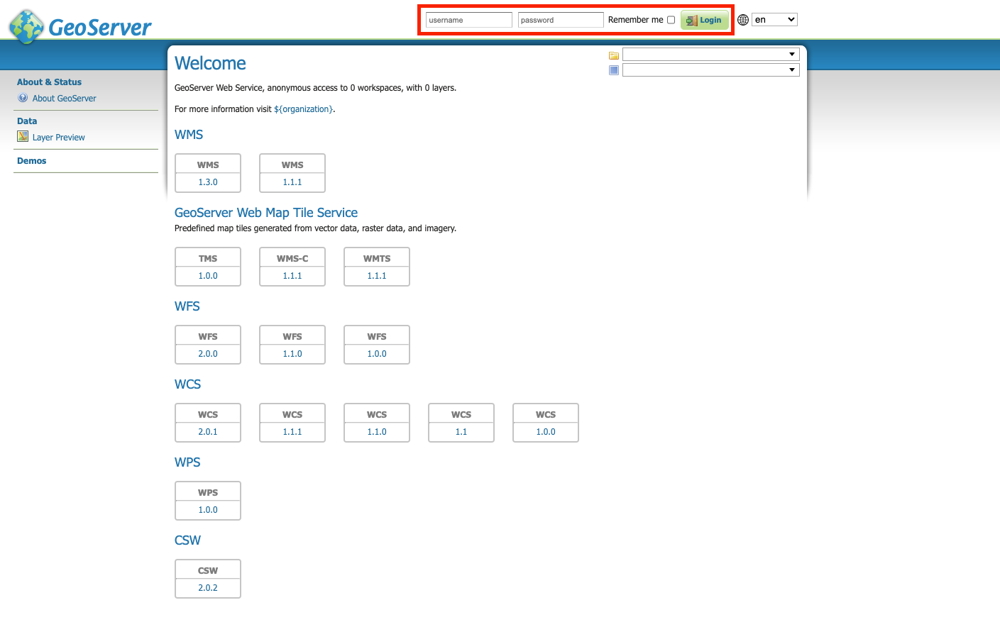
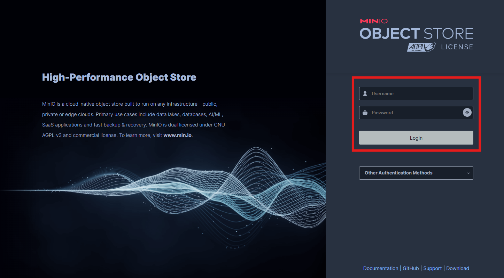
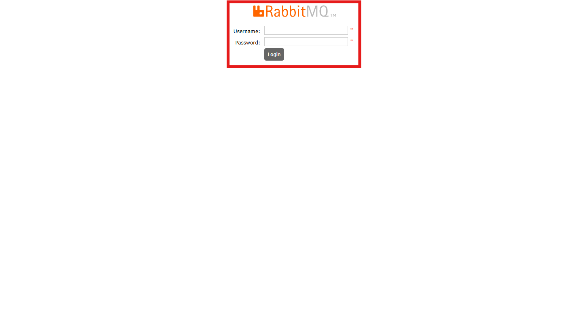
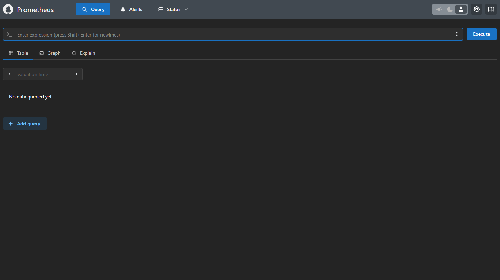
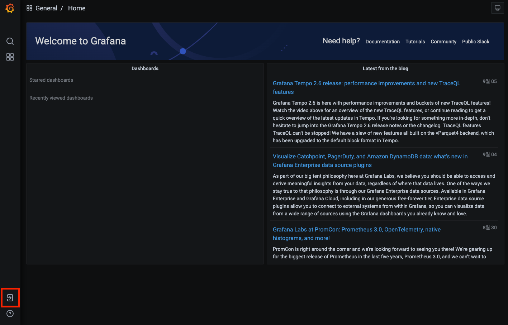
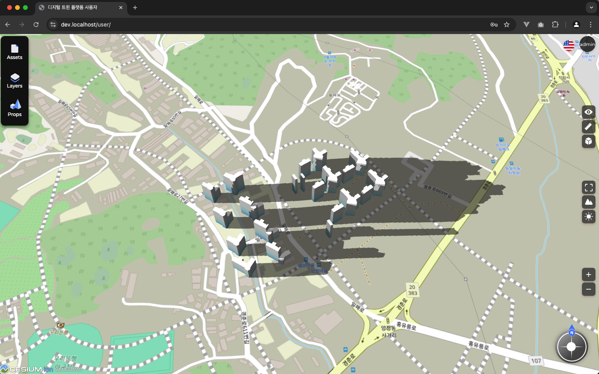
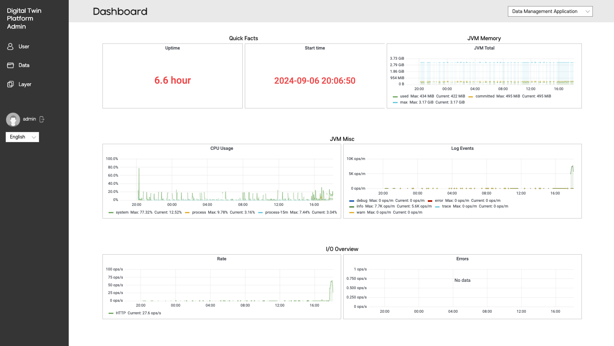

# mago3D Installation Guide

---

This document provides instructions on how to install mago3D using Docker Compose.

## Prerequisites
* An environment with Docker installed
* An environment with a localhost certificate installed
* An environment with git installed (https://github.com/git-guides/install-git)

Start the Docker daemon.  
For Windows, launch Docker Desktop.  
For Mac, launch Docker Desktop.  
For Linux, start the Docker service.  

### How to Install Certificate
Generate a localhost certificate using [mkcert](https://github.com/FiloSottile/mkcert)

* winget(Windows)    
  Run the following command in an elevated PowerShell terminal (as an administrator).
  ```powershell
  winget install mkcert
  ```
* brew(macOS)
  ```bash
  brew install mkcert
  ```

* Install the local CA
  ```cmd
  mkcert -install
  ```

* Generate the certificate
  ```cmd
  mkdir certs
  ```
  ```cmd
  cd certs
  ```
  ```cmd
  mkcert -cert-file default.crt -key-file default.key localhost dev.localhost *.localhost
  ```

If a certificate is installed on the server
Copy the certificate and place it in the `certs` path.


## 2. Create Docker Network
Run the following command to create the Docker Network.
```bash
docker network create mago3d
```

## 3. Deploy using Docker Compose

```bash
cd install
./compose.sh up -d
```
If you don't have execution permissions, run the following command
```bash
chmod +x *.sh
./compose.sh up -d
```

If you want to stop it, run the following command.
```bash
./compose.sh down
```

If Docker Hub access is unstable, load the *.tar files in the `/docker-images` directory first, then run `./compose.sh up -d`.

### Docker Image Loading

#### Linux / Mac / Git Bash (Windows)

```bash
cd docker-images
./load-images.sh
```

Or:

```bash
bash load-images.sh
```

#### Windows PowerShell

```powershell
cd docker-images
.\load-images.ps1
```

If you encounter execution policy errors:

```powershell
# Allow execution for current session only
Set-ExecutionPolicy -ExecutionPolicy Bypass -Scope Process
.\load-images.ps1
```

#### Script Features

- Automatically detects all `.tar` files in the docker-images folder
- Loads each image sequentially into Docker
- Shows progress (e.g., [3/12] Loading: mago3d-geoserver_latest.tar)
- Displays success/failure statistics summary
- Lists loaded images after completion

#### Included Docker Images

The tar files in this folder contain the following mago3D components:

- **mago3d-postgresql**: Spatial database
- **mago3d-geoserver**: Geospatial data server
- **mago3d-keycloak**: Authentication and authorization management
- **mago3d-rabbitmq**: Message broker
- **mago3d-storage**: Storage server
- **mago3d-traefik**: Reverse proxy
- **mago3d-configrepo**: Configuration repository
- **mago3d-configserver**: Configuration server
- **mago3d-fluentd**: Log collector
- **mago3d-prometheus**: Metrics collector
- **mago3d-grafana**: Monitoring dashboard
- **mago3d-opensearch**: Search engine
- **mago3d-opensearch-dashboard**: Search dashboard
- **mago3d-gdal-converter**: GDAL data converter
- **mago3d-t3d-converter**: 3D tile generator
- **mago3d-f4d-converter**: F4D tile generator
- **mago3d-terrain-converter**: Terrain data generator
- **mago3d-dataset-app**: Dataset management application
- **mago3d-layerset-app**: Layerset management application
- **mago3d-userset-app**: User management application
- **mago3d-frontend**: Frontend application
- **mago3d-api-doc**: API documentation server

#### Verify After Loading

Check if images were successfully loaded:

```bash
docker images | grep mago3d
```

#### Troubleshooting

##### Docker is not running

```bash
# Linux
sudo systemctl start docker

# macOS
# Start Docker Desktop application

# Windows
# Start Docker Desktop application
```

##### Permission errors (Linux)

```bash
sudo ./load-images.sh
```

##### Insufficient disk space

Ensure you have enough disk space before loading. Approximately 13GB or more is required.

```bash
docker system df
```

#### Notes

- The loading process may take several minutes depending on image sizes and system performance
- `.docker_temp_*` files are temporary and will not be loaded
- Each image is loaded independently, so if one fails, others will continue to load

### 4. Check Access
* https://dev.localhost/dashboard/  
  

* https://dev.localhost/auth/  
  
* Account: admin/keycloak

* https://dev.localhost/configrepo/  
  
* Account: git/git

* https://dev.localhost/geoserver/  
  
* Account: admin/geoserver

* https://dev.localhost/minio/console/login  
  
* Account: minioadmin/minioadmin

* https://dev.localhost/rabbitmq/  
  
* Account: admin/admin

* https://dev.localhost/prometheus/query  
  

* https://dev.localhost/grafana/   
  
* Account: admin/admin

* https://dev.localhost/user  
* Account: admin/admin
* After logging in, access the user page
  

* https://dev.localhost/admin  
* Account: admin/admin
* After logging in, access the admin page
  
