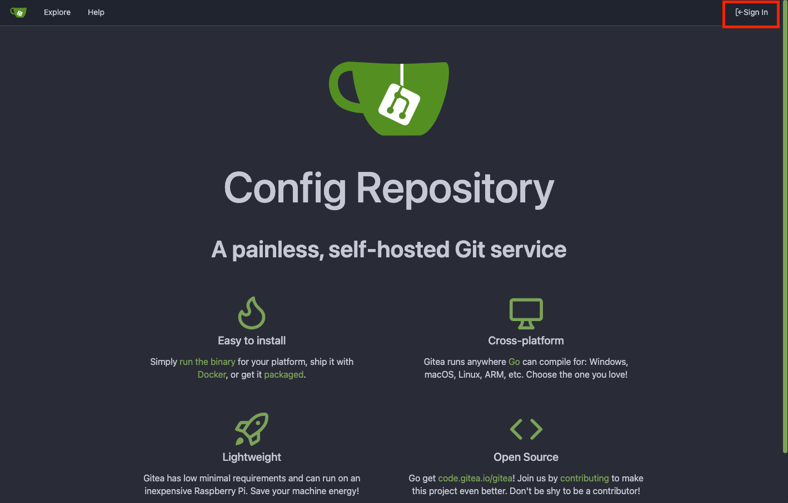

# mago3D 설치 가이드

---

이 문서는 mago3D를 Docker Compose를 이용하여 설치하는 방법을 안내합니다.

## 사전 준비 사항
* Docker가 설치된 환경
* localhost 인증서가 설치된 환경
* git이 설치된 환경 (https://github.com/git-guides/install-git)

Docker 데몬을 실행합니다.  
Windows의 경우, Docker Desktop을 실행합니다.  
Mac의 경우, Docker Desktop을 실행합니다.  
Linux의 경우, Docker 서비스를 실행합니다.  

### 인증서 설치 방법
[mkcert](https://github.com/FiloSottile/mkcert)를 사용하여 localhost 인증서를 생성합니다.

* winget(Windows)    
  PS 터미널을 관리자 권한으로 실행하여 아래 명령을 실행한다.
  ```powershell
  winget install mkcert
  ```
* brew(macOS)
  ```bash
  brew install mkcert
  ```

* local CA 설치
  ```cmd
  mkcert -install
  ```
* 인증서 생성
  ```cmd
  cd install/infra/trafik/certs
  mkcert -cert-file default.crt -key-file default.key localhost dev.localhost *.localhost 127.0.0.1 ::1
  ```

서버에 인증서가 설치되어 있으면, 인증서를 복사하여 `install/traefik/certs` 경로에 배치합니다.


## 2. Docker Network 생성
아래의 명령어를 실행하여 Docker Network를 생성합니다.
```bash
docker network create mago3d
```

## 3. Docker Compose를 이용한 배포

```bash
cd install
./compose.sh up -d
```
혹시 실행 권한이 없다면 다음 구문을 실행
```bash
chmod +x *.sh
./compose.sh up -d
```

종료를 원하면 다음과 같은 명령어를 실행합니다.
```bash
./compose.sh down
```

### 4. 접속 확인
* https://dev.localhost/dashboard/  
  

* https://dev.localhost/auth/  
  
* 계정: admin/keycloak

* https://dev.localhost/configrepo/  
  
* 계정: git/git

* https://dev.localhost/geoserver/  
  
* 계정: admin/geoserver

* https://dev.localhost/minio/console/login  
  
* 계정: minioadmin/minioadmin

* https://dev.localhost/rabbitmq/  
  
* 계정: admin/admin

* https://dev.localhost/prometheus/query  
  

* https://dev.localhost/grafana/   
  
* 계정: admin/admin

* https://dev.localhost/user  
* 계정: admin/admin
* 로그인 후, 사용자 페이지 접속
  

* https://dev.localhost/admin  
* 계정: admin/admin
* 로그인 후, 관리자 페이지 접속
  
