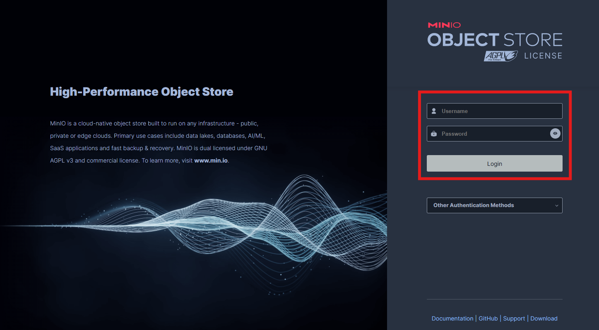
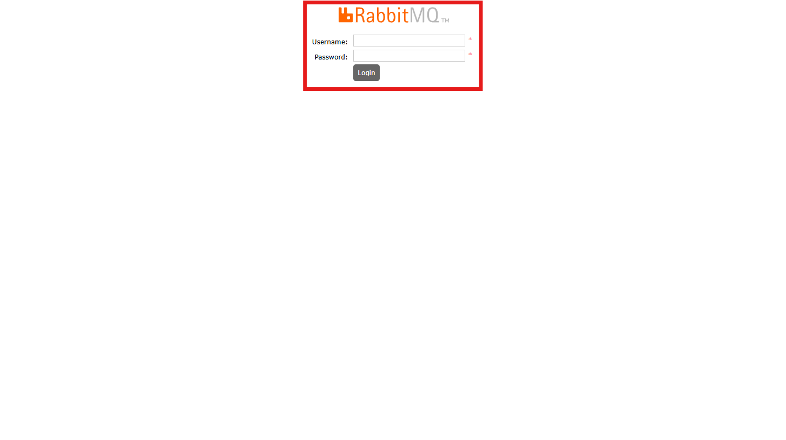
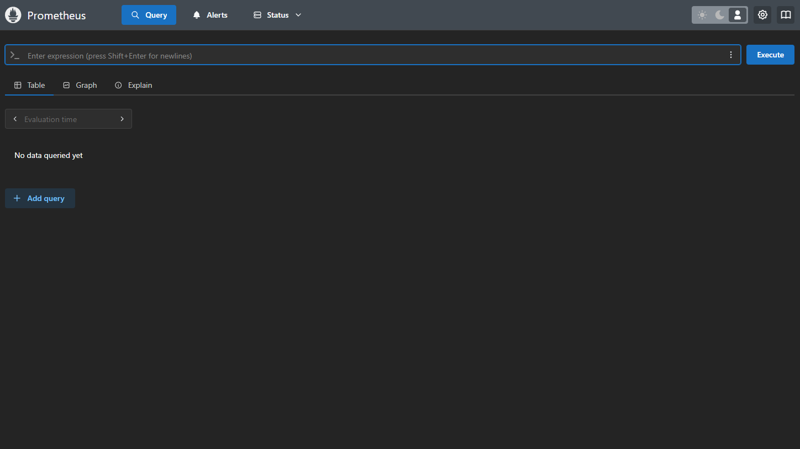
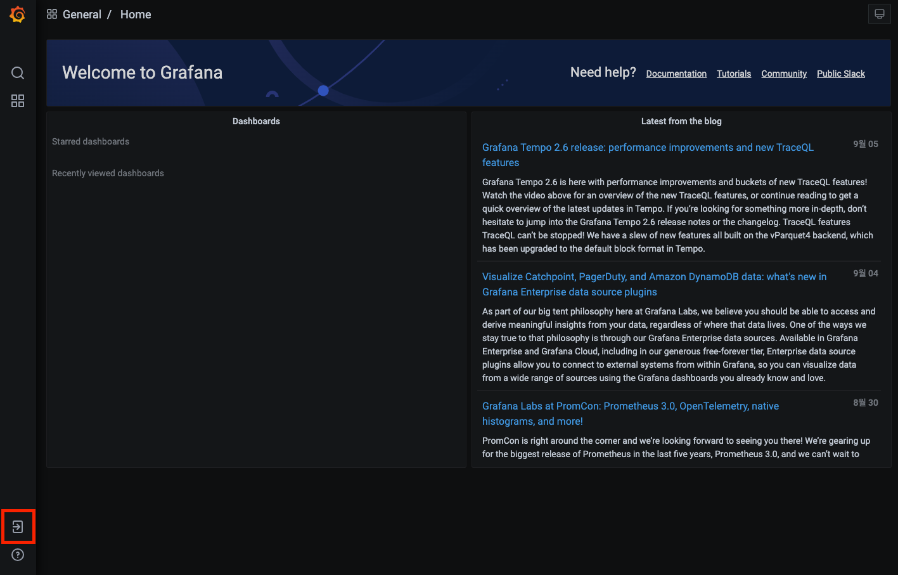
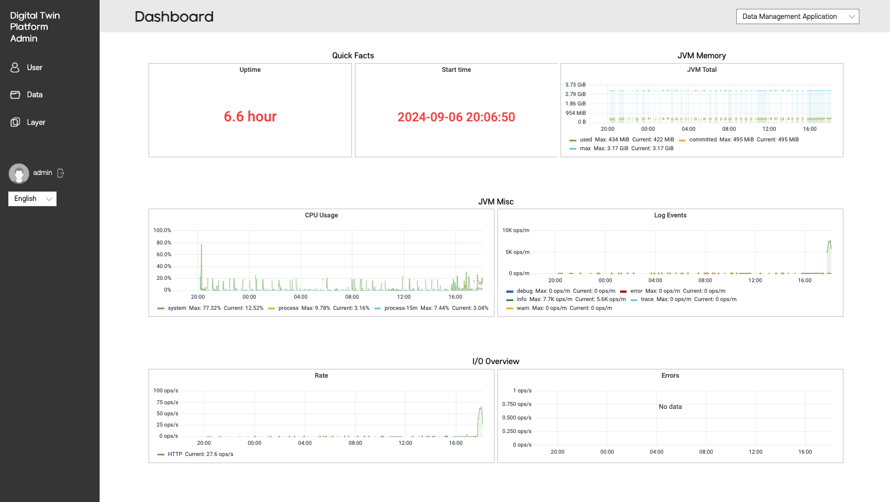

# mago3D 설치 가이드

---

이 문서는 mago3D를 Docker Compose를 이용하여 설치하는 방법을 안내합니다.

## 사전 준비 사항
* Docker가 설치된 환경
* localhost 인증서가 설치된 환경
* git이 설치된 환경 (https://github.com/git-guides/install-git)

Docker 데몬을 실행합니다.  
Windows의 경우, Docker Desktop을 실행합니다.  
Mac의 경우, Docker Desktop을 실행합니다.  
Linux의 경우, Docker 서비스를 실행합니다.  

### 인증서 설치 방법
[mkcert](https://github.com/FiloSottile/mkcert)를 사용하여 localhost 인증서를 생성합니다.

* winget(Windows)    
  PS 터미널을 관리자 권한으로 실행하여 아래 명령을 실행한다.
  ```powershell
  winget install mkcert
  ```
* brew(macOS)
  ```bash
  brew install mkcert
  ```

* local CA 설치
  ```cmd
  mkcert -install
  ```
* 인증서 생성
  ```cmd
  mkdir certs
  ```
  ```cmd
  cd certs
  ```
  ```cmd
  mkcert -cert-file default.crt -key-file default.key localhost dev.localhost *.localhost
  ```

서버에 인증서가 설치되어 있으면, 인증서를 복사하여 `certs` 경로에 배치합니다.

### Windows 사용자 주의사항

Windows에서 Docker Desktop을 사용하는 경우, 볼륨 마운트가 제대로 작동하려면 다음을 확인하세요:

1. **Docker Desktop 설정 확인**
   - Docker Desktop > Settings > Resources > File Sharing
   - `C:\` 드라이브가 공유 목록에 있는지 확인
   - 없으면 추가 후 Apply & Restart

2. **WSL2 사용 시** (권장)
   - Docker Desktop > Settings > General
   - "Use the WSL 2 based engine" 체크 확인
   - WSL2를 사용하면 파일 마운트 성능이 향상됩니다

3. **경로 문제 해결**
   - `install` 디렉토리에서 스크립트를 실행해야 합니다
   - 상대 경로(`./certs`)가 올바르게 인식되도록 작업 디렉토리 확인

## 2. Docker Network 생성
아래의 명령어를 실행하여 Docker Network를 생성합니다.
```bash
docker network create mago3d
```

## 3. Docker Compose를 이용한 배포

### Linux / Mac / Git Bash (Windows)

```bash
cd install
./compose.sh up -d
```
혹시 실행 권한이 없다면 다음 구문을 실행
```bash
chmod +x *.sh
./compose.sh up -d
```

종료를 원하면 다음과 같은 명령어를 실행합니다.
```bash
./compose.sh down
```

### Windows (CMD / PowerShell)

```cmd
cd install
compose.bat up -d
```

종료를 원하면 다음과 같은 명령어를 실행합니다.
```cmd
compose.bat down
```

### compose 스크립트 사용법

#### 기본 명령어
- `config`: 병합 및 보간 후 최종 설정 파일 출력
- `build`: 서비스 빌드 또는 재빌드
- `push`: 서비스 이미지 푸시
- `up`: 컨테이너 생성 및 시작
- `down`: 컨테이너 중지 및 제거
- `ps`: 컨테이너 목록 표시
- `logs`: 컨테이너 출력 보기

#### 옵션
- `--env-file <path>`: 환경 파일 지정 (기본값: .env.compose)
- `-h, --help`: 도움말 표시

#### 사용 예시

```bash
# Linux/Mac/Git Bash
./compose.sh up -d                           # 백그라운드로 시작
./compose.sh logs -f                         # 로그 실시간 확인
./compose.sh ps                              # 실행 중인 컨테이너 확인
./compose.sh down                            # 중지 및 제거
./compose.sh --env-file .env.prod up -d      # 커스텀 환경 파일 사용
```

```cmd
REM Windows
compose.bat up -d                            REM 백그라운드로 시작
compose.bat logs -f                          REM 로그 실시간 확인
compose.bat ps                               REM 실행 중인 컨테이너 확인
compose.bat down                             REM 중지 및 제거
compose.bat --env-file .env.prod up -d       REM 커스텀 환경 파일 사용
```

만일, docker hub 접속이 원활하지 않을 경우, `/docker-images` 디렉토리 내부의 *.tar 파일들을 미리 로드한 후, `./compose.sh up -d` (Linux/Mac) 또는 `compose.bat up -d` (Windows) 명령어를 실행합니다.

### Docker 이미지 로드 방법

#### Linux / Mac / Git Bash (Windows)

```bash
cd docker-images
./load-images.sh
```

또는:

```bash
bash load-images.sh
```

#### Windows PowerShell

```powershell
cd docker-images
.\load-images.ps1
```

만약 실행 정책 오류가 발생하면:

```powershell
# 현재 세션에서만 실행 허용
Set-ExecutionPolicy -ExecutionPolicy Bypass -Scope Process
.\load-images.ps1
```

#### 스크립트 기능

- docker-images 폴더 내의 모든 `.tar` 파일을 자동으로 감지
- 각 이미지를 순차적으로 Docker에 로드
- 진행 상황 표시 (예: [3/12] Loading: mago3d-geoserver_latest.tar)
- 성공/실패 통계 요약
- 로드 완료 후 이미지 목록 표시

#### 포함된 Docker 이미지

이 폴더의 tar 파일들은 다음 mago3D 컴포넌트를 포함합니다:

- **mago3d-postgresql**: 공간 데이터베이스
- **mago3d-geoserver**: 지리공간 데이터 서버
- **mago3d-keycloak**: 인증 및 권한 관리
- **mago3d-rabbitmq**: 메시지 브로커
- **mago3d-storage**: 스토리지 서버
- **mago3d-traefik**: 리버스 프록시
- **mago3d-configrepo**: 설정 저장소
- **mago3d-configserver**: 설정 서버
- **mago3d-fluentd**: 로그 수집기
- **mago3d-prometheus**: 메트릭 수집기
- **mago3d-grafana**: 모니터링 대시보드
- **mago3d-opensearch**: 검색 엔진
- **mago3d-opensearch-dashboard**: 검색 대시보드
- **mago3d-gdal-converter**: GDAL 데이터 변환기
- **mago3d-t3d-converter**: 3D 타일 생성기
- **mago3d-f4d-converter**: F4D 타일 생성기
- **mago3d-terrain-converter**: 지형 데이터 생성기
- **mago3d-dataset-app**: 데이터셋 관리 애플리케이션
- **mago3d-layerset-app**: 레이어셋 관리 애플리케이션
- **mago3d-userset-app**: 사용자 관리 애플리케이션
- **mago3d-frontend**: 프론트엔드 애플리케이션
- **mago3d-api-doc**: API 문서 서버

### 로드 후 확인

이미지가 성공적으로 로드되었는지 확인:

```bash
docker images | grep mago3d
```

### 문제 해결

#### Docker가 실행 중이 아닌 경우

```bash
# Linux
sudo systemctl start docker

# macOS
# Docker Desktop 애플리케이션 시작

# Windows
# Docker Desktop 애플리케이션 시작
```

#### 권한 오류 (Linux)

```bash
sudo ./load-images.sh
```

#### 디스크 공간 부족

로드하기 전에 충분한 디스크 공간이 있는지 확인하세요. 약 13GB 이상의 공간이 필요합니다.

```bash
docker system df
```

#### Windows 볼륨 마운트 오류

Windows에서 `Error response from daemon: invalid mount config` 또는 certs 관련 오류가 발생하는 경우:

1. **작업 디렉토리 확인**
   ```cmd
   cd C:\Users\user\IdeaProjects\mago3d-doc\install
   compose.bat config
   ```
   - config 명령으로 볼륨 경로가 올바른지 확인

2. **Docker Desktop 재시작**
   - Docker Desktop을 완전히 종료 후 재시작
   - 설정 > Resources > File Sharing에서 드라이브 재공유

3. **절대 경로 사용** (최후의 수단)
   - docker-compose.base.yml 파일 수정
   - `./certs` → `C:/Users/user/IdeaProjects/mago3d-doc/install/certs`로 변경
   - 단, 이 방법은 다른 환경에서 호환성 문제가 발생할 수 있음

4. **WSL2 경로 사용** (WSL2 사용 시)
   - WSL2 내에서 프로젝트 복제
   - `/mnt/c/` 경로 대신 WSL2 파일시스템 사용 (`~/projects/mago3d-doc`)

### 참고

- 로드 과정은 이미지 크기와 시스템 성능에 따라 몇 분이 소요될 수 있습니다
- `.docker_temp_*` 파일은 임시 파일이므로 로드되지 않습니다
- 각 이미지는 독립적으로 로드되므로 하나가 실패해도 다른 이미지는 계속 로드됩니다

### 4. 접속 확인
* https://dev.localhost/dashboard/  
  

* https://dev.localhost/auth/  
  
* 계정: admin/keycloak

* https://dev.localhost/configrepo/  
  
* 계정: git/git

* https://dev.localhost/geoserver/  
  
* 계정: admin/geoserver

* https://dev.localhost/minio/console/login  
  
* 계정: minioadmin/minioadmin

* https://dev.localhost/rabbitmq/  
  
* 계정: admin/admin

* https://dev.localhost/prometheus/query  
  

* https://dev.localhost/grafana/   
  
* 계정: admin/admin

* https://dev.localhost/user  
* 계정: admin/admin
* 로그인 후, 사용자 페이지 접속
  

* https://dev.localhost/admin  
* 계정: admin/admin
* 로그인 후, 관리자 페이지 접속
  
