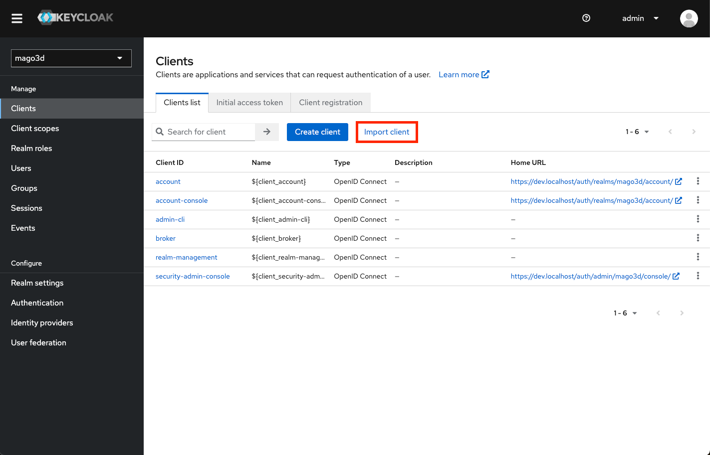
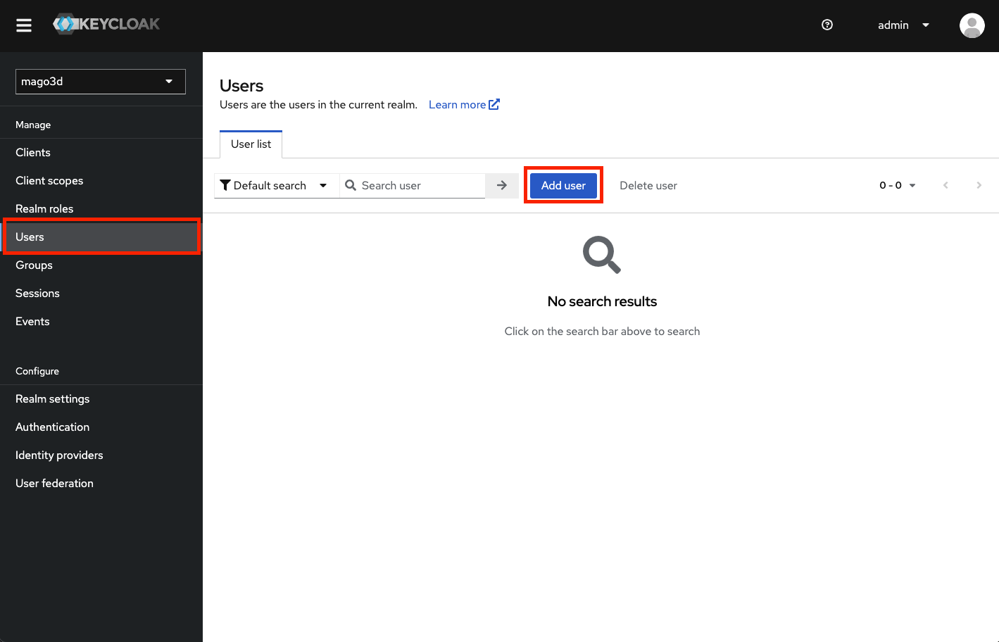
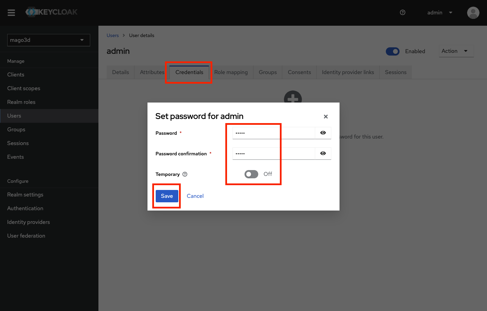
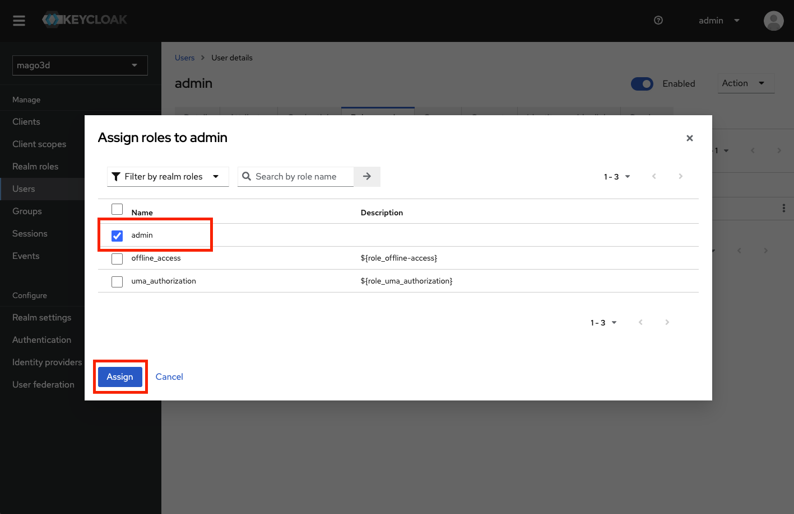
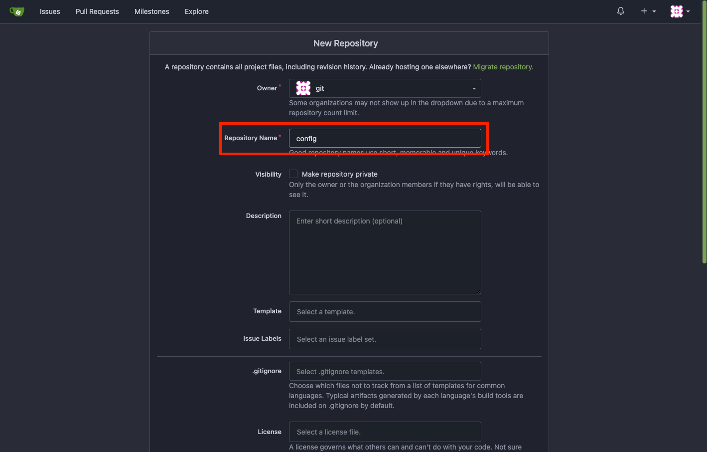
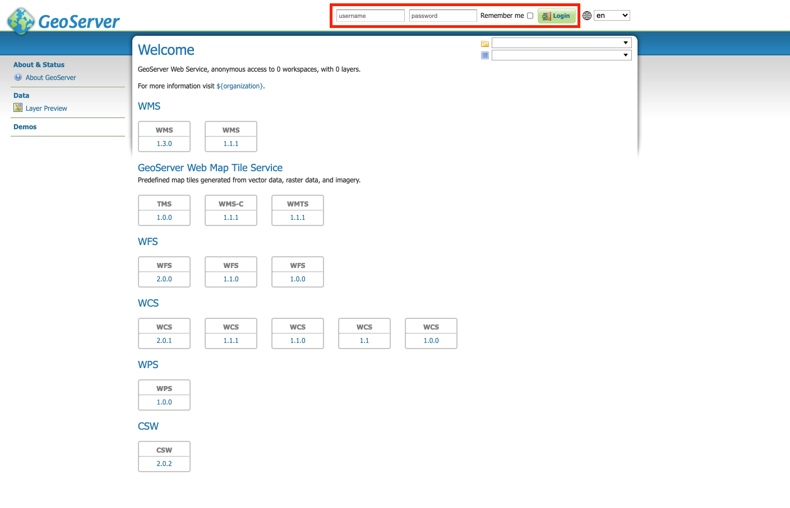
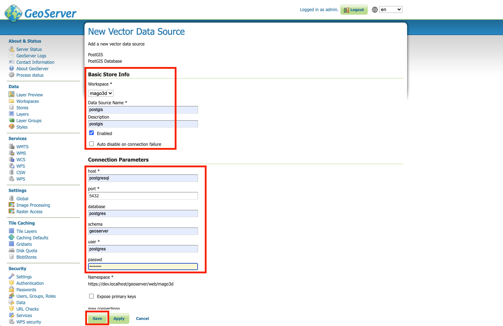
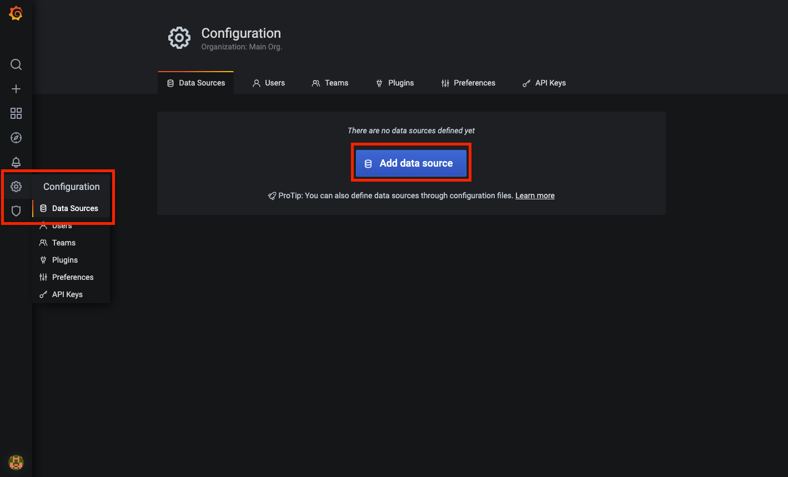
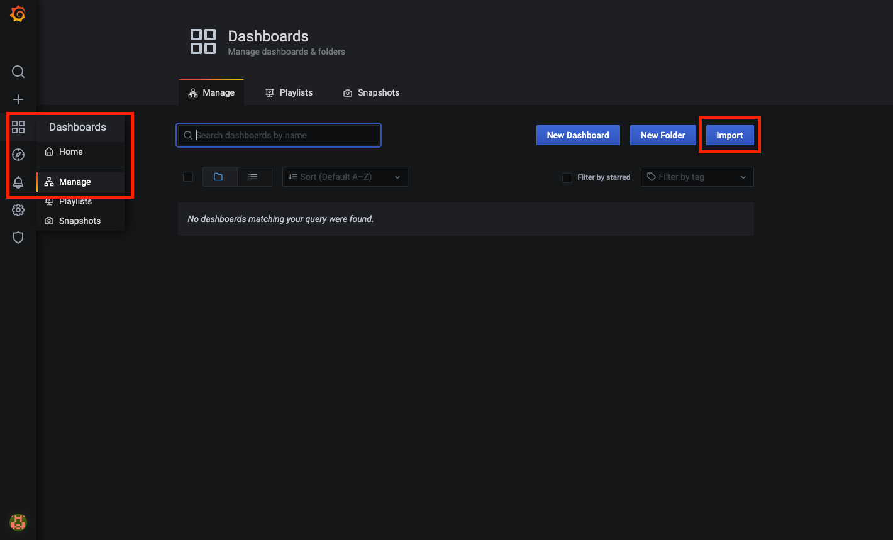
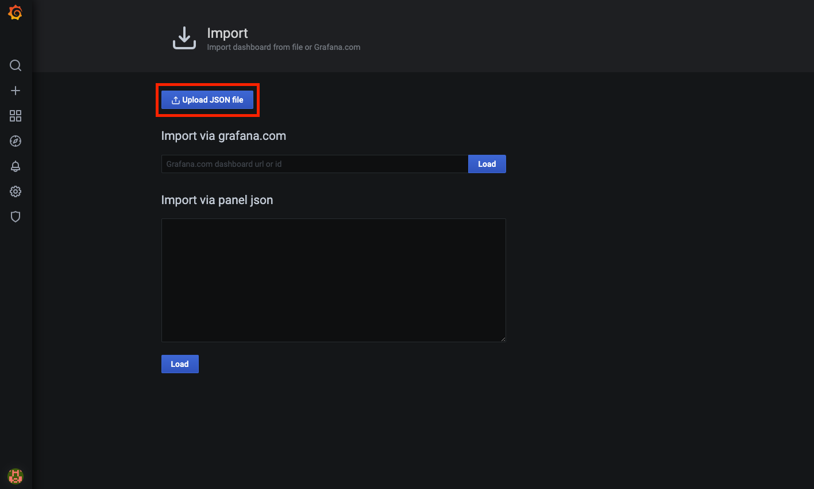

# mago3D Installation Guide

---

This document provides instructions on how to install mago3D using Docker Compose.

## Prerequisites
* An environment with Docker installed
* An environment with a localhost certificate installed
* An environment with Git installed (https://github.com/git-guides/install-git)

Start the Docker daemon.
For Windows, launch Docker Desktop.
For Mac, launch Docker Desktop.
For Linux, start the Docker service.

### How to Install Certificate
Generate a localhost certificate using [mkcert](https://github.com/FiloSottile/mkcert)

* winget(Windows)    
  Run the following command in an elevated PowerShell terminal (as an administrator).
  ```powershell
  winget install mkcert
  ```
* brew(macOS)
  ```bash
  brew install mkcert
  ```

* Install the local CA
  ```cmd
  mkcert -install
  ```
* Generate the certificate
  ```cmd
  cd install/infra/traefik/certs
  mkcert -cert-file default.crt -key-file default.key localhost dev.localhost *.localhost 127.0.0.1 ::1
  ```

## 1. Load Docker image
First, copy the deployed Docker image files to the install directory.  
Run the following script to load the related Docker images.
```bash
cd install
./load_docker_images.sh
```
If you don't have execution permissions, run the following command
```bash
chmod +x load_docker_images.sh
./load_docker_images.sh
```

## 2. Create Docker Network
Run the following command to create the Docker Network.
```bash
docker network create mago3d
```

## 3. Copy Terrain Data
Copy the deployed terrain folder to the install/infra/terrain-data directory.

## 4. Deploy using Docker Compose
### 4.1. Deploy Infra
```bash
cd install/infra
./compose.sh up -d
```
If you don't have execution permissions, run the following command
```bash
chmod +x *.sh
./compose.sh up -d
```
### 4.2. Shut down Infra
If you want to stop it, run the following command.
```bash
./compose.sh down
```

### 4.3. Configure Infra
#### 1. Traefik Dashboard
* https://dev.localhost/dashboard/  
  

#### 2. Keycloak
* https://dev.localhost/auth/
* Access the Administration Console and add the following settings.
  
* Account: admin/keycloak
* Create the mago3d realm
  Use the `install/infra/auth-data/realm-export.json` file to create the realm
  ```  
    master Select Box -> Create Realm -> upload realm-export.json -> create
  ```
  
* Create the mago3d client
  Use the `install/infra/auth-data/mago3d-api.json`, `install/infra/auth-data/mago3d-front.json` files to create the clients.
  ```
    Select Box -> mago3d -> Clients -> Import client -> Upload mago3d-api.json -> Save  
    Select Box -> mago3d -> Clients -> Import client -> Upload mago3d-front.json -> Save
  ```  
  
  
  
* Add the service account role
  ```
    Select Box -> mago3d -> Clients -> mago3d-api -> Service account roles -> Assign role ->   
    Filter by clients -> select (realm-management) manage-users, (account) manage-account -> Assign
  ```
  
  

* Create the mago3d user
  ```
    Select Box -> mago3d ->  Users -> Add user
    Username: admin
    First Name: admin
    -> Create
  ```
  
  
* Set the password for the mago3d user
  ```
    Select Box -> mago3d -> Users -> admin -> Credentials -> Set password
    New password: admin
    Temporary: OFF
    -> Save password
  ```
  
* Add the role to the mago3d user
  ```
    Select Box -> mago3d -> Users -> admin -> Role mapping
    Assign role -> select admin -> Assign
  ```
  

#### 3. ConfigRepo
* https://dev.localhost/configrepo/
  
* Account: git/git
* Add the config repository
  
  
* Upload and commit the files located under `install/infra/config-data/`
```
cd install/infra/config-data
git init
git checkout -b main
git add .
git commit -m "first commit"
git remote add origin https://dev.localhost/configrepo/git/config.git
git push -u origin main
```
* Modify the configuration files to fit each environment and commit the changes

#### 4. Geoserver
* https://dev.localhost/geoserver/
  
* Account: admin/geoserver
* Create the Workspace
  ```
    Workspace -> Add new workspace -> 
    Workspace Name: mago3d 
    Namespace URI: https://dev.localhost/geoserver/web/mago3d
    check Default Workspace 
    -> Save
  ```
  
* Create the Store
  ```
    Stores -> Add new Store -> Store Type: PostGIS ->
    Workspace: mago3d 
    Data Store Name: postgis 
    Connection Parameters:
      host: postgresql
      port: 5432
      database: postgres
      schema: geoserver
      user: postgres
      passwd: postgres
    -> Save
  ```
  
  

#### 5. Grafana
* https://dev.localhost/grafana/   
  
* Account: admin/admin
* Add the Datasource
  ```
    Configuration -> Data Sources -> Add data source -> Prometheus -> Select
    Name: Prometheus
    URL: http://prometheus:9090
    -> Save & Test
  ```
  
  
  
  
* Add the Dashboard
* Add the dashboard using the `install/infra/dashboard/jvm-micrometer.json` file
  ```
    + -> Import -> Upload JSON File -> jvm-micrometer.json -> Import
  ```
  
  
  
### 4.4. Deploy Apps
```bash
cd install/apps
./compose.sh up -d
```
If you don't have execution permissions, run the following command
```bash
chmod +x *.sh
./compose.sh up -d
```
### 4.5. Shut down Apps
If you want to stop it, run the following command.
```bash
./compose.sh down
```

### 4.6. Deploy Front
```bash
cd install/front
./compose.sh up -d
```
If you don't have execution permissions, run the following command
```bash
chmod +x *.sh
./compose.sh up -d
```
### 4.7. Shut down Front
If you want to stop it, run the following command.
```bash
./compose.sh down
```

## 5. Check Access
### 5.1. Access the mago3D user page
* https://dev.localhost/user
* Account: admin/admin
* After logging in, access the user page
  

### 5.2. Access mago3D admin page
* https://dev.localhost/admin
* Account: admin/admin
* After logging in, access the admin page
  
