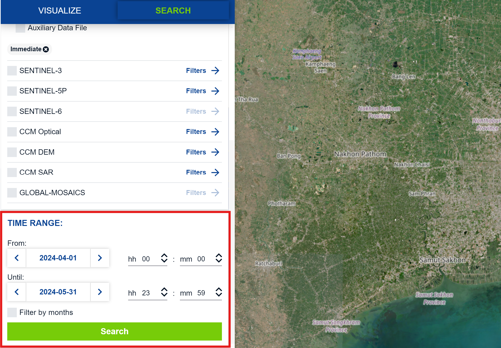
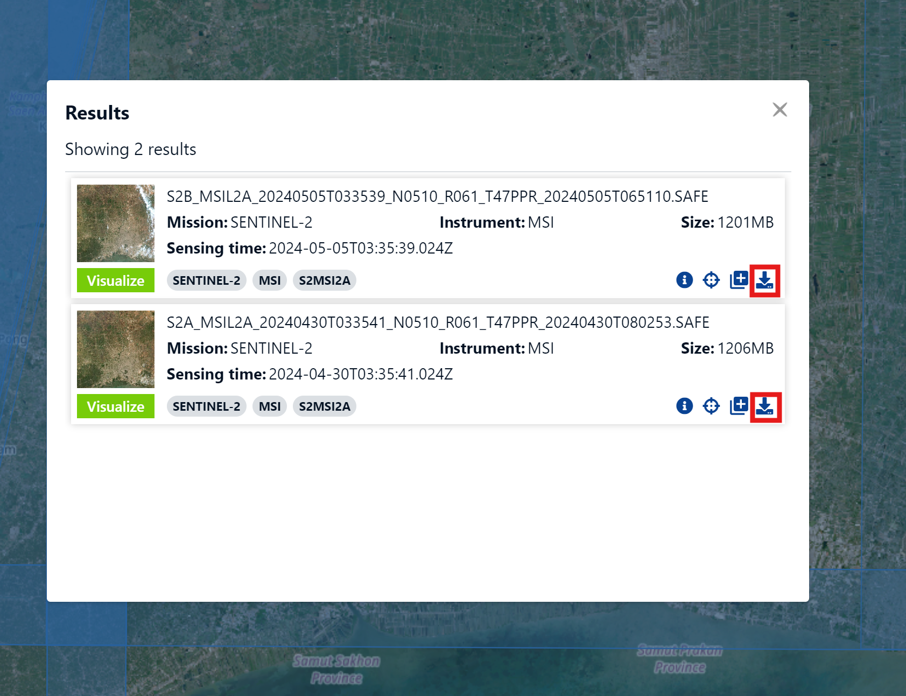

# mago3D Training Guide

# :bookmark_tabs: How to build data

## :globe_with_meridians: Download Overture Maps Data

### 1. Verify Python is installed

- [Install the Python](https://www.python.org/downloads/)
- Open the cmd window and check whether Python is installed. Run the following command.

    ```sql
    $ python --version
    ```


### 2. Create a virtual environment

- Open the cmd window and navigate to the directory where you want to create the virtual environment.
- For example, to navigate to the directory 'C:\Projects\MyProject', enter the following command.

    ```sql
    $ cd C:\Projects\MyProject
    ```

- Run the following command to create a virtual environment.

    ```sql
    $ python -m venv mago3D
    ```

- 'mago3D' is the name of the virtual environment, you can change it to the name you want.

### 3. Activate the virtual environment

- To activate the virtual environment, run the following command in the cmd window.

    ```sql
    $ mago3D\Scripts\activate
    ```

  - If the virtual environment is activated, the name of the virtual environment '(mago3D)' will be displayed in the cmd window.

### 4. Install the Overture Maps package

- Run the following command to install the Overture Maps package in the virtual environment.

    ```sql
    $ pip install overturemaps
    ```


### 5. Download Overture Maps Data

- Run the following command to install the Overture Maps package in the virtual environment.
- Download the building data of Bangkok and Khlong Toei as a geojson file named 'bangkok_building.geojson' and 'khlongtoei_building.geojson'.

    ```sql
    $ overturemaps download --bbox=100.3279208704736476,13.4938189846044274,100.9385088643698083,13.9545957682767714 -f geojson --type=building -o bangkok_building.geojson
    $ overturemaps download --bbox=100.5507001257371797,13.6970007530963525,100.6016431134770528,13.7428667529314463 -f geojson --type=building -o khlongtoei_building.geojson
    ```

- Download the water data of Bangkok and Khlong Toei as a geojson file named 'bangkok_water.geojson' and 'khlongtoei_water.geojson'.

    ```sql
    $ overturemaps download --bbox=100.3279208704736476,13.4938189846044274,100.9385088643698083,13.9545957682767714 -f geojson --type=water -o bangkok_water.geojson
    $ overturemaps download --bbox=100.5507001257371797,13.6970007530963525,100.6016431134770528,13.7428667529314463 -f geojson --type=water -o khlongtoei_water.geojson
    ```

- The downloaded files are saved in the directory where you created the virtual environment.

## :rocket: Download NASA DEM

### 1. Access NASA EARTHDATA

[search.earthdata.nasa.gov](https://search.earthdata.nasa.gov/search/granules?p=C1711961296-LPCLOUD&pg[0][v]=f&pg[0][gsk]=-start_date&as[science_keywords][0]=Land%20Surface%3ATopography%3ATerrain%20Elevation%3ADigital%20Elevation/Terrain%20Model%20(Dem)&tl=1723601365!3!!&fst0=Land%20Surface&fsm0=Topography&fs10=Terrain%20Elevation&fs20=Digital%20Elevation/Terrain%20Model%20(Dem))

### 2. Specify area

- Use the tool on the right to specify the area you want to download.


### 3. Download data

- Downloads data that corresponds to the specified area.


## :telescope: Download Sentinel Video

### 1. Access Copernicus Data Space Ecosystem

[Copernicus Data Space Ecosystem | Europe's eyes on Earth](https://dataspace.copernicus.eu/)


### 2. Setting Data Search Conditions

- Navigate to the area that you want and expand it.
- Click the search button, and adjust the SENTINEL-2>MSI>L2A>cloud amount to 5%.


- Specify a date and click the Search button.



### 3. Download Data

- The list of searched images and the range of sentinel images appear on the screen.


- If you have completed searching for the desired image, click the button to download it.



## Data-based mago3D training guide
Explain how to use the service in mago3D using the data downloaded according to the above data construction plan. For more information on data, refer to the dataset/README.md file.

### Extrusion model
buildings.geojson -> 3D Tiles

1. Upload builds.geojson to Mago3D.
2. Converts builds.geojson to 3D Tiles format within mago3D.
   Select the appropriate conversion options for the data as follows.
    - Input Type: GeoJSON
    - EPSG code: 4326
3. Visualize and verify the converted 3D Tiles in mago3D.

### 3D model
sample.fbx -> 3D Tiles

1. Upload the 3D original data to Mago3D.
2. Converts 3D original data to 3D Tiles format within mago3D.
   Select the appropriate conversion options for the data as follows.
    - Input Type: FBX
    - EPSG code: 4326
3. Visualize and verify the converted 3D Tiles in mago3D.

### Terrain Model
dem.tif -> Cesium Terrain Mesh

1. Upload the terrain.tif file to Mago3D.
2. Convert the terrain.tif file to the Cesium Terrain Mesh format.
   Select the appropriate conversion options for the data as follows.
    - Min Depth: 0
    - Max Depth: 12
3. Visualize and verify the converted Cesium Terrain Mesh in mago3D.

### 2D Grid
satellite.tif -> WMS

1. Upload the satellite.tif file to Mago3D.
2. Convert the image file by selecting the coordinate system and the output data type.
3. Automatically publishes the converted image to the GeoServer layer.
4. Visualize and verify the converted image in mago3D with WMS

### 2D Vector
water.geojson -> WMS

1. Upload the water.geojson file to Mago3D.
2. Select the appropriate conversion option for the data to convert the water.geojson file.
    - Input Type: GeoJSON
    - EPSG code: 4326
3. Convert and save it to the database, and publish it automatically to the GeoServer layer.
4. Visualize and verify the converted vector in mago3D with WMS